# LiteOS Studio 使用指南
-   [前言](#前言.md)
-   [简介](#简介.md)
-   [LiteOS Studio安装](#LiteOS-Studio安装.md)
    -   [安装LiteOS Studio](#安装LiteOS-Studio.md)
    -   [配置Studio](#配置Studio.md)
-   [环境准备](#环境准备.md)
-   [快速上手](#快速上手.md)
    -   [第三方芯片](#第三方芯片.md)
    -   [华为海思芯片](#华为海思芯片.md)
-   [LiteOS Studio使用](#LiteOS-Studio使用.md)
    -   [了解界面](#了解界面.md)
    -   [了解工具栏](#了解工具栏.md)
    -   [代码编辑](#代码编辑.md)
        -   [智能提示/自动补齐](#智能提示-自动补齐.md)
        -   [符号跟踪](#符号跟踪.md)
        -   [格式自动对齐](#格式自动对齐.md)
        -   [视图单步前进/后退](#视图单步前进-后退.md)
        -   [全局搜索](#全局搜索.md)
        -   [当前文件代码查找/替换](#当前文件代码查找-替换.md)
        -   [文件搜索](#文件搜索.md)
    -   [打开调试面板](#打开调试面板.md)
    -   [断点控制](#断点控制.md)
        -   [新增断点](#新增断点.md)
        -   [新增条件断点](#新增条件断点.md)
        -   [编辑断点](#编辑断点.md)
        -   [删除断点](#删除断点.md)
        -   [禁用断点](#禁用断点.md)
    -   [打开控制台输出](#打开控制台输出.md)
    -   [工程管理](#工程管理.md)
        -   [新建工程](#新建工程.md)
            -   [操作步骤](#操作步骤.md)
            -   [目录文件介绍](#目录文件介绍.md)
        -   [打开工程](#打开工程.md)
        -   [导入工程](#导入工程.md)
    -   [编译](#编译.md)
        -   [编译（Windows）](#编译（Windows）.md)
        -   [编译（Linux）](#编译（Linux）.md)
    -   [烧录](#烧录.md)
    -   [调试](#调试.md)
        -   [变量监视](#变量监视.md)
        -   [变量修改](#变量修改.md)
        -   [导出Memory地址数据](#导出Memory地址数据.md)
        -   [反汇编调试](#反汇编调试.md)
    -   [Trace](#Trace.md)
        -   [操作步骤](#操作步骤-0.md)
        -   [内存跟踪](#内存跟踪.md)
-   [通用操作](#通用操作.md)
    -   [配置SDK路径](#配置SDK路径.md)
    -   [配置开发环境](#配置开发环境.md)
    -   [配置工程](#配置工程.md)
-   [OceanConnect](#OceanConnect.md)
-   [用户反馈](#用户反馈.md)
-   [FAQ](#FAQ.md)
    -   [如何在Linux系统下搭建开发环境](#如何在Linux系统下搭建开发环境.md)
    -   [如何获取连接开发板的实际串口号](#如何获取连接开发板的实际串口号.md)
    -   [如何进行Trace埋点](#如何进行Trace埋点.md)
        -   [EVENTS面板](#EVENTS面板.md)
        -   [Interrupts面板](#Interrupts面板.md)
        -   [Timer面板](#Timer面板.md)
        -   [Queue面板](#Queue面板.md)
        -   [Timeline面板](#Timeline面板.md)
        -   [Task Details面板](#Task-Details面板.md)
        -   [Semaphore面板](#Semaphore面板.md)
        -   [Mutex面板](#Mutex面板.md)
        -   [Task Stack面板](#Task-Stack面板.md)
        -   [内存面板](#内存面板.md)
            -   [动态内存](#动态内存.md)
            -   [静态内存](#静态内存.md)
    -   [弹出JLink警告如何解决](#弹出JLink警告如何解决.md)
    -   [如何配置环境变量](#如何配置环境变量.md)
    -   [烧录及调试均失败（华为海思芯片）](#烧录及调试均失败（华为海思芯片）.md)
    -   [打开文件搜索框有“卡死”的现象](#打开文件搜索框有-卡死-的现象.md)
    -   [烧录或调试时，JLink弹出框未置顶显示](#烧录或调试时-JLink弹出框未置顶显示.md)
    -   [通过LiteOS Studio修改网络盘符中的文件注意事项](#通过LiteOS-Studio修改网络盘符中的文件注意事项.md)
-   [附录](#附录.md)
    -   [Trace介绍](#Trace介绍.md)
        -   [Trace工具栏](#Trace工具栏.md)
        -   [Events](#Events.md)
        -   [Interrupts](#Interrupts.md)
        -   [Timer](#Timer.md)
        -   [Quene](#Quene.md)
        -   [Timeline](#Timeline.md)
        -   [Task Details](#Task-Details.md)
        -   [Semaphore](#Semaphore.md)
        -   [Mutex](#Mutex.md)
        -   [Task Stack](#Task-Stack.md)
<h2 id="前言.md">前言</h2>

## 概述<a name="section4537382116410"></a>

本文档详细的描述了LiteOS Studio的安装及使用方法。

## 读者对象<a name="section4378592816410"></a>

本文档主要适用于LiteOS Studio的使用人员。

## 符号约定<a name="section133020216410"></a>

在本文中可能出现下列标志，它们所代表的含义如下。

<a name="table2622507016410"></a>
<table><thead align="left"><tr id="row1530720816410"><th class="cellrowborder" valign="top" width="20.580000000000002%" id="mcps1.1.3.1.1"><p id="p6450074116410"><a name="p6450074116410"></a><a name="p6450074116410"></a><strong id="b2136615816410"><a name="b2136615816410"></a><a name="b2136615816410"></a>符号</strong></p>
</th>
<th class="cellrowborder" valign="top" width="79.42%" id="mcps1.1.3.1.2"><p id="p5435366816410"><a name="p5435366816410"></a><a name="p5435366816410"></a><strong id="b5941558116410"><a name="b5941558116410"></a><a name="b5941558116410"></a>说明</strong></p>
</th>
</tr>
</thead>
<tbody><tr id="row1372280416410"><td class="cellrowborder" valign="top" width="20.580000000000002%" headers="mcps1.1.3.1.1 "><p id="p3734547016410"><a name="p3734547016410"></a><a name="p3734547016410"></a><a name="image2670064316410"></a><a name="image2670064316410"></a><span></span></p>
</td>
<td class="cellrowborder" valign="top" width="79.42%" headers="mcps1.1.3.1.2 "><p id="p1757432116410"><a name="p1757432116410"></a><a name="p1757432116410"></a>用于警示紧急的危险情形，若不避免，将会导致人员死亡或严重的人身伤害。</p>
</td>
</tr>
<tr id="row466863216410"><td class="cellrowborder" valign="top" width="20.580000000000002%" headers="mcps1.1.3.1.1 "><p id="p1432579516410"><a name="p1432579516410"></a><a name="p1432579516410"></a><a name="image4895582316410"></a><a name="image4895582316410"></a><span></span></p>
</td>
<td class="cellrowborder" valign="top" width="79.42%" headers="mcps1.1.3.1.2 "><p id="p959197916410"><a name="p959197916410"></a><a name="p959197916410"></a>用于警示潜在的危险情形，若不避免，可能会导致人员死亡或严重的人身伤害。</p>
</td>
</tr>
<tr id="row123863216410"><td class="cellrowborder" valign="top" width="20.580000000000002%" headers="mcps1.1.3.1.1 "><p id="p1232579516410"><a name="p1232579516410"></a><a name="p1232579516410"></a><a name="image1235582316410"></a><a name="image1235582316410"></a><span></span></p>
</td>
<td class="cellrowborder" valign="top" width="79.42%" headers="mcps1.1.3.1.2 "><p id="p123197916410"><a name="p123197916410"></a><a name="p123197916410"></a>用于警示潜在的危险情形，若不避免，可能会导致中度或轻微的人身伤害。</p>
</td>
</tr>
<tr id="row5786682116410"><td class="cellrowborder" valign="top" width="20.580000000000002%" headers="mcps1.1.3.1.1 "><p id="p2204984716410"><a name="p2204984716410"></a><a name="p2204984716410"></a><a name="image4504446716410"></a><a name="image4504446716410"></a><span></span></p>
</td>
<td class="cellrowborder" valign="top" width="79.42%" headers="mcps1.1.3.1.2 "><p id="p4388861916410"><a name="p4388861916410"></a><a name="p4388861916410"></a>用于传递设备或环境安全警示信息，若不避免，可能会导致设备损坏、数据丢失、设备性能降低或其它不可预知的结果。</p>
<p id="p1238861916410"><a name="p1238861916410"></a><a name="p1238861916410"></a>“注意”不涉及人身伤害。</p>
</td>
</tr>
<tr id="row2856923116410"><td class="cellrowborder" valign="top" width="20.580000000000002%" headers="mcps1.1.3.1.1 "><p id="p5555360116410"><a name="p5555360116410"></a><a name="p5555360116410"></a><a name="image799324016410"></a><a name="image799324016410"></a><span></span></p>
</td>
<td class="cellrowborder" valign="top" width="79.42%" headers="mcps1.1.3.1.2 "><p id="p4612588116410"><a name="p4612588116410"></a><a name="p4612588116410"></a>用于突出重要/关键信息、最佳实践和小窍门等。</p>
<p id="p1232588116410"><a name="p1232588116410"></a><a name="p1232588116410"></a>“说明”不是安全警示信息，不涉及人身、设备及环境伤害。</p>
</td>
</tr>
</tbody>
</table>

## 修改记录<a name="section2467512116410"></a>

<a name="table1557726816410"></a>
<table><thead align="left"><tr id="row2942532716410"><th class="cellrowborder" valign="top" width="20.72%" id="mcps1.1.4.1.1"><p id="p3778275416410"><a name="p3778275416410"></a><a name="p3778275416410"></a><strong id="b5687322716410"><a name="b5687322716410"></a><a name="b5687322716410"></a>文档版本</strong></p>
</th>
<th class="cellrowborder" valign="top" width="26.119999999999997%" id="mcps1.1.4.1.2"><p id="p5627845516410"><a name="p5627845516410"></a><a name="p5627845516410"></a><strong id="b5800814916410"><a name="b5800814916410"></a><a name="b5800814916410"></a>发布日期</strong></p>
</th>
<th class="cellrowborder" valign="top" width="53.16%" id="mcps1.1.4.1.3"><p id="p2382284816410"><a name="p2382284816410"></a><a name="p2382284816410"></a><strong id="b3316380216410"><a name="b3316380216410"></a><a name="b3316380216410"></a>修改说明</strong></p>
</th>
</tr>
</thead>
<tbody><tr id="row49859355163622"><td class="cellrowborder" valign="top" width="20.72%" headers="mcps1.1.4.1.1 "><p id="p46081013163622"><a name="p46081013163622"></a><a name="p46081013163622"></a>01</p>
</td>
<td class="cellrowborder" valign="top" width="26.119999999999997%" headers="mcps1.1.4.1.2 "><p id="p41574543163622"><a name="p41574543163622"></a><a name="p41574543163622"></a>2018-09-30</p>
</td>
<td class="cellrowborder" valign="top" width="53.16%" headers="mcps1.1.4.1.3 "><p id="p12094805163622"><a name="p12094805163622"></a><a name="p12094805163622"></a>第一次正式发布。</p>
</td>
</tr>
</tbody>
</table>

<h2 id="简介.md">简介</h2>

LiteOS Studio是基于LiteOS嵌入式系统软件开发的工具。它提供了代码编辑、编译、烧录、调试及Trace跟踪等功能，可以对系统关键数据进行实时跟踪及保存与回放。

<h2 id="LiteOS-Studio安装.md">LiteOS Studio安装</h2>

-   **[安装LiteOS Studio](#安装LiteOS-Studio.md)**  

-   **[配置Studio](#配置Studio.md)**  
配置Studio后，每次新建工程将自动读取此Studio的配置，并作为Studio的默认配置。

<h2 id="安装LiteOS-Studio.md">安装LiteOS Studio</h2>

## 操作步骤<a name="section1132454415554"></a>

1.  获取LiteOS Studio安装包“LiteOS Studio Setup xxxx-xx-xx.exe”。获取地址：[https://github.com/LiteOS/LiteOS\_Studio](https://github.com/LiteOS/LiteOS_Studio)  。

    > **说明：**   
    >xxxx-xx-xx为LiteOS Studio版本号，请以实际获取的安装包版本号为准。  

2.  双击“LiteOS Studio Setup xxxx-xx-xx.exe”。
3.  勾选“我接受协议”，单击“下一步”。

    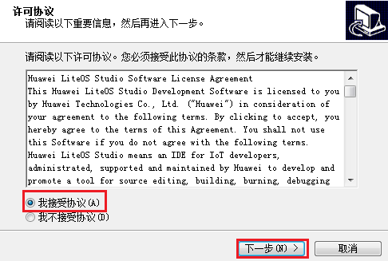

4.  单击“下一步”。

    > **说明：**   
    >-   如需更换安装目录，请单击“浏览”选择其他目录。  
    >-   首次安装将出现如下“选择安装位置”弹框，后续更新或升级将不会出现此弹框。  
    >-   如需出现此弹框，请先卸载已安装的LiteOS Studio。  

    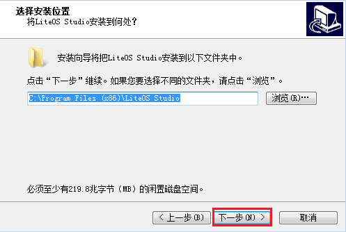

5.  单击“安装”。

    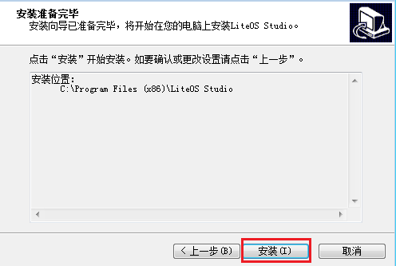

    弹出安装进度条，如下所示：

    

6.  待进度条完成后，单击“结束”完成安装。

    


<h2 id="配置Studio.md">配置Studio</h2>

配置Studio后，每次新建工程将自动读取此Studio的配置，并作为Studio的默认配置。

## 操作步骤<a name="section62307934162847"></a>

首次打开LiteOS Studio，弹出以下界面。

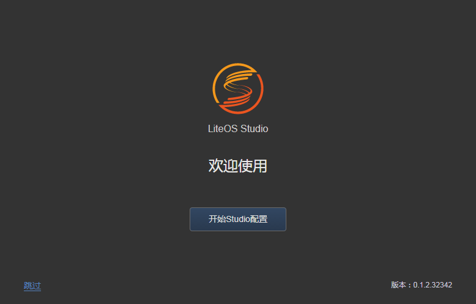

-   单击“跳过”，将不再出现此欢迎界面。如后续需配置studio，待进入Liteos Studio界面后，单击菜单栏中的“文件\>首选项”进行配置。
-   单击“开始Studio配置”，进入如下“开发资源配置”界面。

    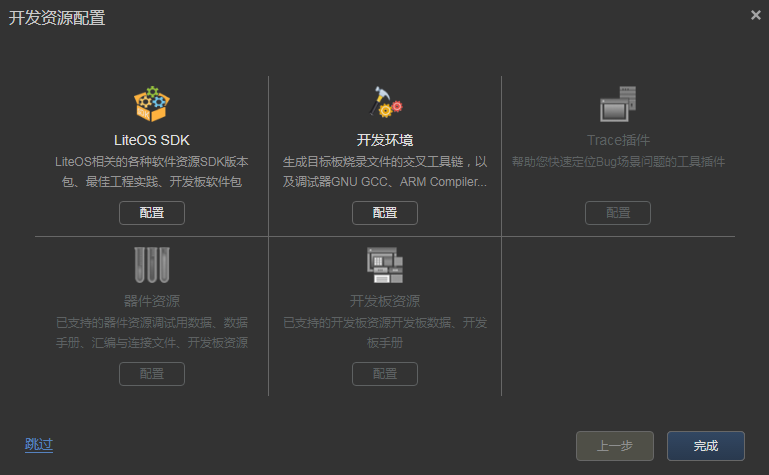

    -   单击“LiteOS SDK”下方的“配置”，配置SDK路径。具体操作请参见[配置SDK路径](#配置SDK路径.md)章节。
    -   单击“开发环境”下方的“配置”，配置开发环境。具体操作请参见[配置开发环境](#配置开发环境.md)章节。

        配置完成后，单击“完成”，后续将不再出现此“开发资源配置”界面。


<h2 id="环境准备.md">环境准备</h2>

使用LiteOS Studio工具进行编译，烧录及调试，需安装LiteOS Studio依赖的MinGW、GCC及JLink开发工具。如已完成安装，请忽略此章节。

## 操作步骤<a name="section3702323215252"></a>

1.  打开LiteOS Studio，单击，打开“Studio 配置”界面。

    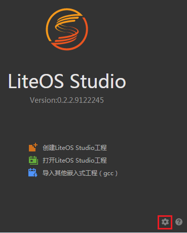

2.  在“开发环境”页签下，获取MinGW、GCC及JLink开发工具安装包。

    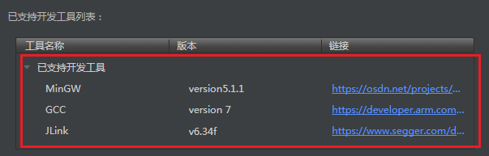

3.  安装“MinGW”。
    1.  单击“MinGW”所在行的链接，获取MinGW安装包“mingw-get-setup.exe”。
    2.  双击“mingw-get-setup.exe”，依照屏幕提示，安装MinGW。

4.  安装“GCC”。
    1.  单击“GCC”所在行的链接，获取GCC安装包“gcc-arm-none-eabi-7-2018-q2-update-win32-sha1.exe”。
    2.  双击“gcc-arm-none-eabi-7-2018-q2-update-win32-sha1.exe”，依照屏幕提示，安装GCC工具。

5.  安装“JLink”。
    1.  单击“JLink”所在行的链接，获取JLink安装包“Link\_Windows\_V634f.exe”。
    2.  双击“JLink\_Windows\_V634f.exe”，依照屏幕提示，安装JLink。

6.  （可选）配置环境变量。具体请参见[如何配置环境变量](#如何配置环境变量.md)章节。如未配置studio，将读取系统配置的环境变量参数，并作为Studio的默认配置。

<h2 id="快速上手.md">快速上手</h2>

本LiteOS Studio工具支持对华为海思芯片及第三方芯片（非华为海思芯片）进行编译、烧录及调试。

本章以STM32F429IGTx\_FIRE及华为海思3516Cv300工程示例，进行编译、烧录及调试功能演示，快速掌握LiteOS Studio工具使用方法，详细的LiteOS Studio工具介绍请参见[LiteOS Studio使用](#LiteOS-Studio使用.md)章节。

-   **[第三方芯片](#第三方芯片.md)**  

-   **[华为海思芯片](#华为海思芯片.md)**  


<h2 id="第三方芯片.md">第三方芯片</h2>

第三方芯片（非华为海思芯片）工程演示以STM32F429IGTx\_FIRE开发板为例，并在Windows系统中进行编译，烧录及调试。

## 新建工程<a name="section590461529527"></a>

1.  单击“创建LiteOS Studio工程”。

    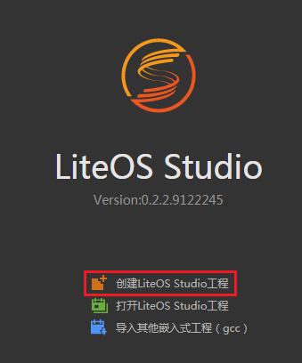

2.  配置“LiteOS SDK版本”，自定义“工程名称”及配置“工程目录”。

    -   如未配置SDK路径，单击“SDK管理”，配置SDK路径。具体操作请参见[配置SDK路径](#配置SDK路径.md)章节。
    -   如已配置SDK路径，单击“LiteOS SDK版本”的下拉框，选择已配置的SDK路径。

    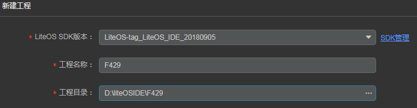

3.  配置开发环境，参数如[表1](#table5018758615458)所示。

    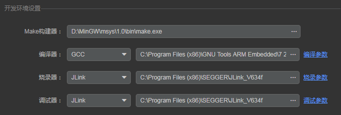

    **表 1**  开发环境配置

    <a name="table5018758615458"></a>
    <table><thead align="left"><tr id="row1074008015458"><th class="cellrowborder" valign="top" id="mcps1.2.5.1.1"><p id="p487362271554"><a name="p487362271554"></a><a name="p487362271554"></a>参数名称</p>
    </th>
    <th class="cellrowborder" colspan="2" valign="top" id="mcps1.2.5.1.2"><p id="p553203111554"><a name="p553203111554"></a><a name="p553203111554"></a>值</p>
    </th>
    <th class="cellrowborder" valign="top" id="mcps1.2.5.1.3"><p id="p517602361554"><a name="p517602361554"></a><a name="p517602361554"></a>备注</p>
    </th>
    </tr>
    </thead>
    <tbody><tr id="row2025529415458"><td class="cellrowborder" valign="top" headers="mcps1.2.5.1.1 "><p id="p3006612315458"><a name="p3006612315458"></a><a name="p3006612315458"></a>Make构建器</p>
    </td>
    <td class="cellrowborder" colspan="2" valign="top" headers="mcps1.2.5.1.2 "><p id="p1943691715458"><a name="p1943691715458"></a><a name="p1943691715458"></a>&lt;MinGW安装目录&gt;\MinGW\msys\1.0\bin\make.exe</p>
    </td>
    <td class="cellrowborder" valign="top" headers="mcps1.2.5.1.3 "><p id="p1877331015458"><a name="p1877331015458"></a><a name="p1877331015458"></a>MinGW安装目录以实际情况为准，如：D:\MinGW\msys\1.0\bin\make.exe</p>
    </td>
    </tr>
    <tr id="row3474206315458"><td class="cellrowborder" valign="top" width="22.137786221377866%" headers="mcps1.2.5.1.1 "><p id="p6264373615458"><a name="p6264373615458"></a><a name="p6264373615458"></a>编译器</p>
    </td>
    <td class="cellrowborder" valign="top" width="21.947805219478052%" headers="mcps1.2.5.1.2 "><p id="p1121276115556"><a name="p1121276115556"></a><a name="p1121276115556"></a>GCC</p>
    </td>
    <td class="cellrowborder" valign="top" width="28.707129287071297%" headers="mcps1.2.5.1.2 "><p id="p3086949015458"><a name="p3086949015458"></a><a name="p3086949015458"></a>&lt;GCC工具安装目录&gt;\7 2018-q2-update\bin</p>
    </td>
    <td class="cellrowborder" valign="top" width="27.207279272072793%" headers="mcps1.2.5.1.3 "><p id="p16621987151612"><a name="p16621987151612"></a><a name="p16621987151612"></a>GCC工具安装目录以实际情况为准，如：C:\Program Files (x86)\GNU Tools ARM Embedded\7 2018-q2-update\bin</p>
    </td>
    </tr>
    <tr id="row2238907815458"><td class="cellrowborder" valign="top" width="22.137786221377866%" headers="mcps1.2.5.1.1 "><p id="p157606815458"><a name="p157606815458"></a><a name="p157606815458"></a>烧录器</p>
    </td>
    <td class="cellrowborder" valign="top" width="21.947805219478052%" headers="mcps1.2.5.1.2 "><p id="p6055269415458"><a name="p6055269415458"></a><a name="p6055269415458"></a>JLink</p>
    </td>
    <td class="cellrowborder" rowspan="2" valign="top" width="28.707129287071297%" headers="mcps1.2.5.1.2 "><p id="p582120515458"><a name="p582120515458"></a><a name="p582120515458"></a>&lt;JLink安装目录&gt;\SEGGER\JLink_V634f</p>
    </td>
    <td class="cellrowborder" rowspan="2" valign="top" width="27.207279272072793%" headers="mcps1.2.5.1.3 "><p id="p3397462715649"><a name="p3397462715649"></a><a name="p3397462715649"></a>JLink安装目录以实际情况为准，如：C:\Program Files (x86)\SEGGER\JLink_V634f</p>
    </td>
    </tr>
    <tr id="row1580033315458"><td class="cellrowborder" valign="top" headers="mcps1.2.5.1.1 "><p id="p475858615458"><a name="p475858615458"></a><a name="p475858615458"></a>调试器</p>
    </td>
    <td class="cellrowborder" valign="top" headers="mcps1.2.5.1.2 "><p id="p4990116715458"><a name="p4990116715458"></a><a name="p4990116715458"></a>JLink</p>
    </td>
    </tr>
    </tbody>
    </table>

4.  配置编译参数。
    1.  单击“编译参数”。
    2.  在“Makefile脚本”文本框中填入“makefile”，默认为当前工程下主makefile的相对路径。

        

    3.  单击“确认”保存配置。

5.  设置完成后，单击“下一步”。
6.  在“基于Demo工程”页签下，勾选“Cloud\_STM32F429IGTx\_FIRE”。

    

7.  单击“完成”，完成新建工程。

## 工程演示<a name="section5487808295045"></a>

1.  将STM32F429IGTx\_FIRE开发板与电脑连接。
2.  编译。

    在打开的STM32F429IGTx\_FIRE工程中，单击工具栏中的，对当前工程进行编译。

    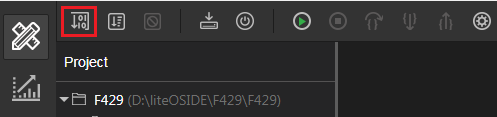

    编译成功后，在控制台输出面板中显示“编译成功”。

    

3.  烧录。

    单击工具栏中的，将已编译的程序烧录至开发板。

    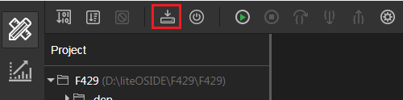

    弹出JLink的“使用协议”，单击接受Jlink插件要求，开始烧录程序 。

    弹出“烧录成功”提示，则程序烧录成功。

    

4.  调试。

    烧录成功后，单击开始调试。

    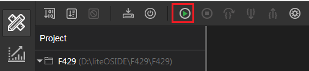

    调试界面如下图所示：

    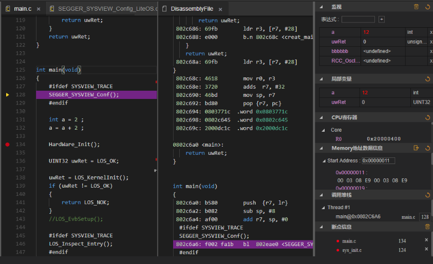


<h2 id="华为海思芯片.md">华为海思芯片</h2>

华为海思芯片工程演示以华为海思3516Cv300开发板为例，在Linux系统中进行编译，并对在Linux系统中编译出来的系统镜像二进制文件在Windows系统中进行烧录和调试。（暂不支持在Windows系统中对华为海思芯片工程进行编译）。

## 前提条件<a name="section28977026144038"></a>

已在Linux环境下搭建开发环境。具体请参见[如何在Linux系统下搭建开发环境](#如何在Linux系统下搭建开发环境.md)章节。

## 在Linux系统中编译<a name="section2395529595228"></a>

1.  打开MobaXterm工具，单击已连接的Linux云主机地址，如下图：

    

    进入Linux云主机后，如下图所示：

    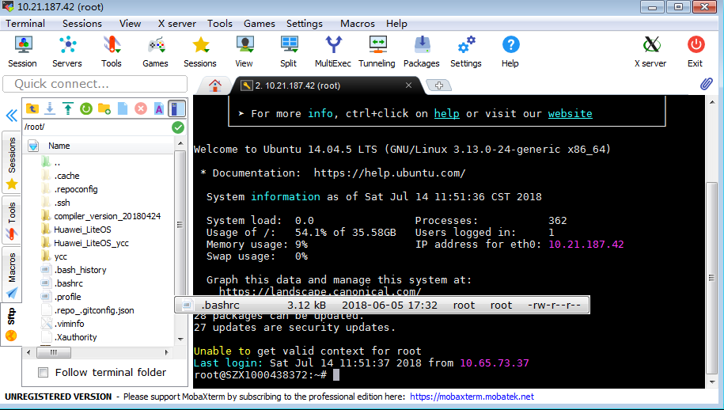

2.  将项目源码包拖入root根目录下。

    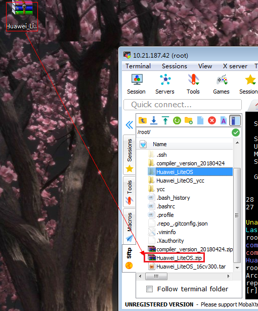

3.  执行以下命令，解压项目源码压缩包。

    **unzip Huawei\_LiteOS.zip**

    

4.  执行以下命令，进入Huawei\_LiteOS文件夹。

    **cd Huawei\_LiteOS**

    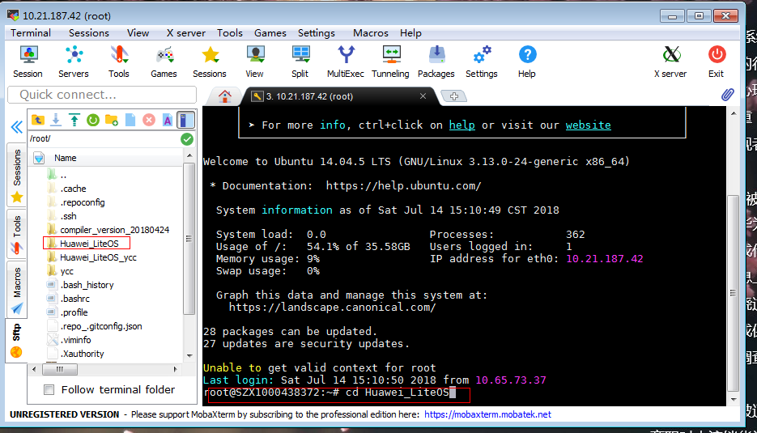

5.  修改.config文件。

    > **说明：**   
    >默认生成的ELF文件\(vs\_server\)所附带的调试信息很少，要生成带更多调试信息的ELF文件需要配置Huawei\_LiteOS目录下的.config文件中的LOSCFG\_COMPILE\_DEBUG。  

    1.  执行以下命令，编辑.config文件。

        **vi  .config**

    2.  如图中区域所示，添加如下信息。

        LOSCFG\_COMPILE\_DEBUG = y

        

    3.  按“Esc”，然后输入“:wq!”后按“Enter”，保存并退出编辑器。

6.  在Makefile目录执行make命令，进行编译。

    **make**

    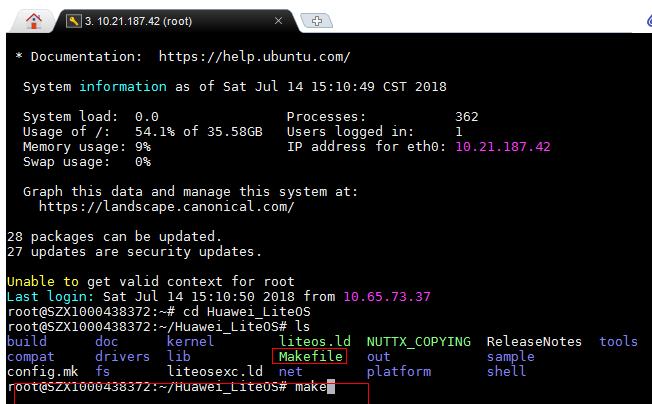

    编译后生成vs\_server，vs\_server.bin及vs\_server.asm文件，如下所示：

    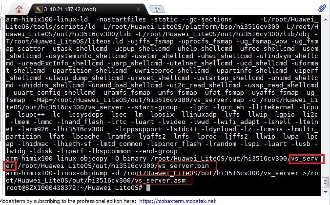

7.  单击“Download”下载编译后的文件到Windows系统中。

    


## 打开工程<a name="section590461529527"></a>

1.  单击“打开LiteOS Studio工程”，选择编译后的华为海思3516Cv300工程。

    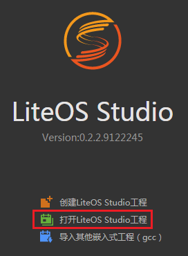

2.  弹出如下提示弹框，单击“是”导入工程。

    

    > **说明：**   
    >首次打开非LiteOS工程，请先执行导入操作，转换为LiteOS工程后，可直接打开工程。  

3.  弹出“导入”界面，单击“Makefile文件”的按钮，选择当前工程下的主Makefile。
4.  单击“工程目录”的按钮，选择需要导入工程的根目录。

    芯片型号及工程名称默认配置，如下图所示。

    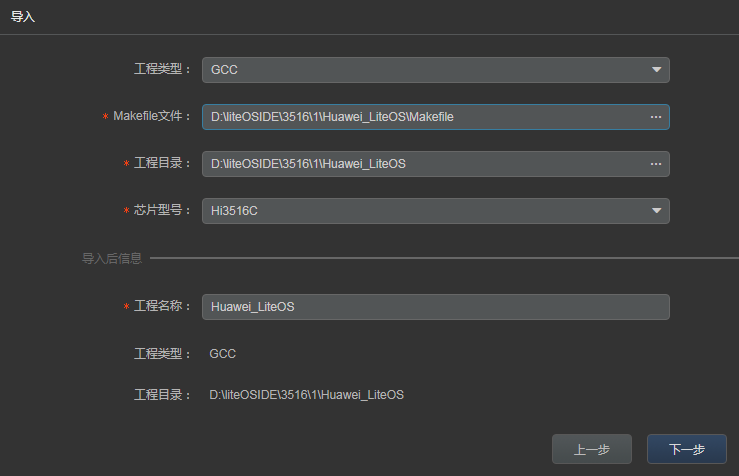

5.  配置完成后，单击“下一步”。
6.  设置开发环境，如[表1](#table5018758615458)所示。

    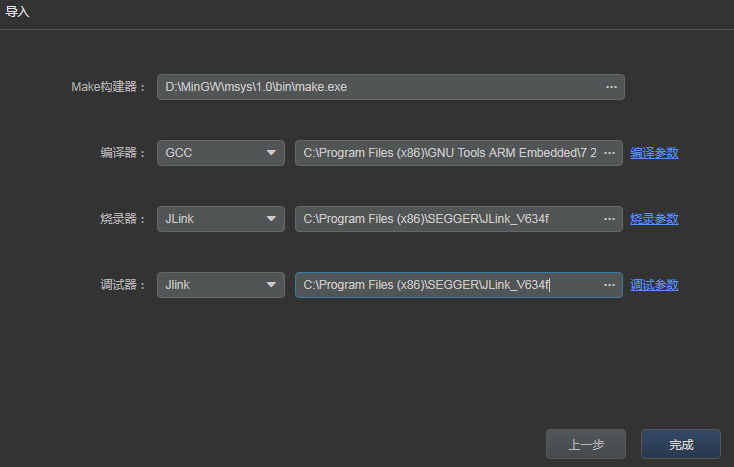

    **表 1**  开发环境配置

    <a name="table5018758615458"></a>
    <table><thead align="left"><tr id="row1074008015458"><th class="cellrowborder" valign="top" id="mcps1.2.5.1.1"><p id="p487362271554"><a name="p487362271554"></a><a name="p487362271554"></a>参数名称</p>
    </th>
    <th class="cellrowborder" colspan="2" valign="top" id="mcps1.2.5.1.2"><p id="p553203111554"><a name="p553203111554"></a><a name="p553203111554"></a>值</p>
    </th>
    <th class="cellrowborder" valign="top" id="mcps1.2.5.1.3"><p id="p517602361554"><a name="p517602361554"></a><a name="p517602361554"></a>备注</p>
    </th>
    </tr>
    </thead>
    <tbody><tr id="row2729867715720"><td class="cellrowborder" valign="top" headers="mcps1.2.5.1.1 "><p id="p2927614015737"><a name="p2927614015737"></a><a name="p2927614015737"></a>Make构建器</p>
    </td>
    <td class="cellrowborder" colspan="2" valign="top" headers="mcps1.2.5.1.2 "><p id="p64351347101524"><a name="p64351347101524"></a><a name="p64351347101524"></a>&lt;MinGW安装目录&gt;\MinGW\msys\1.0\bin\make.exe</p>
    </td>
    <td class="cellrowborder" valign="top" headers="mcps1.2.5.1.3 "><p id="p45076605101524"><a name="p45076605101524"></a><a name="p45076605101524"></a>MinGW安装目录以实际情况为准，如：D:\MinGW\msys\1.0\bin\make.exe</p>
    </td>
    </tr>
    <tr id="row3558078315720"><td class="cellrowborder" valign="top" width="22.137786221377866%" headers="mcps1.2.5.1.1 "><p id="p168760515737"><a name="p168760515737"></a><a name="p168760515737"></a>编译器</p>
    </td>
    <td class="cellrowborder" valign="top" width="21.947805219478052%" headers="mcps1.2.5.1.2 "><p id="p14661023191517"><a name="p14661023191517"></a><a name="p14661023191517"></a>GCC</p>
    </td>
    <td class="cellrowborder" valign="top" width="28.707129287071297%" headers="mcps1.2.5.1.2 "><p id="p3086949015458"><a name="p3086949015458"></a><a name="p3086949015458"></a>&lt;GCC工具安装目录&gt;\7 2018-q2-update\bin</p>
    </td>
    <td class="cellrowborder" valign="top" width="27.207279272072793%" headers="mcps1.2.5.1.3 "><p id="p16621987151612"><a name="p16621987151612"></a><a name="p16621987151612"></a>GCC工具安装目录以实际情况为准，如：C:\Program Files (x86)\GNU Tools ARM Embedded\7 2018-q2-update\bin</p>
    </td>
    </tr>
    <tr id="row2973316515720"><td class="cellrowborder" valign="top" width="22.137786221377866%" headers="mcps1.2.5.1.1 "><p id="p2230491515737"><a name="p2230491515737"></a><a name="p2230491515737"></a>烧录器</p>
    </td>
    <td class="cellrowborder" rowspan="2" valign="top" width="21.947805219478052%" headers="mcps1.2.5.1.2 "><p id="p1652969415742"><a name="p1652969415742"></a><a name="p1652969415742"></a>JLink</p>
    </td>
    <td class="cellrowborder" rowspan="2" valign="top" width="28.707129287071297%" headers="mcps1.2.5.1.2 "><p id="p6665400615720"><a name="p6665400615720"></a><a name="p6665400615720"></a>&lt;JLink安装目录&gt;\SEGGER\JLink_V634f</p>
    </td>
    <td class="cellrowborder" rowspan="2" valign="top" width="27.207279272072793%" headers="mcps1.2.5.1.3 "><p id="p3026543015720"><a name="p3026543015720"></a><a name="p3026543015720"></a>JLink安装目录以实际情况为准，如：C:\Program Files (x86)\SEGGER\JLink_V634f</p>
    </td>
    </tr>
    <tr id="row6445577415728"><td class="cellrowborder" valign="top" headers="mcps1.2.5.1.1 "><p id="p1993858615737"><a name="p1993858615737"></a><a name="p1993858615737"></a>调试器</p>
    </td>
    </tr>
    </tbody>
    </table>

7.  单击“完成”，完成导入工程。

## 工程演示<a name="section5487808295045"></a>

1.  将华为海思3516Cv300开发板与电脑连接。

    > **说明：**   
    >请先连接开发板电源，再将开发板与JLink仿真器连接。  

2.  在烧录前请进行如下工程配置。
    1.  在打开的华为海思3516Cv300工程中，单击工具栏的，进行工程配置。

        工程配置中需配置调试器中的编译目录及串口配置中的端口，其他参数可默认配置。

    2.  单击“调试器”，编译目录配置Linux云主机上编译的工程目录，请根据实际情况修改。如/root/Huawei\_LiteOS。

        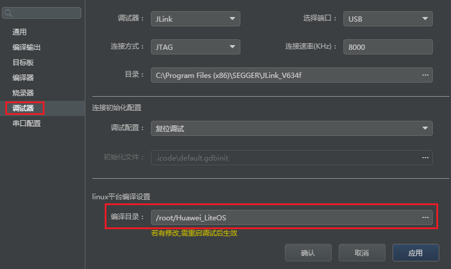

    3.  单击“串口配置”，在“端口”下拉框中选择与开发板实际连接的端口号。具体请参见[如何获取连接开发板的实际串口号](#如何获取连接开发板的实际串口号.md)章节。

        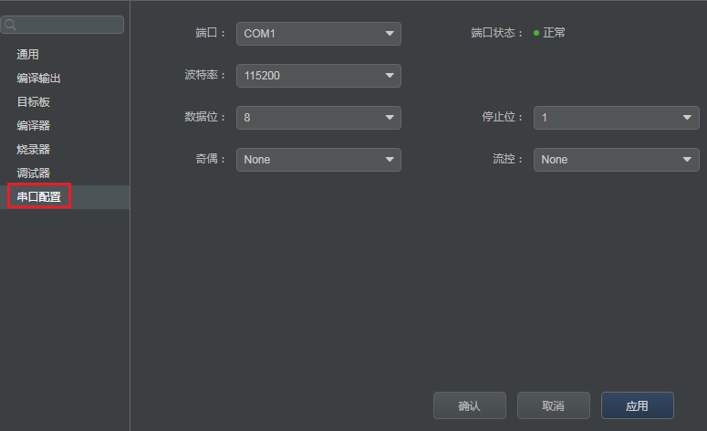

    4.  单击“确认”，保存配置。

3.  烧录。
    1.  单击工具栏中的，将已编译的程序烧录至开发板。

        

    2.  单击烧录后，当显示如下信息时，自动重启开发板 。

        

        烧录进程如下：

        通过Uboot擦除加载操作系统的对应flash地址的内容，擦除完成后通过jlink将新的系统文件加载至开发板内存。

        

        再通过Uboot将已加载至内存中的系统写入flash。

        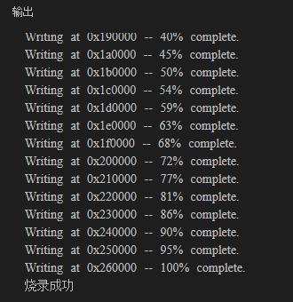

        弹出“烧录成功”提示，则程序烧录成功。

        


4.  调试。

    > **说明：**   
    >调试华为海思3516Cv300工程前，请确认输出的编译文件为vs\_server.elf文件。  

    烧录成功后，单击开始调试。

    

    调试界面如下图所示：

    


<h2 id="LiteOS-Studio使用.md">LiteOS Studio使用</h2>

-   **[了解界面](#了解界面.md)**  

-   **[了解工具栏](#了解工具栏.md)**  

-   **[代码编辑](#代码编辑.md)**  

-   **[打开调试面板](#打开调试面板.md)**  

-   **[断点控制](#断点控制.md)**  

-   **[打开控制台输出](#打开控制台输出.md)**  

-   **[工程管理](#工程管理.md)**  

-   **[编译](#编译.md)**  

-   **[烧录](#烧录.md)**  

-   **[调试](#调试.md)**  

-   **[Trace](#Trace.md)**  


<h2 id="了解界面.md">了解界面</h2>

LiteOS Studio界面构成如下：

-   区域1：编辑、Trace入口。
-   区域2：工程树，由项目工程文件构成，可进行快速新建及打开文件等操作。
-   区域3：调试工具栏，可进行编译、烧录、调试等操作。
-   区域4：代码编辑区。
-   区域5：调试面板。
-   区域6：单击  可打开或关闭区域2（工程树），单击 可打开或关闭区域5（调试面板）。
-   区域7：反汇编开关，打开或关闭反汇编文件。

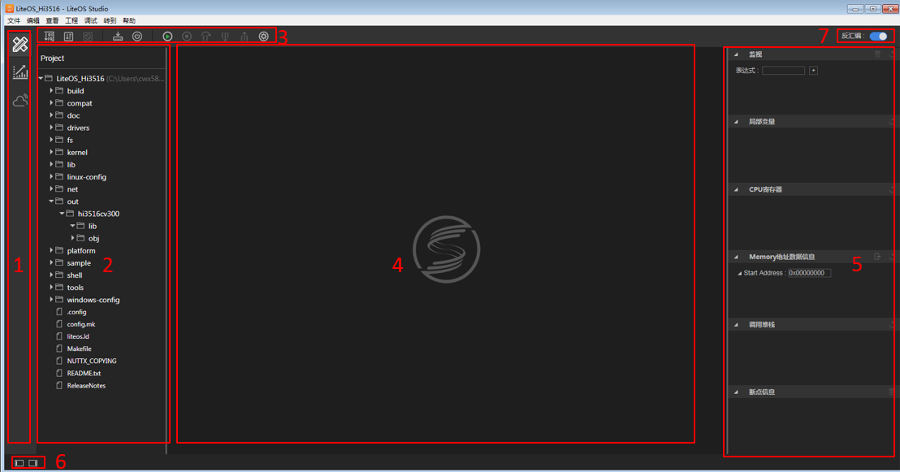

<h2 id="了解工具栏.md">了解工具栏</h2>

## 编译<a name="section35315690143844"></a>

单击（编译），对当前打开工程进行编译。


## 重新编译<a name="section6299166918945"></a>

单击（重新编译），删除上一次编译生成的文件，再次执行编译。


## 停止编译<a name="section3127823618945"></a>

单击（停止编译），停止正在进行的编译。


## 烧录<a name="section4383607018503"></a>

单击（烧录），将程序烧录至开发板。


## 重启开发板<a name="section7402308174749"></a>

单击，重启开发板。


## 开始调试<a name="section2919710175358"></a>

单击启动调试，可启动或继续运行代码调试。


## 停止调试<a name="section303511241805"></a>

单击后停止调试。调试终止，调试信息清空（断点信息保留）。

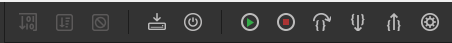

## 下一步<a name="section2798997418534"></a>

单击（下一步）跳过当前代码行，执行到下一有效代码行。


## 跳入<a name="section274508271860"></a>

单击（跳入），单步执行代码。


## 跳出<a name="section2738310518640"></a>

单击（跳出）跳出当前所在函数内部，跳至函数出口下一行代码。


## 工程配置<a name="section4662883518534"></a>

单击，打开“工程配置”界面。


<h2 id="代码编辑.md">代码编辑</h2>

-   **[智能提示/自动补齐](#智能提示-自动补齐.md)**  

-   **[符号跟踪](#符号跟踪.md)**  

-   **[格式自动对齐](#格式自动对齐.md)**  

-   **[视图单步前进/后退](#视图单步前进-后退.md)**  

-   **[全局搜索](#全局搜索.md)**  

-   **[当前文件代码查找/替换](#当前文件代码查找-替换.md)**  

-   **[文件搜索](#文件搜索.md)**  


<h2 id="智能提示-自动补齐.md">智能提示/自动补齐</h2>

-   输入关键字或作用域里的属性及方法，即可触发智能提示，选择其中一项，补全代码。支持代码模糊匹配。

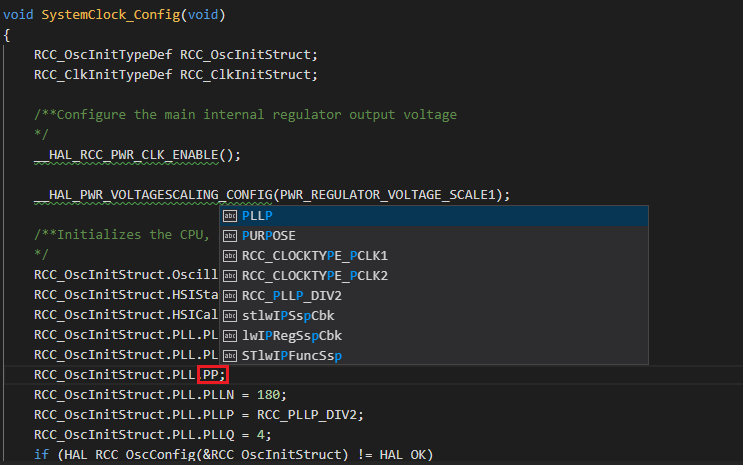

-   在代码编辑区输入“.”，即可触发智能提示，选择其中一项，补全代码。

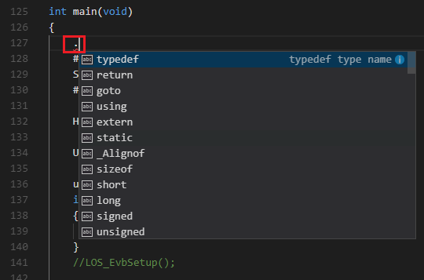

<h2 id="符号跟踪.md">符号跟踪</h2>

-   当鼠标移到某个属性或者方法上时，当前获取焦点的元素高亮显示，悬停几秒后，显示属性的类型或者方法的入参及出参。
-   当鼠标移到某个属性或者方法上时，如有可跳转的属性或方法，按快捷键Ctrl出现下划线，同时单击鼠标左键跳转到属性或方法定义的地方。

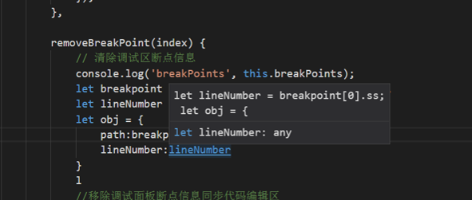

-   当鼠标移到某个属性或者方法上时，选择右键菜单“转到定义”，可以跳转到属性或方法定义的地方。

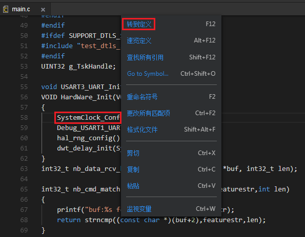

<h2 id="格式自动对齐.md">格式自动对齐</h2>

-   在代码编辑区，单击右键选择“格式化文件”，或按快捷键“Shit+Alt+F”对整个文件进行代码格式化。

    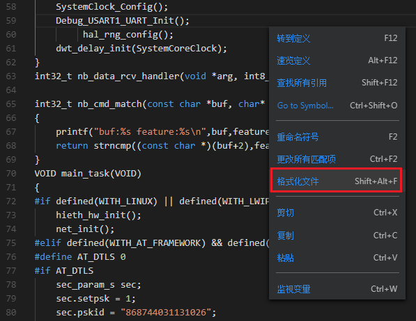

-   选中需要格式化的代码，单击右键选择“格式化选定代码”或先按快捷键“Ctrl+K”再按“Ctrl+F”，源码格式可自动对齐。

    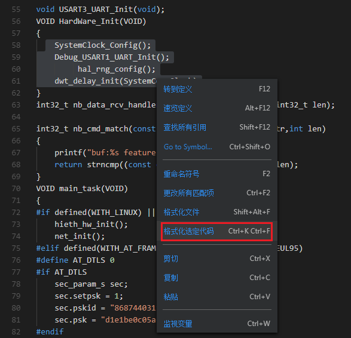


<h2 id="视图单步前进-后退.md">视图单步前进/后退</h2>

在当前视图下，使用快捷键Alt + left快速回到上一次光标放置处，使用快捷键Alt + right快速回到下一次光标放置处。若有多个视图，在多个视图间切换。

> **说明：**   
>您可以单击菜单栏中的“转到”，选择“后退”回到上一次光标放置处，选择“前进”回到下一次光标放置处。  

<h2 id="全局搜索.md">全局搜索</h2>

## 操作步骤<a name="section163221052193913"></a>

1.  在当前打开的工程下，单击菜单栏中的“查看\>搜索”（或按"Ctrl+Shift+F"快捷键），打开全局搜索框。

    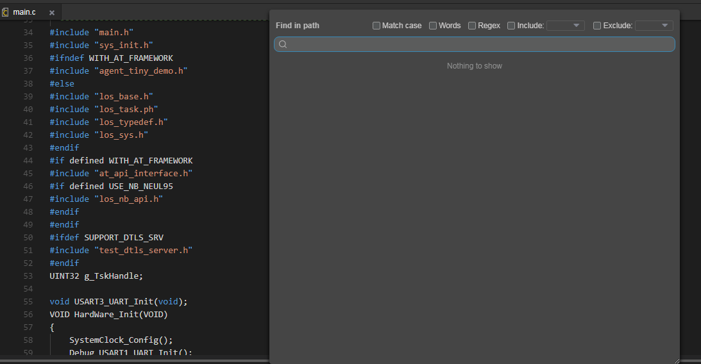

2.  在搜索框中输入需要查找的字符串或正则表达式，搜索结果实时显示。

    > **说明：**   
    >可勾选搜索框上方复选框进行条件搜索：  
    >-   勾选“Match case”后，搜索关键字区分大小写，搜索出的结果按关键字模糊匹配。  
    >-   勾选“Words”后，搜索关键字完全匹配，搜索出的结果按关键字精确匹配。  
    >-   勾选“Regex”后，搜索关键字对应的正则表达式。  
    >-   勾选“Include”后，在下拉框中选择搜索的文件类型。  
    >-   勾选“Exclude”后，在下拉框中选择搜索需去除的文件类型。  

3.  单击搜索的结果，在下方的方框中显示搜索结果的前后文，双击搜索结果，打开对应的文件并定位到关键字所在行。

    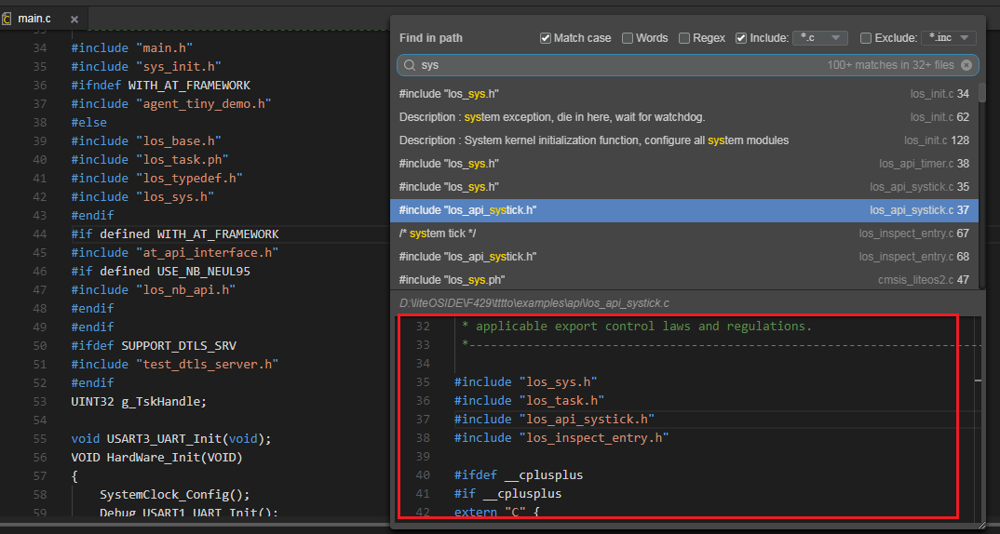


<h2 id="当前文件代码查找-替换.md">当前文件代码查找/替换</h2>

在当前打开的文件下，单击Ctrl+F快捷键，在右上角搜索框中输入要搜索的内容，相应内容将高亮显示。

> **说明：**   
>可单击搜索框右侧图标进行条件搜索：  
>-   选中后，搜索关键字区分大小写，搜索出的结果按关键字模糊匹配。  
>-   选中后，搜索关键字完全匹配，搜索出的结果按关键字精确匹配。  
>-   选中后，搜索关键字对应的正则表达式。  

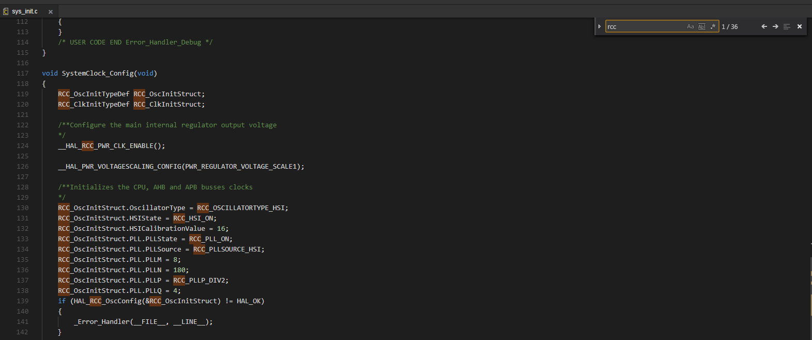

单击搜索框左边的切换为替换模式，填入替换后的内容，选择替换或全部替换。

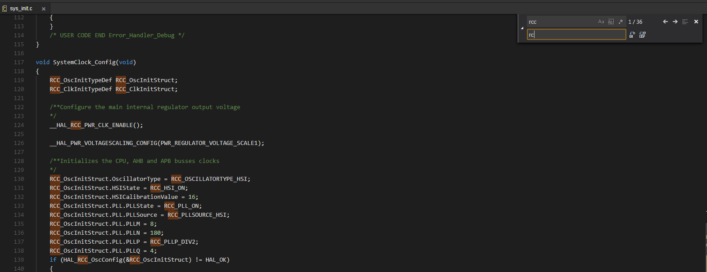

<h2 id="文件搜索.md">文件搜索</h2>

在当前打开的工程下，单击Ctrl+P快捷键（或单击菜单栏中的“转到\>文件”），在界面上方弹出文件搜索框。


在搜索框中输入需要搜索的文件名，下拉框中实时显示搜索的结果，搜索结果按关键字模糊匹配。单击文件名，打开对应的文件。

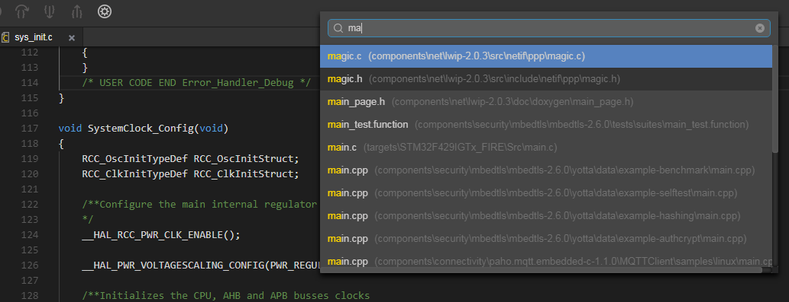

<h2 id="打开调试面板.md">打开调试面板</h2>

在调试状态下，您可以打开调试面板查看调试程序的“监视”、“局部变量”、“CPU寄存器”、“Memory地址数据信息”、“调用堆栈”及“断点信息”。

## 操作步骤<a name="section60555928181335"></a>

方式一：单击菜单栏中的“查看\>调试面板”。

方式二：单击左下角，打开调试面板。

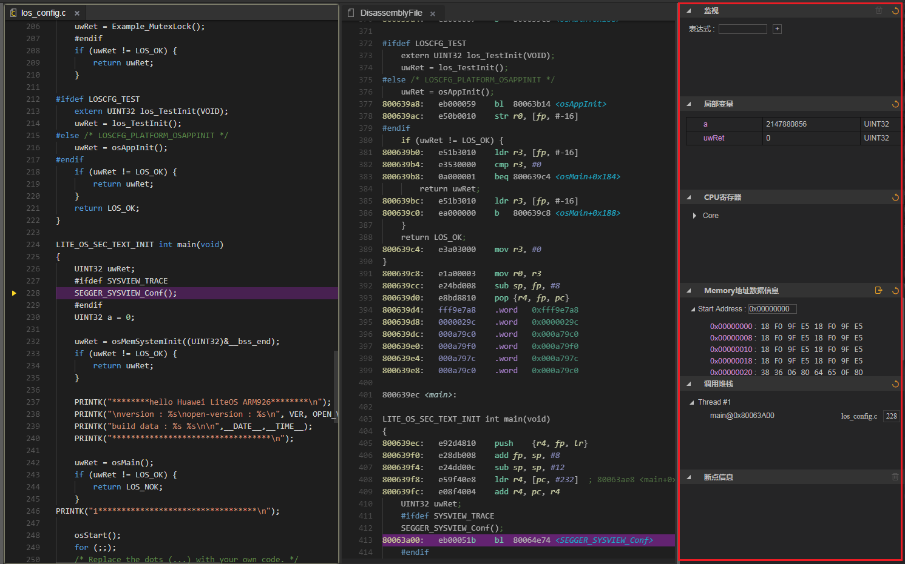

<h2 id="断点控制.md">断点控制</h2>

## 背景信息<a name="section51535016185350"></a>

-   LiteOS Studio会自动保存已有断点，关闭LiteOS Studio后再打开断点信息依然存在。
-   调试运行时，程序经过有效断点处会停止。
-   中断时对应代码行自动定位，且当前代码行高亮显示。

    > **说明：**   
    >-   无效代码场景包括宏定义、空行、括号、注释。  
    >-   程序执行至无效代码处断点时，将跳过无效代码，停止在下一个有效断点处。  
    >-   点击断点，源码和反汇编文件会跳转到对应的行并高亮显示。  


-   **[新增断点](#新增断点.md)**  

-   **[新增条件断点](#新增条件断点.md)**  

-   **[编辑断点](#编辑断点.md)**  

-   **[删除断点](#删除断点.md)**  

-   **[禁用断点](#禁用断点.md)**  


<h2 id="新增断点.md">新增断点</h2>

在代码编辑区左侧单击增加断点，或单击右键选择“添加断点”。

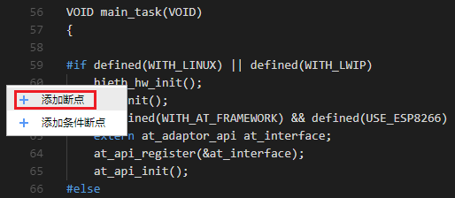

新增断点后，图标如下所示：

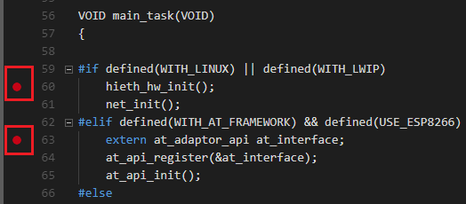

<h2 id="新增条件断点.md">新增条件断点</h2>

## 操作步骤<a name="section21775523164046"></a>

1.  在代码编辑区左侧单击右键选择“添加条件断点”。

    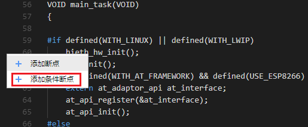

2.  在弹出的页面中，编辑条件断点。
    -   勾选“断点忽略次数”单选框，根据需要设置断点忽略次数。断点忽略次数可以查看某段代码执行特定次数后的堆栈信息。
    -   勾选“在表达式计算结果为true时中断”单选框，在文本框中自定义表达式，让断点在满足用户设定条件的情况下停止。

        如表达式为a\>b，当程序中此断点表达式结果为true时，执行中断，结果为false时，忽略此断点。

        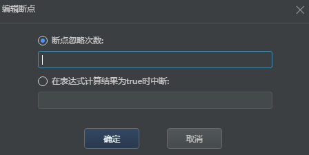


3.  单击“确定”，添加条件断点。鼠标悬停在条件断点处，显示相关条件信息。

    新增条件断点后，图标如下所示：

    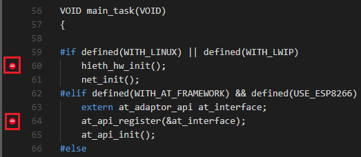


<h2 id="编辑断点.md">编辑断点</h2>

在代码编辑区，右键单击断点处，选择“编辑断点”。

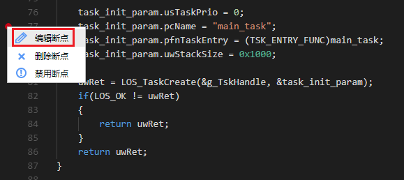

在弹出的页面中，进行编辑断点。

> **说明：**   
>普通断点可通过编辑断点，修改为条件断点。  


<h2 id="删除断点.md">删除断点</h2>

-   代码编辑区：单击断点处可删除断点，或右键单击断点处，选择“删除断点”。

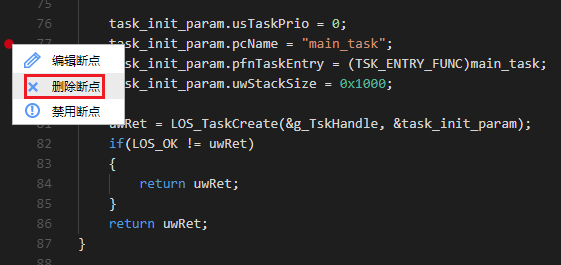

-   调试面板：在“断点信息”区域，单击可删除全部断点，单击可删除对应断点。

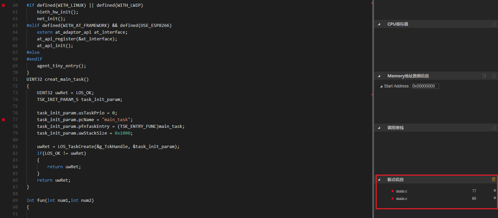

<h2 id="禁用断点.md">禁用断点</h2>

-   代码编辑区：右键单击断点处，选择“禁用断点”，断点置灰并禁用此断点。


-   禁用断点后，右键单击此断点处，选择“启用断点”，可重新启用断点。

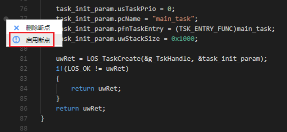

<h2 id="打开控制台输出.md">打开控制台输出</h2>

LiteOS Studio在使用过程中，用户可通过控制台查看程序和系统运行状态，提高开发效率。

控制台输出面板显示如下信息：

-   JLink程序烧录过程中的信息输出至控制台显示。
-   开发板连接或者重启的信息输出至控制台显示。
-   增加或删除断点的信息显示。
-   编译的信息显示。
-   修改监视的变量值、局部变量值、CPU寄存器值及Memory地址信息显示。
-   导出Memory地址数据信息显示。

## 操作步骤<a name="section35404354182831"></a>

在当前打开的工程下，单击菜单栏中的“查看\>控制台输出”，即可打开控制台输出面板。

如下图所示：


-   单击控制台面板右上角的，可清除控制台输出的日志信息。
-   单击控制台面板右上角的，可锁定当前输出的日志信息位置。

    单击可解除锁定状态，有新日志产生时，会自动滚动到最末尾位置。

-   单击控制台面板右上角的，可关闭控制台。

<h2 id="工程管理.md">工程管理</h2>

-   **[新建工程](#新建工程.md)**  

-   **[打开工程](#打开工程.md)**  

-   **[导入工程](#导入工程.md)**  


<h2 id="新建工程.md">新建工程</h2>

-   **[操作步骤](#操作步骤.md)**  

-   **[目录文件介绍](#目录文件介绍.md)**  


<h2 id="操作步骤.md">操作步骤</h2>

1.  打开LiteOS Studio，在弹出的界面中单击“创建LiteOS Studio工程”。
2.  配置“LiteOS SDK版本”。
    -   如未配置SDK路径，单击“SDK管理”，配置SDK路径。具体操作请参见[配置SDK路径](#配置SDK路径.md)章节。

        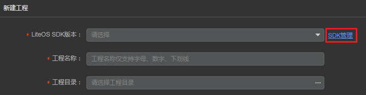

    -   如已配置SDK路径，单击“LiteOS SDK版本”的下拉框，选择已配置的SDK路径。

        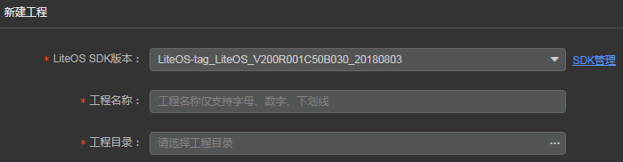


3.  自定义工程名称，项目名称仅支持字母、数字及下划线。
4.  单击“工程目录”的按钮，选择工程根目录。

    > **说明：**   
    >工程目录不支持中文字符。  

5.  （可选）设置开发环境。具体请参见[配置开发环境](#配置开发环境.md)章节。
6.  设置完成后，单击“下一步”。

    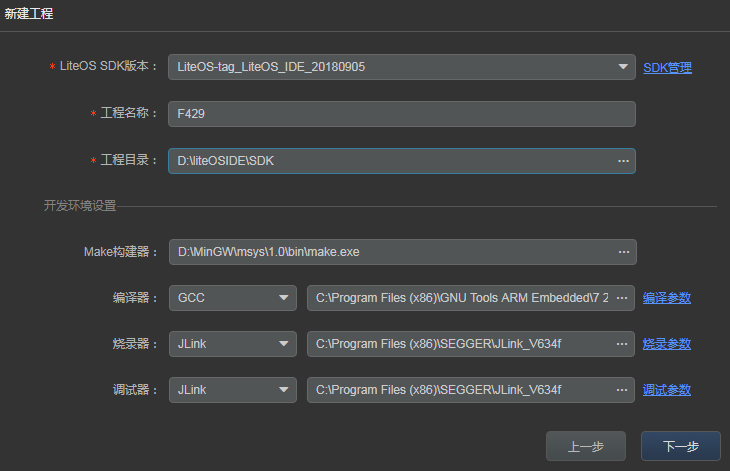

7.  在“基于Demo工程”页签下，勾选对应的开发板。

    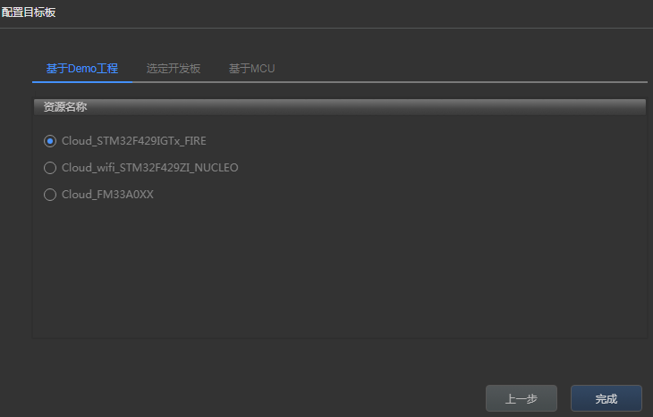

8.  单击“完成”，完成新建工程。

<h2 id="目录文件介绍.md">目录文件介绍</h2>

工程初始化成功后，会在工程目录下生成标准化结构项目：  

|——arch   存放与硬件架构相关的汇编文件，通常每个核心会有对应三种编译器的

汇编文件，支持GCC，IAR，KEIL 

|——components   存放项目支持的组件源码

|——doc   LiteOS系统的说明文档

|——drivers   驱动源码文件夹

|——examples   LiteOS系统的样例代码，包括系统内核的主要功能的应用示例 

|——kernel   LiteOS系统的内核源码

|——targets   LiteOS当前选择的目标板相关的源码

|——thirdparty     LiteOS支持的第三方组件的源码 

|——LICENSE   授权信息文件

|——Makefile    用于编译当前工程，可手动修改，以添加或减少参与编译的源文件

|——README.md   关于LiteOS的简要说明

<h2 id="打开工程.md">打开工程</h2>

## 操作步骤<a name="section56711872151532"></a>

打开LiteOS Studio，在弹出的界面中单击“打开LiteOS Studio工程”，或在右边区域单击最近打开的工程名，打开工程。如下所示：

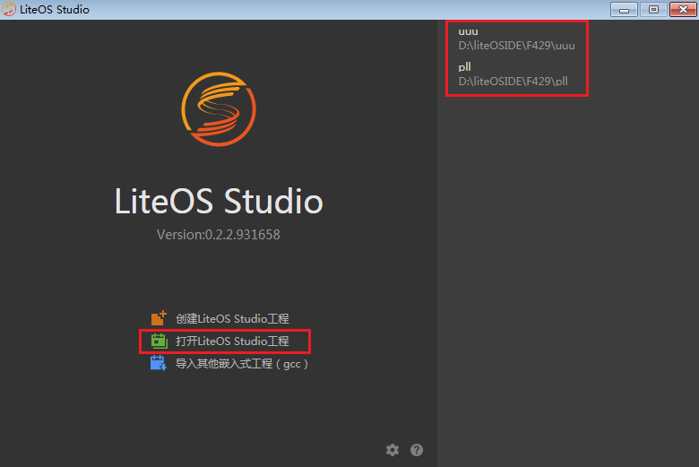

-   若打开的工程为LiteOS Studio工程，进入LiteOS Studio主界面。
-   若打开的工程为非LiteOS Studio工程，弹出如下提示弹框。

    

    -   单击“是”，进入“导入”界面，请先执行导入操作，具体操作请参见[导入工程](#导入工程.md)章节。
    -   单击“取消”，取消打开工程。


## 后续操作<a name="section39622161144654"></a>

进入LiteOS Studio主界面后，如需打开其他工程，需先关闭当前工程，请单击菜单栏中的“工程\>关闭工程”。

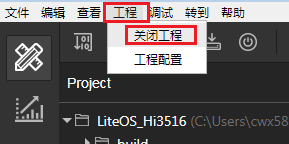

<h2 id="导入工程.md">导入工程</h2>

## 操作步骤<a name="section36577642104552"></a>

1.  打开LiteOS Studio，在弹出的界面中单击“导入其他嵌入式工程（gcc）”。
2.  弹出“导入”界面，请根据[表1](#table4865073911456)所示，配置参数，如下图所示。

    

    **表 1**  导入工程配置参数

    <a name="table4865073911456"></a>
    <table><thead align="left"><tr id="row2379296611456"><th class="cellrowborder" valign="top" width="33.33333333333333%" id="mcps1.2.4.1.1"><p id="p577090151151"><a name="p577090151151"></a><a name="p577090151151"></a>参数名称</p>
    </th>
    <th class="cellrowborder" valign="top" width="33.33333333333333%" id="mcps1.2.4.1.2"><p id="p2681851411456"><a name="p2681851411456"></a><a name="p2681851411456"></a>值</p>
    </th>
    <th class="cellrowborder" valign="top" width="33.33333333333333%" id="mcps1.2.4.1.3"><p id="p2481606311456"><a name="p2481606311456"></a><a name="p2481606311456"></a>备注</p>
    </th>
    </tr>
    </thead>
    <tbody><tr id="row2201797811456"><td class="cellrowborder" valign="top" width="33.33333333333333%" headers="mcps1.2.4.1.1 "><p id="p3862577411456"><a name="p3862577411456"></a><a name="p3862577411456"></a>工程类型</p>
    </td>
    <td class="cellrowborder" valign="top" width="33.33333333333333%" headers="mcps1.2.4.1.2 "><p id="p4167998311456"><a name="p4167998311456"></a><a name="p4167998311456"></a>GCC</p>
    </td>
    <td class="cellrowborder" valign="top" width="33.33333333333333%" headers="mcps1.2.4.1.3 "><p id="p2063542811456"><a name="p2063542811456"></a><a name="p2063542811456"></a>固定值</p>
    </td>
    </tr>
    <tr id="row5150112511456"><td class="cellrowborder" valign="top" width="33.33333333333333%" headers="mcps1.2.4.1.1 "><p id="p1084163611456"><a name="p1084163611456"></a><a name="p1084163611456"></a>Makefile文件</p>
    </td>
    <td class="cellrowborder" valign="top" width="33.33333333333333%" headers="mcps1.2.4.1.2 "><p id="p575735611456"><a name="p575735611456"></a><a name="p575735611456"></a>当前工程下的主Makefile</p>
    </td>
    <td class="cellrowborder" valign="top" width="33.33333333333333%" headers="mcps1.2.4.1.3 ">&nbsp;&nbsp;</td>
    </tr>
    <tr id="row3636317311456"><td class="cellrowborder" valign="top" width="33.33333333333333%" headers="mcps1.2.4.1.1 "><p id="p5973592911456"><a name="p5973592911456"></a><a name="p5973592911456"></a>工程目录</p>
    </td>
    <td class="cellrowborder" valign="top" width="33.33333333333333%" headers="mcps1.2.4.1.2 "><p id="p677208111456"><a name="p677208111456"></a><a name="p677208111456"></a>需要导入的工程根目录</p>
    </td>
    <td class="cellrowborder" valign="top" width="33.33333333333333%" headers="mcps1.2.4.1.3 "><p id="p1166770211456"><a name="p1166770211456"></a><a name="p1166770211456"></a>请根据实际情况选择需要导入的工程根目录</p>
    </td>
    </tr>
    <tr id="row3790045611456"><td class="cellrowborder" valign="top" width="33.33333333333333%" headers="mcps1.2.4.1.1 "><p id="p5003812311456"><a name="p5003812311456"></a><a name="p5003812311456"></a>芯片型号</p>
    </td>
    <td class="cellrowborder" valign="top" width="33.33333333333333%" headers="mcps1.2.4.1.2 "><p id="p5391647216315"><a name="p5391647216315"></a><a name="p5391647216315"></a>默认值：Hi3516C</p>
    </td>
    <td class="cellrowborder" valign="top" width="33.33333333333333%" headers="mcps1.2.4.1.3 "><p id="p356386511456"><a name="p356386511456"></a><a name="p356386511456"></a>请根据实际情况选择开发板芯片型号。</p>
    <a name="ul20184785163058"></a><a name="ul20184785163058"></a><ul id="ul20184785163058"><li>Hi3516C</li><li>STM32F429IG</li><li>FM33A04xx</li></ul>
    </td>
    </tr>
    <tr id="row3207478911456"><td class="cellrowborder" valign="top" width="33.33333333333333%" headers="mcps1.2.4.1.1 "><p id="p4792115311456"><a name="p4792115311456"></a><a name="p4792115311456"></a>工程名称</p>
    </td>
    <td class="cellrowborder" valign="top" width="33.33333333333333%" headers="mcps1.2.4.1.2 "><p id="p5640815211456"><a name="p5640815211456"></a><a name="p5640815211456"></a>自定义</p>
    </td>
    <td class="cellrowborder" valign="top" width="33.33333333333333%" headers="mcps1.2.4.1.3 "><p id="p565762011456"><a name="p565762011456"></a><a name="p565762011456"></a>工程名称仅支持字母、数字、下划线</p>
    </td>
    </tr>
    </tbody>
    </table>

3.  配置完成后，单击“下一步”。
4.  （可选）设置开发环境。具体请参见[配置开发环境](#配置开发环境.md)章节。

    

5.  单击“完成”，完成导入工程。

<h2 id="编译.md">编译</h2>

本LiteOS Studio支持在Windows系统中进行编译、烧录和调试，也支持在Linux系统中编译，并对在Linux系统中编译出来的系统镜像二进制文件在Windows系统中进行烧录和调试。

-   **[编译（Windows）](#编译（Windows）.md)**  

-   **[编译（Linux）](#编译（Linux）.md)**  


<h2 id="编译（Windows）.md">编译（Windows）</h2>

暂不支持在Windows系统中对华为海思芯片工程进行编译。

## 操作步骤<a name="section2707255114519"></a>

1.  打开需要进行编译的工程，单击工具栏的，进行工程配置。具体操作请参见[配置工程](#配置工程.md)章节，若已完成配置，请忽略此步骤。
2.  单击工具栏中的，对当前工程进行编译，或者单击重新编译，删除上一次编译生成的文件，再次执行编译。

    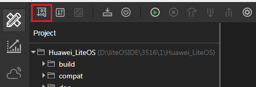

    编译成功后，在控制台输出面板中显示“编译成功”。

    


<h2 id="编译（Linux）.md">编译（Linux）</h2>

## 前提条件<a name="section55094960182023"></a>

已在Linux环境下搭建开发环境。具体请参见[如何在Linux系统下搭建开发环境](#如何在Linux系统下搭建开发环境.md)章节。

## 操作步骤<a name="section42766100192530"></a>

1.  打开MobaXterm工具，单击已连接的Linux云主机地址，如下图：

    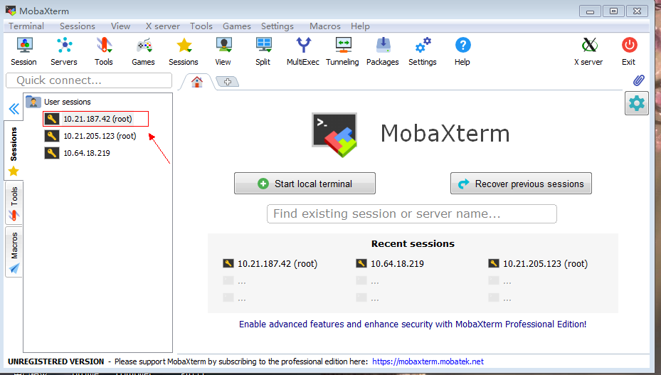

    进入Linux云主机后，如下图所示：

    

2.  将项目源码包拖入root根目录下。

    

3.  执行以下命令，解压项目源码压缩包。

    **unzip Huawei\_LiteOS.zip**

    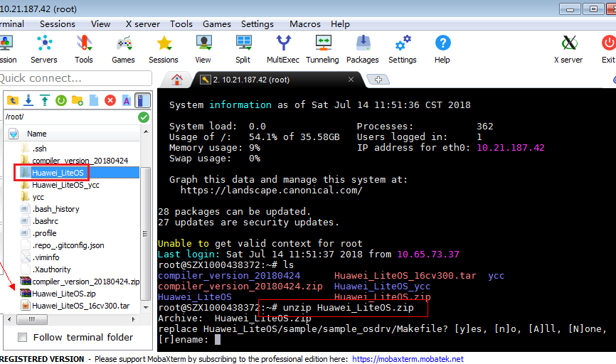

4.  执行以下命令，进入Huawei\_LiteOS文件夹。

    **cd Huawei\_LiteOS**

    

5.  修改.config文件。

    > **说明：**   
    >默认生成的ELF文件\(vs\_server\)所附带的调试信息很少，要生成带更多调试信息的ELF文件需要配置Huawei\_LiteOS目录下的.config文件中的LOSCFG\_COMPILE\_DEBUG。  

    1.  执行以下命令，编辑.config文件。

        **vi  .config**

    2.  如图中区域所示，添加如下信息。

        LOSCFG\_COMPILE\_DEBUG = y

        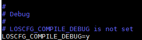

    3.  按“Esc”，然后输入“:wq!”后按“Enter”，保存并退出编辑器。

6.  在Makefile目录执行make命令，进行编译。

    **make**

    

    编译后生成vs\_server，vs\_server.bin及vs\_server.asm文件，如下所示：

    

7.  单击“Download”下载编译后的文件到Windows系统中。

    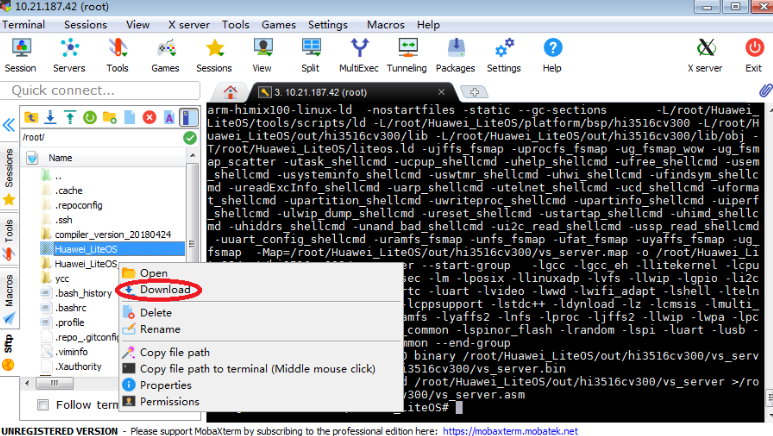


<h2 id="烧录.md">烧录</h2>

## 前提条件<a name="section41874146165516"></a>

-   需要进行烧录的工程已进行编译。具体操作请参见[编译](#编译.md)章节。
-   需要进行烧录的工程已完成工程配置。具体操作请参见[配置工程](#配置工程.md)章节。

## 操作步骤<a name="section44957959103456"></a>

1.  将开发板与电脑连接。

    > **说明：**   
    >若为华为海思芯片开发板，请先连接开发板电源，再将开发板与JLink仿真器连接。  

2.  单击工具栏中的，将程序烧录至开发板。

    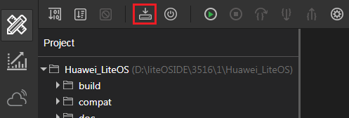

    -   第三方芯片（非华为海思芯片）

    弹出JLink的“使用协议”，单击接受JLink插件要求，开始烧录程序 。

    弹出“烧录成功”提示，则程序烧录成功。

    

    -   华为海思芯片

    单击烧录后，当显示如下信息时，自动重启开发板 。

    

    烧录进程如下：

    通过Uboot擦除加载操作系统的对应flash地址的内容，擦除完成后通过jlink将新的系统文件加载至开发板内存。

    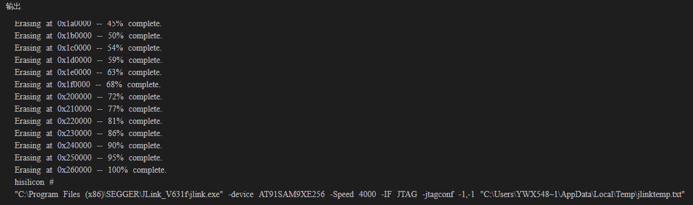

    再通过Uboot将已加载至内存中的系统写入flash。

    

    弹出“烧录成功”提示，则程序烧录成功。

    


<h2 id="调试.md">调试</h2>

## 前提条件<a name="section41874146165516"></a>

已烧录程序至开发板。具体操作请参见[烧录](#烧录.md)章节。

## 操作步骤<a name="section64246654185720"></a>

1.  将开发板与电脑连接。

    > **说明：**   
    >若为华为海思芯片开发板，请先连接开发板电源，再将开发板与JLink仿真器连接。  

2.  在打开的与开发板对应的工程中，单击开始调试。

    > **说明：**   
    >-   调试华为海思3516Cv300工程前，请确认输出的编译文件为vs\_server.elf文件。  
    >-   默认调试方式为复位调试，如需要切换调试方式，单击工具栏的打开工程配置，在“调试器”界面，修改“调试配置”。  

    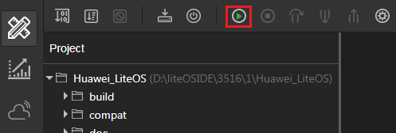

    调试界面如下图所示：

    

    -   可在下方控制台输出面板中查看调试日志信息。
    -   在右侧调试面板中查看局部变量、CPU寄存器信息、调用堆栈及断点等信息。


-   **[变量监视](#变量监视.md)**  

-   **[变量修改](#变量修改.md)**  

-   **[导出Memory地址数据](#导出Memory地址数据.md)**  

-   **[反汇编调试](#反汇编调试.md)**  


<h2 id="变量监视.md">变量监视</h2>

-   启动调试后，在“变量”文本框中填入需要查找的变量名称，单击“Enter”或文本框右边的“+”，在下方显示变量值。若值为“undefined”，表示此变量未定义。

    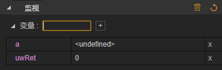


-   启动调试后，在打开的文件中，右键单击需要监视的变量，选择“监视变量”，将此变量添加到“监视”中。

    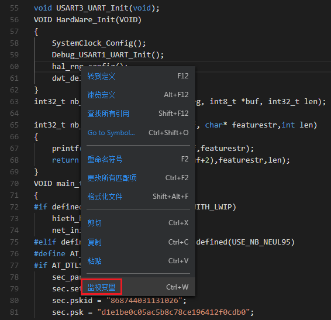


<h2 id="变量修改.md">变量修改</h2>

启动调试后，可对变量值、CPU寄存器的值、Memory地址数据进行修改。

## 修改变量值<a name="section66636748171517"></a>

在“监视”区域，双击文本框修改对应变量的值（输入的数值默认为十进制），单击“Enter”完成修改。修改后，值为红色。

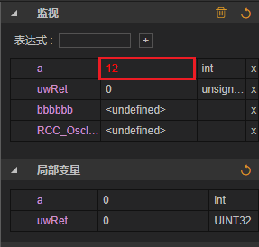

单击“局部变量”的刷新按钮，刷新数据后展示。

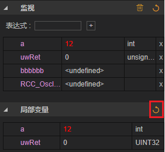

## 修改CPU寄存器值<a name="section47683118171526"></a>

在“CPU寄存器”区域，双击文本框修改对应寄存器的值，单击“Enter”完成修改。修改后，值为红色。

修改寄存器值规则如下：

-   输入以0x开头的数值，识别为十六进制数。
-   输入以非0x开头的数值，识别为十进制，单击“Enter”转换为以0x开头的十六进制数值。
-   若输入错误的值，单击“Enter”显示为修改前的值，修改无效。
-   若输入的值超过0xFFFFFFFF，显示为0xFFFFFFFF。

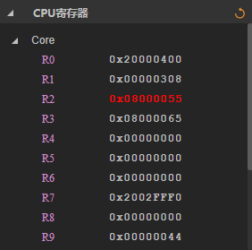

## 修改Memory地址数据<a name="section6374116717209"></a>

在“Memory地址数据信息”区域，双击文本框修改对应Memory地址数据，单击“Enter”完成修改。修改后，值为红色。

修改Memory地址数据规则如下：

-   输入两位数时，识别为十六进制数。
-   输入三位数时，识别为十进制数，单击“Enter”后转换为十六进制数。
-   当输入的数值≥256时，单击“Enter”转换为FF。

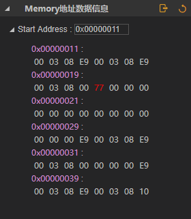

<h2 id="导出Memory地址数据.md">导出Memory地址数据</h2>

## 操作步骤<a name="section21726765185443"></a>

1.  调试状态下，在“Memory地址数据信息”区域，单击，导出Memory地址数据。

    

2.  在弹出的“导出内存数据”界面中填入“起始地址”及“地址范围”。地址范围最大值为10240。

    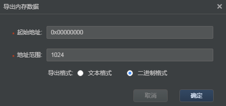

3.  根据需要选择导出格式，勾选“文本格式”或“二进制格式”单选框。
4.  单击“确定”。
5.  选择导出的文件保存路径。
6.  单击“保存”，保存导出的Memory地址数据。

<h2 id="反汇编调试.md">反汇编调试</h2>

## 前提条件<a name="section24532896164421"></a>

当前工程处于调试模式下，才能进行反汇编调试。

## 背景信息<a name="section1278822310416"></a>

反汇编调试，可以查看源代码对应的汇编代码，从更底层，更本质的角度去分析代码的漏洞和性能瓶颈。

## 操作步骤<a name="section5520492104257"></a>

打开右上角的反汇编开关。


在调试模式下，打开的反汇编文件如下图所示：

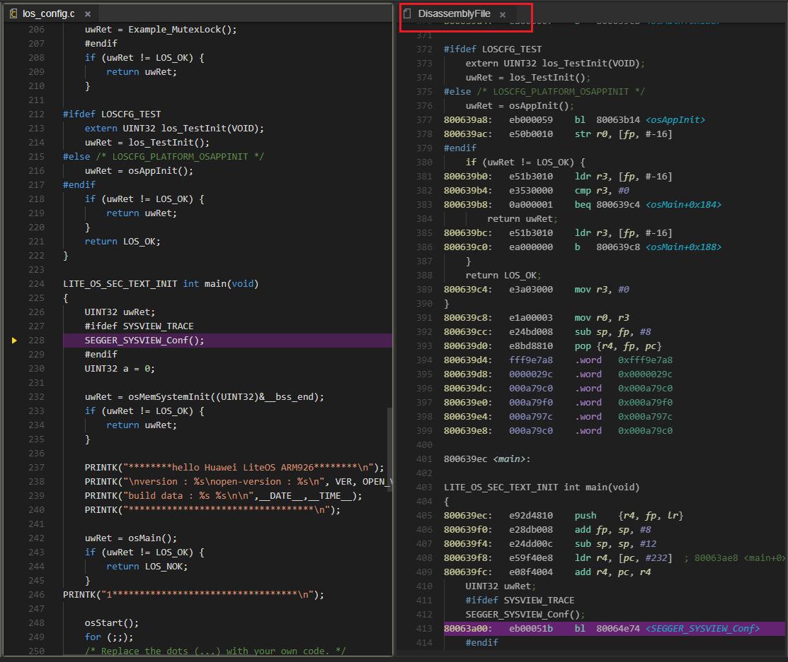

-   调试源代码的断点时，会跳转到汇编代码对应的行数。
-   调试模式下查看源代码时，会跳转到汇编代码对应的行数。
-   调试模式下查看汇编代码时，会跳转到源代码对应的行数。
-   调试模式下，可对反汇编文件进行添加、禁用断点，执行下一步、跳入、跳出、继续调试等操作。

<h2 id="Trace.md">Trace</h2>

## 前提条件<a name="section31146769103144"></a>

使用Trace功能前，需进行Trace埋点。具体请参见[如何进行Trace埋点](#如何进行Trace埋点.md)章节。

## 背景信息<a name="section54135152164630"></a>

Trace具体介绍请参见[Trace介绍](#Trace介绍.md)章节。

-   **[操作步骤](#操作步骤-0.md)**  

-   **[内存跟踪](#内存跟踪.md)**  


<h2 id="操作步骤-0.md">操作步骤</h2>

1.  将开发板与电脑连接。
2.  打开任一工程，在LiteOS Studio应用中单击（Trace）。

    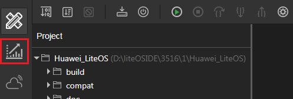

3.  单击开始跟踪开发板的Trace数据。

    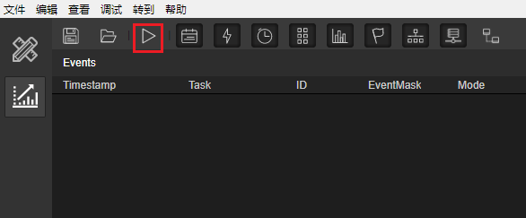

    如下图所示，您可以查看“Events”、“Interrupts”、“Timer”、“Queue”、“Timeline”、“Task Details”、“Semaphore”、“Mutex”及“Task Stack”数据。

    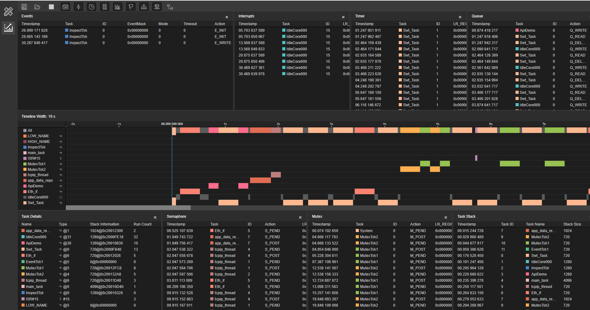


<h2 id="内存跟踪.md">内存跟踪</h2>

## 前提条件<a name="section5854030894348"></a>

已启动Trace功能。具体请参见[Trace](#Trace.md)中的[操作步骤](#操作步骤-0.md)章节。

## 背景信息<a name="section192918569425"></a>

-   在系统运行过程中，内存管理模块通过对内存的申请/释放操作，来管理用户和OS对内存的使用，使内存的利用率和使用效率达到最优，同时最大限度地解决系统的内存碎片问题。

-   图形化跟踪动态内存和静态内存的使用情况，帮助开发者定位并解决内存问题（踩内存）。

## 操作步骤<a name="section18230594316"></a>

在Trace页面中，单击工具栏的（Memory Track）进行内存跟踪。

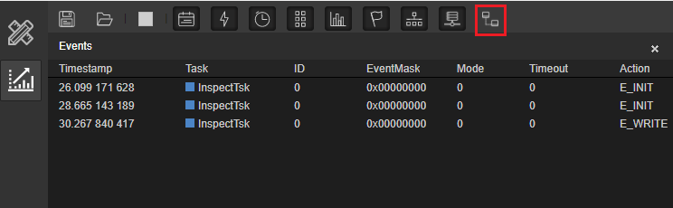

如下图所示：

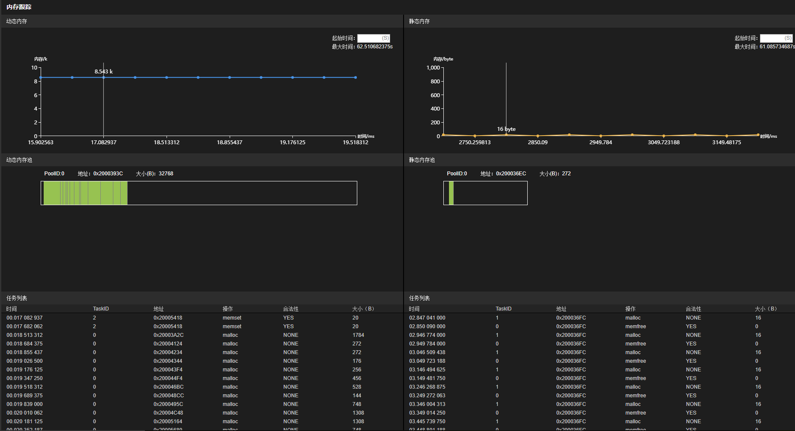

## 内存跟踪页面<a name="section6023014495823"></a>

-   展示从Trace开始时到点击查看内存跟踪页面的时间为止的内存使用情况。

-   内存跟踪页面分三块内容显示：
    -   内存大小与执行时间关系图（左边动态内存，右边静态内存）。
    -   内存池（展示同一时间点内的内存使用情况）。
    -   任务列表（展示这段时间内任务所占用内存的使用情况）。


## 动态内存/静态内存<a name="section4099281610358"></a>

-   起始时间：
    -   默认起始时间为Trace执行开始时间。
    -   用户可以输入任意时间（单位：秒），以此时间为原点的开始时间（当时间大于时间范围时，显示最大时间数据。）。


-   关系图：
    -   纵轴为内存占用大小（单位：随内存大小变化，如：K/byte）。
    -   横轴为执行时间（单位：毫秒）。

-   曲线：
    -   在曲线展示的时间内当有“踩内存”情况出现时，则在对应的时间点用红点显示。
    -   曲线上的竖线对应于曲线上的具体时间点中的内存使用情况，拖动曲线至竖线所交叉位置，则内存池模块中会展示对应的内存使用情况。


## 内存池<a name="section196410421007"></a>

-   展示某一时刻（根据内存使用情况关系图选择）对应任务的内存使用情况。

-   内存池显示任务ID、起始地址、大小。
-   内存池含义：
    -   红色：代表踩内存情况。
    -   绿色：代表正常使用。
    -   背景色：代表当前内存没有占用。


## 任务列表<a name="section2602910510159"></a>

-   展示该时间段内的所有任务内存使用情况。
-   时间、TaskID、地址、操作、合法性、大小（B）。
-   内存操作主要有四种：malloc、memset、memcopy、memfree。
-   合法性：Yes为正常使用、No为踩内存、None为无法确认该操作合法性。

<h2 id="通用操作.md">通用操作</h2>

-   **[配置SDK路径](#配置SDK路径.md)**  

-   **[配置开发环境](#配置开发环境.md)**  

-   **[配置工程](#配置工程.md)**  


<h2 id="配置SDK路径.md">配置SDK路径</h2>

## 操作步骤<a name="section54046961141932"></a>

1.  在“LiteOS 源码包”区域，找到需要下载的LiteOS SDK版本，单击该版本旁边的“”下载按钮。

    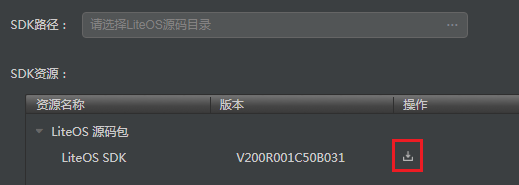

    在打开的网页中，将自动下载LiteOS源码包，打开下载后的源码包，解压缩至自定义的路径中。

    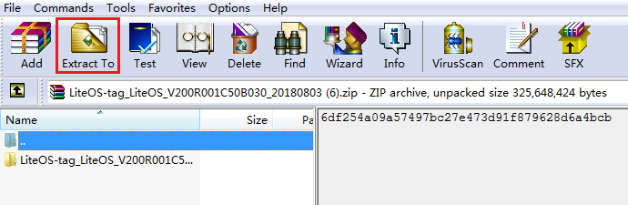

    > **说明：**   
    >自定义的路径中，不支持中文字符。  

2.  解压完成后，回到步骤1的下载界面，单击“SDK路径”的按钮，选择解压后的文件路径，为LiteOS源码目录。

    

3.  保存SDK路径配置。

<h2 id="配置开发环境.md">配置开发环境</h2>

## 操作步骤<a name="section3982231016459"></a>

1.  环境准备。如已安装如下工具，请忽略此步骤。
    1.  在“开发环境”页签下，获取MinGW、GCC及JLink开发工具安装包。

        

    2.  安装“MinGW”。
        1.  单击“MinGW”所在行的链接，获取MinGW安装包“mingw-get-setup.exe”。
        2.  双击“mingw-get-setup.exe”，依照屏幕提示，安装MinGW。


    1.  安装“GCC”。
        1.  单击“GCC”所在行的链接，获取GCC安装包“gcc-arm-none-eabi-7-2018-q2-update-win32-sha1.exe”。
        2.  双击“gcc-arm-none-eabi-7-2018-q2-update-win32-sha1.exe”，依照屏幕提示，安装GCC工具。

    2.  安装“JLink”。
        1.  单击“JLink”所在行的链接，获取JLink安装包“Link\_Windows\_V634f.exe”。
        2.  双击“JLink\_Windows\_V634f.exe”，依照屏幕提示，安装JLink。

    3.  （可选）配置环境变量。具体请参见[如何配置环境变量](#如何配置环境变量.md)章节。如未配置studio，将读取系统配置的环境变量参数，并作为Studio的默认配置。

2.  请根据[表1](#table5018758615458)说明，配置环境参数，如下图所示：

    

    **表 1**  开发环境配置

    <a name="table5018758615458"></a>
    <table><thead align="left"><tr id="row1074008015458"><th class="cellrowborder" valign="top" id="mcps1.2.5.1.1"><p id="p487362271554"><a name="p487362271554"></a><a name="p487362271554"></a>参数名称</p>
    </th>
    <th class="cellrowborder" colspan="2" valign="top" id="mcps1.2.5.1.2"><p id="p553203111554"><a name="p553203111554"></a><a name="p553203111554"></a>值</p>
    </th>
    <th class="cellrowborder" valign="top" id="mcps1.2.5.1.3"><p id="p517602361554"><a name="p517602361554"></a><a name="p517602361554"></a>备注</p>
    </th>
    </tr>
    </thead>
    <tbody><tr id="row2025529415458"><td class="cellrowborder" valign="top" headers="mcps1.2.5.1.1 "><p id="p3006612315458"><a name="p3006612315458"></a><a name="p3006612315458"></a>Make构建器</p>
    </td>
    <td class="cellrowborder" colspan="2" valign="top" headers="mcps1.2.5.1.2 "><p id="p1943691715458"><a name="p1943691715458"></a><a name="p1943691715458"></a>&lt;MinGW安装目录&gt;\MinGW\msys\1.0\bin\make.exe</p>
    </td>
    <td class="cellrowborder" valign="top" headers="mcps1.2.5.1.3 "><p id="p1877331015458"><a name="p1877331015458"></a><a name="p1877331015458"></a>MinGW安装目录以实际情况为准，如：D:\MinGW\msys\1.0\bin\make.exe</p>
    </td>
    </tr>
    <tr id="row3474206315458"><td class="cellrowborder" valign="top" width="21.58%" headers="mcps1.2.5.1.1 "><p id="p6264373615458"><a name="p6264373615458"></a><a name="p6264373615458"></a>编译器</p>
    </td>
    <td class="cellrowborder" valign="top" width="21.349999999999998%" headers="mcps1.2.5.1.2 "><p id="p1121276115556"><a name="p1121276115556"></a><a name="p1121276115556"></a>GCC</p>
    </td>
    <td class="cellrowborder" valign="top" width="29.43%" headers="mcps1.2.5.1.2 "><p id="p3086949015458"><a name="p3086949015458"></a><a name="p3086949015458"></a>&lt;GCC工具安装目录&gt;\7 2018-q2-update\bin</p>
    </td>
    <td class="cellrowborder" valign="top" width="27.639999999999997%" headers="mcps1.2.5.1.3 "><p id="p16621987151612"><a name="p16621987151612"></a><a name="p16621987151612"></a>GCC工具安装目录以实际情况为准，如：C:\Program Files (x86)\GNU Tools ARM Embedded\7 2018-q2-update\bin</p>
    </td>
    </tr>
    <tr id="row2238907815458"><td class="cellrowborder" valign="top" width="21.58%" headers="mcps1.2.5.1.1 "><p id="p157606815458"><a name="p157606815458"></a><a name="p157606815458"></a>烧录器</p>
    </td>
    <td class="cellrowborder" valign="top" width="21.349999999999998%" headers="mcps1.2.5.1.2 "><p id="p6055269415458"><a name="p6055269415458"></a><a name="p6055269415458"></a>JLink</p>
    </td>
    <td class="cellrowborder" rowspan="2" valign="top" width="29.43%" headers="mcps1.2.5.1.2 "><p id="p582120515458"><a name="p582120515458"></a><a name="p582120515458"></a>&lt;JLink安装目录&gt;\SEGGER\JLink_V634f</p>
    </td>
    <td class="cellrowborder" rowspan="2" valign="top" width="27.639999999999997%" headers="mcps1.2.5.1.3 "><p id="p3397462715649"><a name="p3397462715649"></a><a name="p3397462715649"></a>JLink安装目录以实际情况为准，如：C:\Program Files (x86)\SEGGER\JLink_V634f</p>
    </td>
    </tr>
    <tr id="row1580033315458"><td class="cellrowborder" valign="top" headers="mcps1.2.5.1.1 "><p id="p475858615458"><a name="p475858615458"></a><a name="p475858615458"></a>调试器</p>
    </td>
    <td class="cellrowborder" valign="top" headers="mcps1.2.5.1.2 "><p id="p4990116715458"><a name="p4990116715458"></a><a name="p4990116715458"></a>JLink</p>
    </td>
    </tr>
    </tbody>
    </table>

3.  配置“编译参数”。
    1.  单击“编译参数”。
    2.  在“Makefile脚本”文本框中填入“makefile”，默认为当前工程下主makefile的相对路径。
    3.  （可选）在“Make参数”文本框填入“-j8”或“-j4”，提高编译速度。

        配置完成后，如下图所示：

        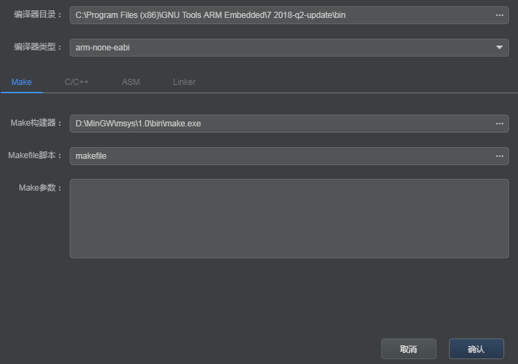

    4.  单击“确认”，保存编译参数配置。

4.  配置“烧录参数”。
    1.  单击“烧录参数”。
    2.  烧录器参数配置如[表2](#table11857927153031)所示：

        **表 2**  烧录器参数配置

        <a name="table11857927153031"></a>
        <table><thead align="left"><tr id="row54141661153031"><th class="cellrowborder" valign="top" width="19.74%" id="mcps1.2.5.1.1"><p id="p45886797153031"><a name="p45886797153031"></a><a name="p45886797153031"></a>开发板型号</p>
        </th>
        <th class="cellrowborder" valign="top" width="18.61%" id="mcps1.2.5.1.2"><p id="p25843102153031"><a name="p25843102153031"></a><a name="p25843102153031"></a>参数名称</p>
        </th>
        <th class="cellrowborder" valign="top" width="30.45%" id="mcps1.2.5.1.3"><p id="p12916556153031"><a name="p12916556153031"></a><a name="p12916556153031"></a>值</p>
        </th>
        <th class="cellrowborder" valign="top" width="31.2%" id="mcps1.2.5.1.4"><p id="p39608126153031"><a name="p39608126153031"></a><a name="p39608126153031"></a>备注</p>
        </th>
        </tr>
        </thead>
        <tbody><tr id="row49529930153031"><td class="cellrowborder" rowspan="7" valign="top" width="19.74%" headers="mcps1.2.5.1.1 "><p id="p23398416153031"><a name="p23398416153031"></a><a name="p23398416153031"></a>第三方芯片（非华为海思芯片）</p>
        </td>
        <td class="cellrowborder" valign="top" width="18.61%" headers="mcps1.2.5.1.2 "><p id="p16223552153031"><a name="p16223552153031"></a><a name="p16223552153031"></a>烧录方式</p>
        </td>
        <td class="cellrowborder" valign="top" width="30.45%" headers="mcps1.2.5.1.3 "><p id="p39039316153031"><a name="p39039316153031"></a><a name="p39039316153031"></a>JLink</p>
        </td>
        <td class="cellrowborder" valign="top" width="31.2%" headers="mcps1.2.5.1.4 ">&nbsp;&nbsp;</td>
        </tr>
        <tr id="row59535482153031"><td class="cellrowborder" valign="top" headers="mcps1.2.5.1.1 "><p id="p43116187153031"><a name="p43116187153031"></a><a name="p43116187153031"></a>目录</p>
        </td>
        <td class="cellrowborder" valign="top" headers="mcps1.2.5.1.2 "><p id="p2750298153031"><a name="p2750298153031"></a><a name="p2750298153031"></a>&lt;JLink安装目录&gt;\SEGGER\JLink_V634f</p>
        </td>
        <td class="cellrowborder" valign="top" headers="mcps1.2.5.1.3 "><p id="p21447618153031"><a name="p21447618153031"></a><a name="p21447618153031"></a>JLink安装目录以实际情况为准，如：C:\Program Files (x86)\SEGGER\JLink_V634f</p>
        </td>
        </tr>
        <tr id="row34062140153031"><td class="cellrowborder" valign="top" headers="mcps1.2.5.1.1 "><p id="p66057291153031"><a name="p66057291153031"></a><a name="p66057291153031"></a>连接方式</p>
        </td>
        <td class="cellrowborder" valign="top" headers="mcps1.2.5.1.2 "><p id="p49040383153031"><a name="p49040383153031"></a><a name="p49040383153031"></a>SWD</p>
        </td>
        <td class="cellrowborder" valign="top" headers="mcps1.2.5.1.3 ">&nbsp;&nbsp;</td>
        </tr>
        <tr id="row52439663153031"><td class="cellrowborder" valign="top" headers="mcps1.2.5.1.1 "><p id="p38123806153031"><a name="p38123806153031"></a><a name="p38123806153031"></a>连接速率（KHz）</p>
        </td>
        <td class="cellrowborder" valign="top" headers="mcps1.2.5.1.2 "><p id="p1020609153031"><a name="p1020609153031"></a><a name="p1020609153031"></a>4000</p>
        </td>
        <td class="cellrowborder" valign="top" headers="mcps1.2.5.1.3 "><p id="p15560484153031"><a name="p15560484153031"></a><a name="p15560484153031"></a>默认值，可根据实际情况修改</p>
        </td>
        </tr>
        <tr id="row53408122153031"><td class="cellrowborder" valign="top" headers="mcps1.2.5.1.1 "><p id="p2194923153031"><a name="p2194923153031"></a><a name="p2194923153031"></a>加载地址</p>
        </td>
        <td class="cellrowborder" valign="top" headers="mcps1.2.5.1.2 "><p id="p43571111153031"><a name="p43571111153031"></a><a name="p43571111153031"></a>0x08000000</p>
        </td>
        <td class="cellrowborder" valign="top" headers="mcps1.2.5.1.3 ">&nbsp;&nbsp;</td>
        </tr>
        <tr id="row42273037153031"><td class="cellrowborder" valign="top" headers="mcps1.2.5.1.1 "><p id="p10911058153031"><a name="p10911058153031"></a><a name="p10911058153031"></a>清除</p>
        </td>
        <td class="cellrowborder" valign="top" headers="mcps1.2.5.1.2 "><p id="p11380480153031"><a name="p11380480153031"></a><a name="p11380480153031"></a>默认勾选</p>
        </td>
        <td class="cellrowborder" valign="top" headers="mcps1.2.5.1.3 ">&nbsp;&nbsp;</td>
        </tr>
        <tr id="row8760542153031"><td class="cellrowborder" valign="top" headers="mcps1.2.5.1.1 "><p id="p44913016153031"><a name="p44913016153031"></a><a name="p44913016153031"></a>校验</p>
        </td>
        <td class="cellrowborder" valign="top" headers="mcps1.2.5.1.2 "><p id="p14075683153031"><a name="p14075683153031"></a><a name="p14075683153031"></a>默认勾选</p>
        </td>
        <td class="cellrowborder" valign="top" headers="mcps1.2.5.1.3 ">&nbsp;&nbsp;</td>
        </tr>
        <tr id="row50697494153031"><td class="cellrowborder" rowspan="9" valign="top" width="19.74%" headers="mcps1.2.5.1.1 "><p id="p11736014153031"><a name="p11736014153031"></a><a name="p11736014153031"></a>华为海思芯片</p>
        </td>
        <td class="cellrowborder" valign="top" width="18.61%" headers="mcps1.2.5.1.2 "><p id="p11093039153031"><a name="p11093039153031"></a><a name="p11093039153031"></a>烧录方式</p>
        </td>
        <td class="cellrowborder" valign="top" width="30.45%" headers="mcps1.2.5.1.3 "><p id="p26120961153031"><a name="p26120961153031"></a><a name="p26120961153031"></a>JLink+Uboot串口</p>
        </td>
        <td class="cellrowborder" valign="top" width="31.2%" headers="mcps1.2.5.1.4 ">&nbsp;&nbsp;</td>
        </tr>
        <tr id="row19853053153031"><td class="cellrowborder" valign="top" headers="mcps1.2.5.1.1 "><p id="p53624267153031"><a name="p53624267153031"></a><a name="p53624267153031"></a>目录</p>
        </td>
        <td class="cellrowborder" valign="top" headers="mcps1.2.5.1.2 "><p id="p48598394153031"><a name="p48598394153031"></a><a name="p48598394153031"></a>&lt;JLink安装目录&gt;\SEGGER\JLink_V634f</p>
        </td>
        <td class="cellrowborder" valign="top" headers="mcps1.2.5.1.3 "><p id="p44155837153031"><a name="p44155837153031"></a><a name="p44155837153031"></a>JLink安装目录以实际情况为准，如：C:\Program Files (x86)\SEGGER\JLink_V634f</p>
        </td>
        </tr>
        <tr id="row45836272153031"><td class="cellrowborder" valign="top" headers="mcps1.2.5.1.1 "><p id="p44459751153031"><a name="p44459751153031"></a><a name="p44459751153031"></a>连接方式</p>
        </td>
        <td class="cellrowborder" valign="top" headers="mcps1.2.5.1.2 "><p id="p44470060153031"><a name="p44470060153031"></a><a name="p44470060153031"></a>JTAG</p>
        </td>
        <td class="cellrowborder" valign="top" headers="mcps1.2.5.1.3 ">&nbsp;&nbsp;</td>
        </tr>
        <tr id="row21261432153031"><td class="cellrowborder" valign="top" headers="mcps1.2.5.1.1 "><p id="p9873272153031"><a name="p9873272153031"></a><a name="p9873272153031"></a>连接速率（KHz）</p>
        </td>
        <td class="cellrowborder" valign="top" headers="mcps1.2.5.1.2 "><p id="p61537599153031"><a name="p61537599153031"></a><a name="p61537599153031"></a>8000</p>
        </td>
        <td class="cellrowborder" valign="top" headers="mcps1.2.5.1.3 "><p id="p18489585153031"><a name="p18489585153031"></a><a name="p18489585153031"></a>默认值，可根据实际情况修改</p>
        </td>
        </tr>
        <tr id="row28222819153031"><td class="cellrowborder" valign="top" headers="mcps1.2.5.1.1 "><p id="p57135167153031"><a name="p57135167153031"></a><a name="p57135167153031"></a>ROM地址</p>
        </td>
        <td class="cellrowborder" valign="top" headers="mcps1.2.5.1.2 "><p id="p64545824153031"><a name="p64545824153031"></a><a name="p64545824153031"></a>0x00100000</p>
        </td>
        <td class="cellrowborder" valign="top" headers="mcps1.2.5.1.3 ">&nbsp;&nbsp;</td>
        </tr>
        <tr id="row63492488153031"><td class="cellrowborder" valign="top" headers="mcps1.2.5.1.1 "><p id="p52678786153031"><a name="p52678786153031"></a><a name="p52678786153031"></a>ROM大小（B）</p>
        </td>
        <td class="cellrowborder" valign="top" headers="mcps1.2.5.1.2 "><p id="p39123272153031"><a name="p39123272153031"></a><a name="p39123272153031"></a>/</p>
        </td>
        <td class="cellrowborder" valign="top" headers="mcps1.2.5.1.3 "><p id="p14868434153031"><a name="p14868434153031"></a><a name="p14868434153031"></a>可选配置</p>
        </td>
        </tr>
        <tr id="row31453575153031"><td class="cellrowborder" valign="top" headers="mcps1.2.5.1.1 "><p id="p34561488153031"><a name="p34561488153031"></a><a name="p34561488153031"></a>加载地址</p>
        </td>
        <td class="cellrowborder" valign="top" headers="mcps1.2.5.1.2 "><p id="p48017140153031"><a name="p48017140153031"></a><a name="p48017140153031"></a>0X80000000</p>
        </td>
        <td class="cellrowborder" valign="top" headers="mcps1.2.5.1.3 ">&nbsp;&nbsp;</td>
        </tr>
        <tr id="row44905861153031"><td class="cellrowborder" valign="top" headers="mcps1.2.5.1.1 "><p id="p14646720153031"><a name="p14646720153031"></a><a name="p14646720153031"></a>清除</p>
        </td>
        <td class="cellrowborder" valign="top" headers="mcps1.2.5.1.2 "><p id="p45533677153031"><a name="p45533677153031"></a><a name="p45533677153031"></a>默认勾选</p>
        </td>
        <td class="cellrowborder" valign="top" headers="mcps1.2.5.1.3 ">&nbsp;&nbsp;</td>
        </tr>
        <tr id="row15113459153031"><td class="cellrowborder" valign="top" headers="mcps1.2.5.1.1 "><p id="p1499569153031"><a name="p1499569153031"></a><a name="p1499569153031"></a>校验</p>
        </td>
        <td class="cellrowborder" valign="top" headers="mcps1.2.5.1.2 "><p id="p54356289153031"><a name="p54356289153031"></a><a name="p54356289153031"></a>默认勾选</p>
        </td>
        <td class="cellrowborder" valign="top" headers="mcps1.2.5.1.3 ">&nbsp;&nbsp;</td>
        </tr>
        </tbody>
        </table>

    3.  单击“确认”，保存烧录参数配置。

5.  配置“调试参数”。
    1.  单击“调试参数”。
    2.  调试器参数配置如[表3](#table2461109152248)所示：

        **表 3**  调试器参数配置

        <a name="table2461109152248"></a>
        <table><thead align="left"><tr id="row47739412152248"><th class="cellrowborder" valign="top" width="33.33333333333333%" id="mcps1.2.4.1.1"><p id="p41687173152248"><a name="p41687173152248"></a><a name="p41687173152248"></a>参数名称</p>
        </th>
        <th class="cellrowborder" valign="top" width="33.33333333333333%" id="mcps1.2.4.1.2"><p id="p21217854152248"><a name="p21217854152248"></a><a name="p21217854152248"></a>值</p>
        </th>
        <th class="cellrowborder" valign="top" width="33.33333333333333%" id="mcps1.2.4.1.3"><p id="p40924648152248"><a name="p40924648152248"></a><a name="p40924648152248"></a>备注</p>
        </th>
        </tr>
        </thead>
        <tbody><tr id="row26562219152248"><td class="cellrowborder" valign="top" width="33.33333333333333%" headers="mcps1.2.4.1.1 "><p id="p4056110152248"><a name="p4056110152248"></a><a name="p4056110152248"></a>调试器</p>
        </td>
        <td class="cellrowborder" valign="top" width="33.33333333333333%" headers="mcps1.2.4.1.2 "><p id="p60109465152248"><a name="p60109465152248"></a><a name="p60109465152248"></a>JLink</p>
        </td>
        <td class="cellrowborder" valign="top" width="33.33333333333333%" headers="mcps1.2.4.1.3 ">&nbsp;&nbsp;</td>
        </tr>
        <tr id="row64821057152248"><td class="cellrowborder" valign="top" width="33.33333333333333%" headers="mcps1.2.4.1.1 "><p id="p16014232152248"><a name="p16014232152248"></a><a name="p16014232152248"></a>选择端口</p>
        </td>
        <td class="cellrowborder" valign="top" width="33.33333333333333%" headers="mcps1.2.4.1.2 "><p id="p22084436152248"><a name="p22084436152248"></a><a name="p22084436152248"></a>USB</p>
        </td>
        <td class="cellrowborder" valign="top" width="33.33333333333333%" headers="mcps1.2.4.1.3 ">&nbsp;&nbsp;</td>
        </tr>
        <tr id="row60536010152248"><td class="cellrowborder" valign="top" width="33.33333333333333%" headers="mcps1.2.4.1.1 "><p id="p4469744152248"><a name="p4469744152248"></a><a name="p4469744152248"></a>连接方式</p>
        </td>
        <td class="cellrowborder" valign="top" width="33.33333333333333%" headers="mcps1.2.4.1.2 "><p id="p26504983152248"><a name="p26504983152248"></a><a name="p26504983152248"></a>SWD</p>
        </td>
        <td class="cellrowborder" valign="top" width="33.33333333333333%" headers="mcps1.2.4.1.3 "><p id="p66528870152248"><a name="p66528870152248"></a><a name="p66528870152248"></a>若为华为海思芯片，连接方式“SWD”更改为“JTAG”。</p>
        </td>
        </tr>
        <tr id="row61888925152248"><td class="cellrowborder" valign="top" width="33.33333333333333%" headers="mcps1.2.4.1.1 "><p id="p46947004152248"><a name="p46947004152248"></a><a name="p46947004152248"></a>连接速率（KHz）</p>
        </td>
        <td class="cellrowborder" valign="top" width="33.33333333333333%" headers="mcps1.2.4.1.2 "><p id="p44610968152248"><a name="p44610968152248"></a><a name="p44610968152248"></a>4000</p>
        </td>
        <td class="cellrowborder" valign="top" width="33.33333333333333%" headers="mcps1.2.4.1.3 "><p id="p56718616152248"><a name="p56718616152248"></a><a name="p56718616152248"></a>若为华为海思芯片，默认值为8000，可根据实际情况修改。</p>
        </td>
        </tr>
        <tr id="row40705497152248"><td class="cellrowborder" valign="top" width="33.33333333333333%" headers="mcps1.2.4.1.1 "><p id="p8810955152248"><a name="p8810955152248"></a><a name="p8810955152248"></a>目录</p>
        </td>
        <td class="cellrowborder" valign="top" width="33.33333333333333%" headers="mcps1.2.4.1.2 "><p id="p42598741152248"><a name="p42598741152248"></a><a name="p42598741152248"></a>&lt;JLink安装目录&gt;\SEGGER\JLink_V634f</p>
        </td>
        <td class="cellrowborder" valign="top" width="33.33333333333333%" headers="mcps1.2.4.1.3 "><p id="p27946016152248"><a name="p27946016152248"></a><a name="p27946016152248"></a>JLink安装目录以实际情况为准，如：C:\Program Files (x86)\SEGGER\JLink_V634f</p>
        </td>
        </tr>
        <tr id="row50187557152248"><td class="cellrowborder" valign="top" width="33.33333333333333%" headers="mcps1.2.4.1.1 "><p id="p38660340152248"><a name="p38660340152248"></a><a name="p38660340152248"></a>调试配置</p>
        </td>
        <td class="cellrowborder" valign="top" width="33.33333333333333%" headers="mcps1.2.4.1.2 "><p id="p44479831152248"><a name="p44479831152248"></a><a name="p44479831152248"></a>复位调试</p>
        </td>
        <td class="cellrowborder" valign="top" width="33.33333333333333%" headers="mcps1.2.4.1.3 "><p id="p4730678294033"><a name="p4730678294033"></a><a name="p4730678294033"></a>默认配置。请根据需要选择调试方式。</p>
        <a name="ul15743464134956"></a><a name="ul15743464134956"></a><ul id="ul15743464134956"><li>复位调试</li><li>附加调试</li><li>自定义</li></ul>
        </td>
        </tr>
        <tr id="row12215921152248"><td class="cellrowborder" valign="top" width="33.33333333333333%" headers="mcps1.2.4.1.1 "><p id="p49965526152248"><a name="p49965526152248"></a><a name="p49965526152248"></a>初始化文件</p>
        </td>
        <td class="cellrowborder" valign="top" width="33.33333333333333%" headers="mcps1.2.4.1.2 "><p id="p20675820152248"><a name="p20675820152248"></a><a name="p20675820152248"></a>置灰，不可配置</p>
        </td>
        <td class="cellrowborder" valign="top" width="33.33333333333333%" headers="mcps1.2.4.1.3 "><a name="ul17909694153314"></a><a name="ul17909694153314"></a><ul id="ul17909694153314"><li>当调试方式为“复位调试”或“附加调试”时，“初始化文件”配置置灰。</li><li>当调试方式为“自定义”时，初始化文件默认配置“.icode\default.gdbinit”。<p id="p63574964135243"><a name="p63574964135243"></a><a name="p63574964135243"></a>可在C盘“用户”目录下找到“.icode\templates\xxxx.gdbinit”文件，根据实际情况修改gdbinit文件，选择更改后的gdbinit文件。</p>
        </li></ul>
        </td>
        </tr>
        <tr id="row33297578152248"><td class="cellrowborder" valign="top" width="33.33333333333333%" headers="mcps1.2.4.1.1 "><p id="p12749299152248"><a name="p12749299152248"></a><a name="p12749299152248"></a>编译目录</p>
        </td>
        <td class="cellrowborder" valign="top" width="33.33333333333333%" headers="mcps1.2.4.1.2 "><p id="p26060333152248"><a name="p26060333152248"></a><a name="p26060333152248"></a>&lt;编译工程目录&gt;</p>
        </td>
        <td class="cellrowborder" valign="top" width="33.33333333333333%" headers="mcps1.2.4.1.3 "><p id="p5379791103614"><a name="p5379791103614"></a><a name="p5379791103614"></a>在Linux系统中编译，配置Linux云主机上编译的工程目录，请根据实际情况修改。如/root/Huawei_LiteOS。</p>
        </td>
        </tr>
        </tbody>
        </table>

    3.  单击“确认”，保存调试参数配置。


<h2 id="配置工程.md">配置工程</h2>

## 操作步骤<a name="section2707255114519"></a>

1.  在当前打开的工程中，单击工具栏的。

    > **说明：**   
    >方式二：单击菜单栏中的“工程\>工程配置”。  
    >方式三：在工程树中，右键单击工程名，选择“打开工程配置”。  

    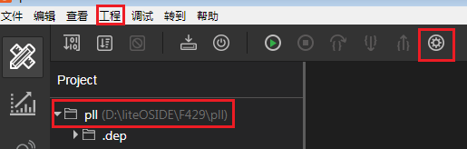

    弹出如下“工程配置”界面，配置工程。

    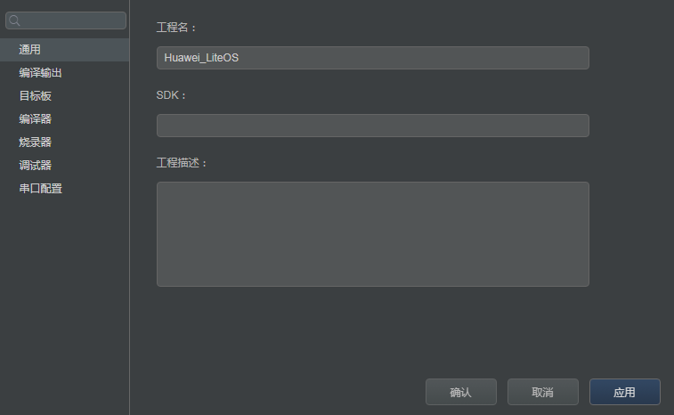

2.  在“通用”页签下，可修改当前工程名称。
3.  在“编译输出”页签下，您可以自定义输出名称及输出目录：
    -   第三方芯片（非华为海思芯片），输出名称默认为“Huawei\_LiteOS”，输出目录默认为“./build”。
    -   华为海思芯片，输出名称默认为“vs\_server”，输出目录默认为“.\\out\\hi3516cv300”。

4.  在“目标板”页签下，确认所选的开发板MCU型号与实际需要使用的开发板MCU型号一致。

    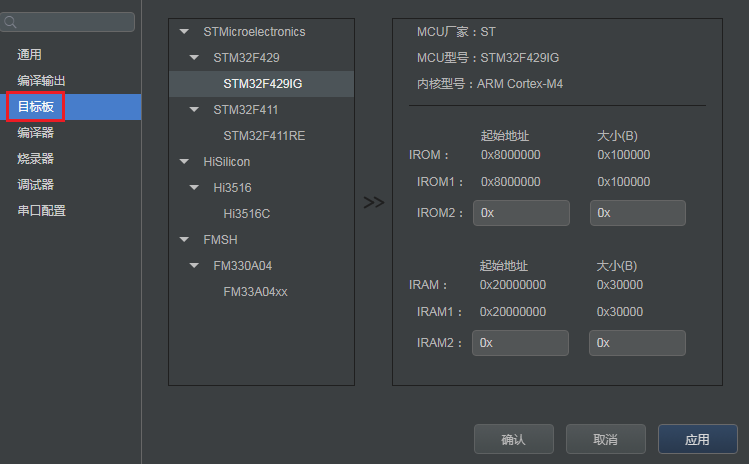

5.  配置“编译器”。

    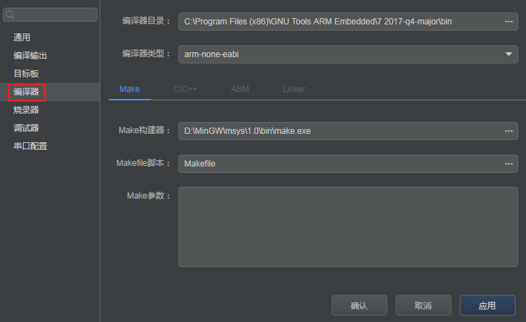

    -   配置编译器目录及编译器类型如[表1](#table12570773113234)所示：

        **表 1**  编译器目录及编译器类型参数

        <a name="table12570773113234"></a>
        <table><thead align="left"><tr id="row36422766113234"><th class="cellrowborder" valign="top" width="32.25%" id="mcps1.2.4.1.1"><p id="p38908320113338"><a name="p38908320113338"></a><a name="p38908320113338"></a>参数名称</p>
        </th>
        <th class="cellrowborder" valign="top" width="29.7%" id="mcps1.2.4.1.2"><p id="p63462551113952"><a name="p63462551113952"></a><a name="p63462551113952"></a>值</p>
        </th>
        <th class="cellrowborder" valign="top" width="38.05%" id="mcps1.2.4.1.3"><p id="p56083584113234"><a name="p56083584113234"></a><a name="p56083584113234"></a>备注</p>
        </th>
        </tr>
        </thead>
        <tbody><tr id="row8185622113325"><td class="cellrowborder" valign="top" width="32.25%" headers="mcps1.2.4.1.1 "><p id="p64566254113338"><a name="p64566254113338"></a><a name="p64566254113338"></a>编译器目录</p>
        </td>
        <td class="cellrowborder" valign="top" width="29.7%" headers="mcps1.2.4.1.2 "><p id="p61738806113325"><a name="p61738806113325"></a><a name="p61738806113325"></a>&lt;GCC工具安装目录&gt;\7 2018-q2-update\bin</p>
        </td>
        <td class="cellrowborder" valign="top" width="38.05%" headers="mcps1.2.4.1.3 "><p id="p34787357113325"><a name="p34787357113325"></a><a name="p34787357113325"></a>请根据实际情况修改交叉GCC安装目录，如：C:\Program Files (x86)\GNU Tools ARM Embedded\7 2018-q2-update\bin</p>
        </td>
        </tr>
        <tr id="row34990214113234"><td class="cellrowborder" valign="top" width="32.25%" headers="mcps1.2.4.1.1 "><p id="p62484096113338"><a name="p62484096113338"></a><a name="p62484096113338"></a>编译器类型</p>
        </td>
        <td class="cellrowborder" valign="top" width="29.7%" headers="mcps1.2.4.1.2 "><p id="p51032684113834"><a name="p51032684113834"></a><a name="p51032684113834"></a>arm-none-eabi</p>
        </td>
        <td class="cellrowborder" valign="top" width="38.05%" headers="mcps1.2.4.1.3 ">&nbsp;&nbsp;</td>
        </tr>
        <tr id="row64635932182723"><td class="cellrowborder" valign="top" width="32.25%" headers="mcps1.2.4.1.1 "><p id="p9172072182723"><a name="p9172072182723"></a><a name="p9172072182723"></a>Make构建器</p>
        </td>
        <td class="cellrowborder" valign="top" width="29.7%" headers="mcps1.2.4.1.2 "><p id="p4740350182723"><a name="p4740350182723"></a><a name="p4740350182723"></a>&lt;MinGW安装目录&gt;\MinGW\msys\1.0\bin\make.exe</p>
        </td>
        <td class="cellrowborder" valign="top" width="38.05%" headers="mcps1.2.4.1.3 "><p id="p1877331015458"><a name="p1877331015458"></a><a name="p1877331015458"></a>MinGW安装目录以实际情况为准，如：D:\MinGW\msys\1.0\bin\make.exe</p>
        </td>
        </tr>
        </tbody>
        </table>

    -   在“Makefile脚本”文本框中填入“makefile”，默认为当前工程下主makefile的相对路径。
    -   （可选）在“Make参数”文本框填入“-j8”或“-j4”，提高编译速度。

6.  配置“烧录器”。

    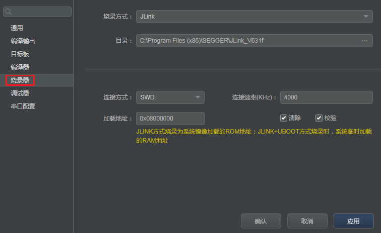

    烧录器参数配置如[表2](#table40796721162615)所示：

    **表 2**  烧录器参数配置

    <a name="table40796721162615"></a>
    <table><thead align="left"><tr id="row31562031162615"><th class="cellrowborder" valign="top" width="19.74%" id="mcps1.2.5.1.1"><p id="p13572038145041"><a name="p13572038145041"></a><a name="p13572038145041"></a>开发板型号</p>
    </th>
    <th class="cellrowborder" valign="top" width="18.61%" id="mcps1.2.5.1.2"><p id="p57489385162615"><a name="p57489385162615"></a><a name="p57489385162615"></a>参数名称</p>
    </th>
    <th class="cellrowborder" valign="top" width="30.45%" id="mcps1.2.5.1.3"><p id="p26128633162615"><a name="p26128633162615"></a><a name="p26128633162615"></a>值</p>
    </th>
    <th class="cellrowborder" valign="top" width="31.2%" id="mcps1.2.5.1.4"><p id="p36044546162615"><a name="p36044546162615"></a><a name="p36044546162615"></a>备注</p>
    </th>
    </tr>
    </thead>
    <tbody><tr id="row55965459162615"><td class="cellrowborder" rowspan="7" valign="top" width="19.74%" headers="mcps1.2.5.1.1 "><p id="p33616449145148"><a name="p33616449145148"></a><a name="p33616449145148"></a>第三方芯片（非华为海思芯片）</p>
    </td>
    <td class="cellrowborder" valign="top" width="18.61%" headers="mcps1.2.5.1.2 "><p id="p36908291162615"><a name="p36908291162615"></a><a name="p36908291162615"></a>烧录方式</p>
    </td>
    <td class="cellrowborder" valign="top" width="30.45%" headers="mcps1.2.5.1.3 "><p id="p36781567162615"><a name="p36781567162615"></a><a name="p36781567162615"></a>JLink</p>
    </td>
    <td class="cellrowborder" valign="top" width="31.2%" headers="mcps1.2.5.1.4 ">&nbsp;&nbsp;</td>
    </tr>
    <tr id="row37326200162615"><td class="cellrowborder" valign="top" headers="mcps1.2.5.1.1 "><p id="p3523379162615"><a name="p3523379162615"></a><a name="p3523379162615"></a>目录</p>
    </td>
    <td class="cellrowborder" valign="top" headers="mcps1.2.5.1.2 "><p id="p16958295162615"><a name="p16958295162615"></a><a name="p16958295162615"></a>&lt;JLink安装目录&gt;\SEGGER\JLink_V634f</p>
    </td>
    <td class="cellrowborder" valign="top" headers="mcps1.2.5.1.3 "><p id="p31444618162615"><a name="p31444618162615"></a><a name="p31444618162615"></a>JLink安装目录以实际情况为准，如：C:\Program Files (x86)\SEGGER\JLink_V634f</p>
    </td>
    </tr>
    <tr id="row14566114162615"><td class="cellrowborder" valign="top" headers="mcps1.2.5.1.1 "><p id="p39004594162615"><a name="p39004594162615"></a><a name="p39004594162615"></a>连接方式</p>
    </td>
    <td class="cellrowborder" valign="top" headers="mcps1.2.5.1.2 "><p id="p5255526162615"><a name="p5255526162615"></a><a name="p5255526162615"></a>SWD</p>
    </td>
    <td class="cellrowborder" valign="top" headers="mcps1.2.5.1.3 ">&nbsp;&nbsp;</td>
    </tr>
    <tr id="row6073503162615"><td class="cellrowborder" valign="top" headers="mcps1.2.5.1.1 "><p id="p22191741162615"><a name="p22191741162615"></a><a name="p22191741162615"></a>连接速率（KHz）</p>
    </td>
    <td class="cellrowborder" valign="top" headers="mcps1.2.5.1.2 "><p id="p52700636162615"><a name="p52700636162615"></a><a name="p52700636162615"></a>4000</p>
    </td>
    <td class="cellrowborder" valign="top" headers="mcps1.2.5.1.3 "><p id="p40893156162615"><a name="p40893156162615"></a><a name="p40893156162615"></a>默认值，可根据实际情况修改</p>
    </td>
    </tr>
    <tr id="row57749463162615"><td class="cellrowborder" valign="top" headers="mcps1.2.5.1.1 "><p id="p47194909162615"><a name="p47194909162615"></a><a name="p47194909162615"></a>加载地址</p>
    </td>
    <td class="cellrowborder" valign="top" headers="mcps1.2.5.1.2 "><p id="p64691321162615"><a name="p64691321162615"></a><a name="p64691321162615"></a>0x08000000</p>
    </td>
    <td class="cellrowborder" valign="top" headers="mcps1.2.5.1.3 ">&nbsp;&nbsp;</td>
    </tr>
    <tr id="row49550550162615"><td class="cellrowborder" valign="top" headers="mcps1.2.5.1.1 "><p id="p54171636162615"><a name="p54171636162615"></a><a name="p54171636162615"></a>清除</p>
    </td>
    <td class="cellrowborder" valign="top" headers="mcps1.2.5.1.2 "><p id="p25826370162615"><a name="p25826370162615"></a><a name="p25826370162615"></a>默认勾选</p>
    </td>
    <td class="cellrowborder" valign="top" headers="mcps1.2.5.1.3 ">&nbsp;&nbsp;</td>
    </tr>
    <tr id="row36941868162615"><td class="cellrowborder" valign="top" headers="mcps1.2.5.1.1 "><p id="p39501322162615"><a name="p39501322162615"></a><a name="p39501322162615"></a>校验</p>
    </td>
    <td class="cellrowborder" valign="top" headers="mcps1.2.5.1.2 "><p id="p45490517162615"><a name="p45490517162615"></a><a name="p45490517162615"></a>默认勾选</p>
    </td>
    <td class="cellrowborder" valign="top" headers="mcps1.2.5.1.3 ">&nbsp;&nbsp;</td>
    </tr>
    <tr id="row62290520145053"><td class="cellrowborder" rowspan="9" valign="top" width="19.74%" headers="mcps1.2.5.1.1 "><p id="p40636192145136"><a name="p40636192145136"></a><a name="p40636192145136"></a>华为海思芯片</p>
    </td>
    <td class="cellrowborder" valign="top" width="18.61%" headers="mcps1.2.5.1.2 "><p id="p1693214114518"><a name="p1693214114518"></a><a name="p1693214114518"></a>烧录方式</p>
    </td>
    <td class="cellrowborder" valign="top" width="30.45%" headers="mcps1.2.5.1.3 "><p id="p2932614414518"><a name="p2932614414518"></a><a name="p2932614414518"></a>JLink+Uboot串口</p>
    </td>
    <td class="cellrowborder" valign="top" width="31.2%" headers="mcps1.2.5.1.4 ">&nbsp;&nbsp;</td>
    </tr>
    <tr id="row40481670145053"><td class="cellrowborder" valign="top" headers="mcps1.2.5.1.1 "><p id="p240679614518"><a name="p240679614518"></a><a name="p240679614518"></a>目录</p>
    </td>
    <td class="cellrowborder" valign="top" headers="mcps1.2.5.1.2 "><p id="p6073278114518"><a name="p6073278114518"></a><a name="p6073278114518"></a>&lt;JLink安装目录&gt;\SEGGER\JLink_V634f</p>
    </td>
    <td class="cellrowborder" valign="top" headers="mcps1.2.5.1.3 "><p id="p2040819414518"><a name="p2040819414518"></a><a name="p2040819414518"></a>JLink安装目录以实际情况为准，如：C:\Program Files (x86)\SEGGER\JLink_V634f</p>
    </td>
    </tr>
    <tr id="row38194241145053"><td class="cellrowborder" valign="top" headers="mcps1.2.5.1.1 "><p id="p4651464214518"><a name="p4651464214518"></a><a name="p4651464214518"></a>连接方式</p>
    </td>
    <td class="cellrowborder" valign="top" headers="mcps1.2.5.1.2 "><p id="p958969014518"><a name="p958969014518"></a><a name="p958969014518"></a>JTAG</p>
    </td>
    <td class="cellrowborder" valign="top" headers="mcps1.2.5.1.3 ">&nbsp;&nbsp;</td>
    </tr>
    <tr id="row10599482145053"><td class="cellrowborder" valign="top" headers="mcps1.2.5.1.1 "><p id="p6413688714518"><a name="p6413688714518"></a><a name="p6413688714518"></a>连接速率（KHz）</p>
    </td>
    <td class="cellrowborder" valign="top" headers="mcps1.2.5.1.2 "><p id="p2770535914518"><a name="p2770535914518"></a><a name="p2770535914518"></a>8000</p>
    </td>
    <td class="cellrowborder" valign="top" headers="mcps1.2.5.1.3 "><p id="p2954162014518"><a name="p2954162014518"></a><a name="p2954162014518"></a>默认值，可根据实际情况修改</p>
    </td>
    </tr>
    <tr id="row9518248145053"><td class="cellrowborder" valign="top" headers="mcps1.2.5.1.1 "><p id="p6100472914518"><a name="p6100472914518"></a><a name="p6100472914518"></a>ROM地址</p>
    </td>
    <td class="cellrowborder" valign="top" headers="mcps1.2.5.1.2 "><p id="p4243599614518"><a name="p4243599614518"></a><a name="p4243599614518"></a>0x00100000</p>
    </td>
    <td class="cellrowborder" valign="top" headers="mcps1.2.5.1.3 ">&nbsp;&nbsp;</td>
    </tr>
    <tr id="row34849800145053"><td class="cellrowborder" valign="top" headers="mcps1.2.5.1.1 "><p id="p2526332714518"><a name="p2526332714518"></a><a name="p2526332714518"></a>ROM大小（B）</p>
    </td>
    <td class="cellrowborder" valign="top" headers="mcps1.2.5.1.2 "><p id="p3306357414518"><a name="p3306357414518"></a><a name="p3306357414518"></a>/</p>
    </td>
    <td class="cellrowborder" valign="top" headers="mcps1.2.5.1.3 "><p id="p6090385814518"><a name="p6090385814518"></a><a name="p6090385814518"></a>可选</p>
    </td>
    </tr>
    <tr id="row45900770145053"><td class="cellrowborder" valign="top" headers="mcps1.2.5.1.1 "><p id="p3995404014518"><a name="p3995404014518"></a><a name="p3995404014518"></a>加载地址</p>
    </td>
    <td class="cellrowborder" valign="top" headers="mcps1.2.5.1.2 "><p id="p1505177414518"><a name="p1505177414518"></a><a name="p1505177414518"></a>0X80000000</p>
    </td>
    <td class="cellrowborder" valign="top" headers="mcps1.2.5.1.3 ">&nbsp;&nbsp;</td>
    </tr>
    <tr id="row2794298414510"><td class="cellrowborder" valign="top" headers="mcps1.2.5.1.1 "><p id="p243682714518"><a name="p243682714518"></a><a name="p243682714518"></a>清除</p>
    </td>
    <td class="cellrowborder" valign="top" headers="mcps1.2.5.1.2 "><p id="p6316527414518"><a name="p6316527414518"></a><a name="p6316527414518"></a>默认勾选</p>
    </td>
    <td class="cellrowborder" valign="top" headers="mcps1.2.5.1.3 ">&nbsp;&nbsp;</td>
    </tr>
    <tr id="row749092814510"><td class="cellrowborder" valign="top" headers="mcps1.2.5.1.1 "><p id="p273258314518"><a name="p273258314518"></a><a name="p273258314518"></a>校验</p>
    </td>
    <td class="cellrowborder" valign="top" headers="mcps1.2.5.1.2 "><p id="p2001266514518"><a name="p2001266514518"></a><a name="p2001266514518"></a>默认勾选</p>
    </td>
    <td class="cellrowborder" valign="top" headers="mcps1.2.5.1.3 ">&nbsp;&nbsp;</td>
    </tr>
    </tbody>
    </table>

7.  配置“调试器”。

    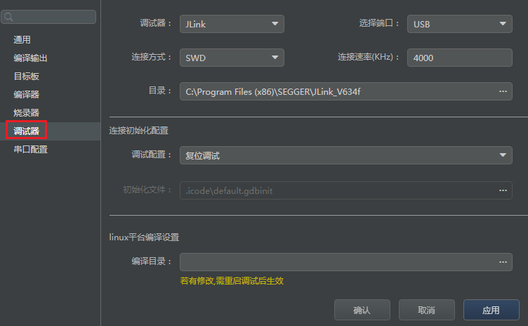

    调试器参数配置如[表3](#table3390115194033)所示。

    **表 3**  调试器参数配置

    <a name="table3390115194033"></a>
    <table><thead align="left"><tr id="row3043306594033"><th class="cellrowborder" valign="top" width="33.33333333333333%" id="mcps1.2.4.1.1"><p id="p4887386694033"><a name="p4887386694033"></a><a name="p4887386694033"></a>参数名称</p>
    </th>
    <th class="cellrowborder" valign="top" width="33.33333333333333%" id="mcps1.2.4.1.2"><p id="p6646911094033"><a name="p6646911094033"></a><a name="p6646911094033"></a>值</p>
    </th>
    <th class="cellrowborder" valign="top" width="33.33333333333333%" id="mcps1.2.4.1.3"><p id="p1528879794033"><a name="p1528879794033"></a><a name="p1528879794033"></a>备注</p>
    </th>
    </tr>
    </thead>
    <tbody><tr id="row2045642394033"><td class="cellrowborder" valign="top" width="33.33333333333333%" headers="mcps1.2.4.1.1 "><p id="p4915923494033"><a name="p4915923494033"></a><a name="p4915923494033"></a>调试器</p>
    </td>
    <td class="cellrowborder" valign="top" width="33.33333333333333%" headers="mcps1.2.4.1.2 "><p id="p2247502394033"><a name="p2247502394033"></a><a name="p2247502394033"></a>JLink</p>
    </td>
    <td class="cellrowborder" valign="top" width="33.33333333333333%" headers="mcps1.2.4.1.3 ">&nbsp;&nbsp;</td>
    </tr>
    <tr id="row6470842194033"><td class="cellrowborder" valign="top" width="33.33333333333333%" headers="mcps1.2.4.1.1 "><p id="p4989008394033"><a name="p4989008394033"></a><a name="p4989008394033"></a>选择端口</p>
    </td>
    <td class="cellrowborder" valign="top" width="33.33333333333333%" headers="mcps1.2.4.1.2 "><p id="p1456494794033"><a name="p1456494794033"></a><a name="p1456494794033"></a>USB</p>
    </td>
    <td class="cellrowborder" valign="top" width="33.33333333333333%" headers="mcps1.2.4.1.3 ">&nbsp;&nbsp;</td>
    </tr>
    <tr id="row851738494033"><td class="cellrowborder" valign="top" width="33.33333333333333%" headers="mcps1.2.4.1.1 "><p id="p4550487794033"><a name="p4550487794033"></a><a name="p4550487794033"></a>连接方式</p>
    </td>
    <td class="cellrowborder" valign="top" width="33.33333333333333%" headers="mcps1.2.4.1.2 "><p id="p6201639394033"><a name="p6201639394033"></a><a name="p6201639394033"></a>SWD</p>
    </td>
    <td class="cellrowborder" valign="top" width="33.33333333333333%" headers="mcps1.2.4.1.3 "><p id="p5727196294033"><a name="p5727196294033"></a><a name="p5727196294033"></a>若为华为海思芯片，连接方式“SWD”更改为“JTAG”。</p>
    </td>
    </tr>
    <tr id="row1784945794033"><td class="cellrowborder" valign="top" width="33.33333333333333%" headers="mcps1.2.4.1.1 "><p id="p954759794033"><a name="p954759794033"></a><a name="p954759794033"></a>连接速率（KHz）</p>
    </td>
    <td class="cellrowborder" valign="top" width="33.33333333333333%" headers="mcps1.2.4.1.2 "><p id="p3515790594033"><a name="p3515790594033"></a><a name="p3515790594033"></a>4000</p>
    </td>
    <td class="cellrowborder" valign="top" width="33.33333333333333%" headers="mcps1.2.4.1.3 "><p id="p2921802094033"><a name="p2921802094033"></a><a name="p2921802094033"></a>若为华为海思芯片，默认值为8000，可根据实际情况修改。</p>
    </td>
    </tr>
    <tr id="row5458208694033"><td class="cellrowborder" valign="top" width="33.33333333333333%" headers="mcps1.2.4.1.1 "><p id="p2642738894033"><a name="p2642738894033"></a><a name="p2642738894033"></a>目录</p>
    </td>
    <td class="cellrowborder" valign="top" width="33.33333333333333%" headers="mcps1.2.4.1.2 "><p id="p6024366494033"><a name="p6024366494033"></a><a name="p6024366494033"></a>&lt;JLink安装目录&gt;\SEGGER\JLink_V634f</p>
    </td>
    <td class="cellrowborder" valign="top" width="33.33333333333333%" headers="mcps1.2.4.1.3 "><p id="p4789860994033"><a name="p4789860994033"></a><a name="p4789860994033"></a>JLink安装目录以实际情况为准，如：C:\Program Files (x86)\SEGGER\JLink_V634f</p>
    </td>
    </tr>
    <tr id="row664411894033"><td class="cellrowborder" valign="top" width="33.33333333333333%" headers="mcps1.2.4.1.1 "><p id="p2147672794033"><a name="p2147672794033"></a><a name="p2147672794033"></a>调试配置</p>
    </td>
    <td class="cellrowborder" valign="top" width="33.33333333333333%" headers="mcps1.2.4.1.2 "><p id="p6189336694033"><a name="p6189336694033"></a><a name="p6189336694033"></a>复位调试</p>
    </td>
    <td class="cellrowborder" valign="top" width="33.33333333333333%" headers="mcps1.2.4.1.3 "><p id="p4730678294033"><a name="p4730678294033"></a><a name="p4730678294033"></a>默认配置。请根据需要选择调试方式。</p>
    <a name="ul15743464134956"></a><a name="ul15743464134956"></a><ul id="ul15743464134956"><li>复位调试</li><li>附加调试</li><li>自定义</li></ul>
    </td>
    </tr>
    <tr id="row1416639294033"><td class="cellrowborder" valign="top" width="33.33333333333333%" headers="mcps1.2.4.1.1 "><p id="p5979706394033"><a name="p5979706394033"></a><a name="p5979706394033"></a>初始化文件</p>
    </td>
    <td class="cellrowborder" valign="top" width="33.33333333333333%" headers="mcps1.2.4.1.2 "><p id="p1172396394033"><a name="p1172396394033"></a><a name="p1172396394033"></a>置灰，不可配置</p>
    </td>
    <td class="cellrowborder" valign="top" width="33.33333333333333%" headers="mcps1.2.4.1.3 "><a name="ul17909694153314"></a><a name="ul17909694153314"></a><ul id="ul17909694153314"><li>当调试方式为“复位调试”或“附加调试”时，“初始化文件”配置置灰。</li><li>当调试方式为“自定义”时，初始化文件默认配置“.icode\default.gdbinit”。<p id="p63574964135243"><a name="p63574964135243"></a><a name="p63574964135243"></a>可在C盘“用户”目录下找到“.icode\templates\xxxx.gdbinit”文件，根据实际情况修改gdbinit文件，选择更改后的gdbinit文件。</p>
    </li></ul>
    </td>
    </tr>
    <tr id="row4922034294033"><td class="cellrowborder" valign="top" width="33.33333333333333%" headers="mcps1.2.4.1.1 "><p id="p3387267994033"><a name="p3387267994033"></a><a name="p3387267994033"></a>编译目录</p>
    </td>
    <td class="cellrowborder" valign="top" width="33.33333333333333%" headers="mcps1.2.4.1.2 "><p id="p5933251594033"><a name="p5933251594033"></a><a name="p5933251594033"></a>&lt;编译工程目录&gt;</p>
    </td>
    <td class="cellrowborder" valign="top" width="33.33333333333333%" headers="mcps1.2.4.1.3 "><p id="p52870348104121"><a name="p52870348104121"></a><a name="p52870348104121"></a>在Linux系统中编译，配置Linux云主机上编译的工程目录，请根据实际情况修改。如/root/Huawei_LiteOS。</p>
    </td>
    </tr>
    </tbody>
    </table>

8.  若为华为海思芯片，请配置“串口配置”。否则，请忽略此步骤。

    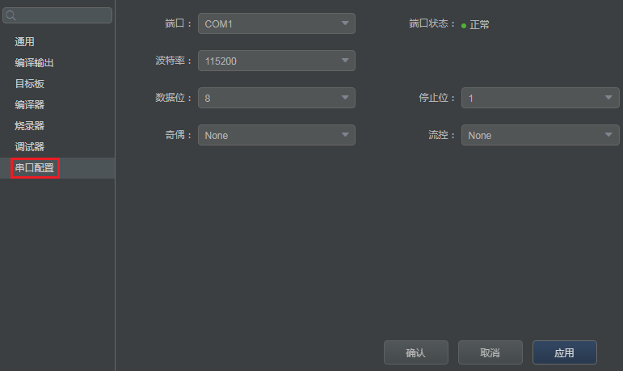

    串口配置参数如[表4](#table61391392155515)所示：

    **表 4**  串口配置参数

    <a name="table61391392155515"></a>
    <table><thead align="left"><tr id="row35285387155515"><th class="cellrowborder" valign="top" width="33.33333333333333%" id="mcps1.2.4.1.1"><p id="p20352668155515"><a name="p20352668155515"></a><a name="p20352668155515"></a>参数名称</p>
    </th>
    <th class="cellrowborder" valign="top" width="33.33333333333333%" id="mcps1.2.4.1.2"><p id="p37953375155515"><a name="p37953375155515"></a><a name="p37953375155515"></a>值</p>
    </th>
    <th class="cellrowborder" valign="top" width="33.33333333333333%" id="mcps1.2.4.1.3"><p id="p54324572155515"><a name="p54324572155515"></a><a name="p54324572155515"></a>备注</p>
    </th>
    </tr>
    </thead>
    <tbody><tr id="row19159103155515"><td class="cellrowborder" valign="top" width="33.33333333333333%" headers="mcps1.2.4.1.1 "><p id="p8383491155515"><a name="p8383491155515"></a><a name="p8383491155515"></a>端口</p>
    </td>
    <td class="cellrowborder" valign="top" width="33.33333333333333%" headers="mcps1.2.4.1.2 "><p id="p7974164155515"><a name="p7974164155515"></a><a name="p7974164155515"></a>串口号</p>
    </td>
    <td class="cellrowborder" valign="top" width="33.33333333333333%" headers="mcps1.2.4.1.3 "><p id="p41927513155515"><a name="p41927513155515"></a><a name="p41927513155515"></a>请根据实际情况修改。获取实际串口号请参见<a href="#如何获取连接开发板的实际串口号.md">如何获取连接开发板的实际串口号</a>章节。</p>
    </td>
    </tr>
    <tr id="row41803298155515"><td class="cellrowborder" valign="top" width="33.33333333333333%" headers="mcps1.2.4.1.1 "><p id="p30624017155515"><a name="p30624017155515"></a><a name="p30624017155515"></a>波特率</p>
    </td>
    <td class="cellrowborder" valign="top" width="33.33333333333333%" headers="mcps1.2.4.1.2 "><p id="p64626345155515"><a name="p64626345155515"></a><a name="p64626345155515"></a>115200</p>
    </td>
    <td class="cellrowborder" rowspan="5" valign="top" width="33.33333333333333%" headers="mcps1.2.4.1.3 "><p id="p242577155515"><a name="p242577155515"></a><a name="p242577155515"></a>默认值，可根据实际情况修改。</p>
    </td>
    </tr>
    <tr id="row2183194155515"><td class="cellrowborder" valign="top" headers="mcps1.2.4.1.1 "><p id="p42621054155515"><a name="p42621054155515"></a><a name="p42621054155515"></a>数据位</p>
    </td>
    <td class="cellrowborder" valign="top" headers="mcps1.2.4.1.2 "><p id="p29753350155515"><a name="p29753350155515"></a><a name="p29753350155515"></a>8</p>
    </td>
    </tr>
    <tr id="row14029557155515"><td class="cellrowborder" valign="top" headers="mcps1.2.4.1.1 "><p id="p23271663155748"><a name="p23271663155748"></a><a name="p23271663155748"></a>停止位</p>
    </td>
    <td class="cellrowborder" valign="top" headers="mcps1.2.4.1.2 "><p id="p41676379155515"><a name="p41676379155515"></a><a name="p41676379155515"></a>1</p>
    </td>
    </tr>
    <tr id="row48873866155515"><td class="cellrowborder" valign="top" headers="mcps1.2.4.1.1 "><p id="p66469110155515"><a name="p66469110155515"></a><a name="p66469110155515"></a>奇偶</p>
    </td>
    <td class="cellrowborder" valign="top" headers="mcps1.2.4.1.2 "><p id="p15288797155515"><a name="p15288797155515"></a><a name="p15288797155515"></a>None</p>
    </td>
    </tr>
    <tr id="row5462137155515"><td class="cellrowborder" valign="top" headers="mcps1.2.4.1.1 "><p id="p39779927155515"><a name="p39779927155515"></a><a name="p39779927155515"></a>流控</p>
    </td>
    <td class="cellrowborder" valign="top" headers="mcps1.2.4.1.2 "><p id="p948621155515"><a name="p948621155515"></a><a name="p948621155515"></a>None</p>
    </td>
    </tr>
    </tbody>
    </table>

9.  配置完成后，单击“确认”，保存配置。

    > **说明：**   
    >单击“应用”可实时保存配置。  


<h2 id="OceanConnect.md">OceanConnect</h2>

LiteOS Studio内置了OceanConnect 入口，您可以通过此入口进入OceanConnect开发者平台。

## 背景信息<a name="section20981112072613"></a>

OceanConnect 是华为公司基于物联网、云计算和大数据等技术打造的开放生态环境。OceanConnect 围绕着华为IoT联接管理平台，通过开放API和系列化Agent实现与上下游产品能力的无缝联接，给客户提供端到端的高价值行业应用，比如智慧家庭、车联网、智能抄表、智能停车、平安城市等。

OceanConnect开发者平台为您提供物联网所需的技术、服务和专业知识，使创新者能够快速开发和部署物联网的智能连接解决方案，快速进入物联网市场。

## 前提条件<a name="section16879514192016"></a>

当前使用的电脑已连接网络。

## 操作步骤<a name="section1885131511232"></a>

在当前打开的工程下，单击（OceanConnect）。

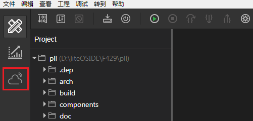

打开OceanConnect登录页面，如下图所示：

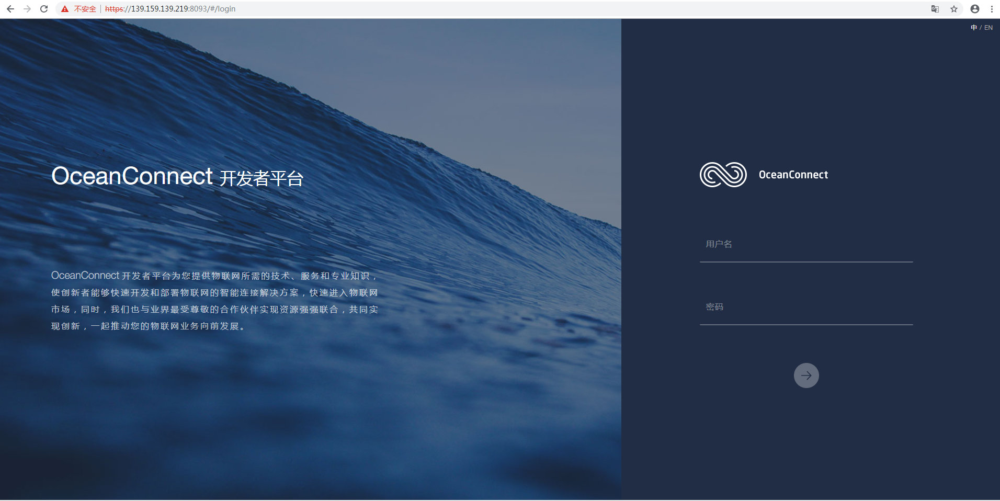

进入OceanConnect平台前，您需要注册OceanConnect平台账号，获取OceanConnect平台账号及该平台详细使用指南请参见[https://github.com/SuYai/OceanConnectHelp](https://github.com/SuYai/OceanConnectHelp)  。

<h2 id="用户反馈.md">用户反馈</h2>

感谢您仔细阅读我们的使用指南，如这些信息仍然不能解决您的问题，请单击菜单栏中的“帮助\>用户反馈”，您可以在线反馈使用本LiteOS Studio工具遇到的任何问题及建议。

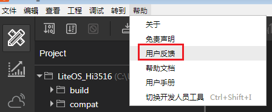

<h2 id="FAQ.md">FAQ</h2>

-   **[如何在Linux系统下搭建开发环境](#如何在Linux系统下搭建开发环境.md)**  

-   **[如何获取连接开发板的实际串口号](#如何获取连接开发板的实际串口号.md)**  

-   **[如何进行Trace埋点](#如何进行Trace埋点.md)**  

-   **[弹出JLink警告如何解决](#弹出JLink警告如何解决.md)**  

-   **[如何配置环境变量](#如何配置环境变量.md)**  

-   **[烧录及调试均失败（华为海思芯片）](#烧录及调试均失败（华为海思芯片）.md)**  

-   **[打开文件搜索框有“卡死”的现象](#打开文件搜索框有-卡死-的现象.md)**  

-   **[烧录或调试时，JLink弹出框未置顶显示](#烧录或调试时-JLink弹出框未置顶显示.md)**  

-   **[通过LiteOS Studio修改网络盘符中的文件注意事项](#通过LiteOS-Studio修改网络盘符中的文件注意事项.md)**  


<h2 id="如何在Linux系统下搭建开发环境.md">如何在Linux系统下搭建开发环境</h2>

本章节以MobaXterm为例，介绍如何在Linux系统下搭建开发环境。

## 前提条件<a name="section18783954103852"></a>

-   已安装MobaXterm工具。
-   已下载arm-himix100-linux工具链。

## 操作步骤<a name="section5813491618363"></a>

1.  通过MobaXterm连接Linux云主机。
    1.  打开MobaXterm软件，新建session（菜单栏Sessions\>New session）。

        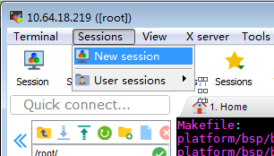

    2.  填写Linux主机信息。

        -   Remote host：Linux云主机的IP地址。
        -   Specify username：root。

        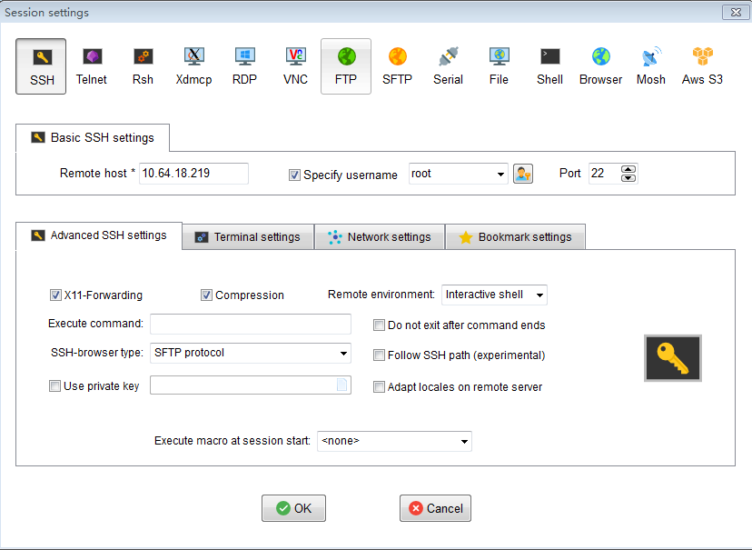

    3.  填写完成后，单击“OK”，连接Linux云主机。

        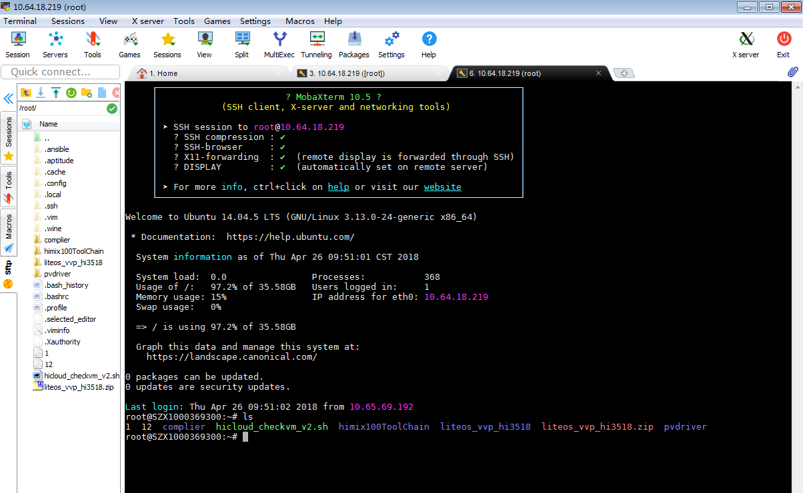


2.  确认Linux系统中有make文件。

    在Linux系统中，执行以下命令，查找make文件。

    **find / -name make**

    -   如有make文件，执行[3](#li9744308184222)。
    -   如没有找到make文件，请在其他Linux系统中查找make文件，并将找到的make文件放入到Linux云主机的/usr/bin目录下。

3.  <a name="li9744308184222"></a>在linux环境下搭建arm-himix100-linux交叉编译器。

    1.  压缩arm-himix100-linux为arm-himix100-linux.zip。
    2.  通过MobaXterm将arm-himix100-linux.zip包拷贝到云Linux主机上。
    3.  执行以下命令，解压压缩包。

        **unzip arm-himix100-linux.zip**

    4.  执行以下命令，进入arm-himix100-linux文件夹。

        **cd arm-himix100-linux**

    5.  执行以下命令，安装himix100交叉编译器。默认将工具链安装在 /opt/hisi-linux/x86-arm 目录下。

        **source ./arm-himix100-linux.install**

        > **说明：**   
        >如果想指定工具链的安装位置，执行以下命令：  
        >**source ./arm-himix100-linux.install <安装路径\>**  
        >如：**source ./arm-himix100-linux.install dirname**，指定安装在dirname目录下。  


    安装后，就可以使用arm-himix100-linux-xxx 工具链了。

    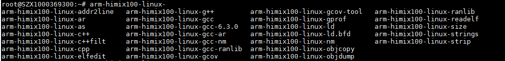

4.  配置交叉编译器的环境变量。这里以arm-himix100-linux为例。
    1.  执行以下命令，打开~/.bashrc文件。

        **vi  ~/.bashrc**

    2.  增加如下交叉编译器的环境变量。

        **export PATH=$PATH:/root/himix100ToolChain/arm-himix100-linux/bin**

        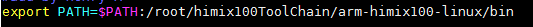

        按“Esc”，然后输入“:wq!”后按“Enter”，保存并退出编辑器。

    3.  执行以下命令，编译环境准备完成。

        **Source ~/.bashrc**


<h2 id="如何获取连接开发板的实际串口号.md">如何获取连接开发板的实际串口号</h2>

## 操作步骤<a name="section24745699102125"></a>

1.  将开发板与电脑连接。
2.  连接成功后，打开“控制面板\>硬件和声音\>设备管理器”

    

3.  在“端口”子菜单下，找到连接设备的串口号，如下图所示：

    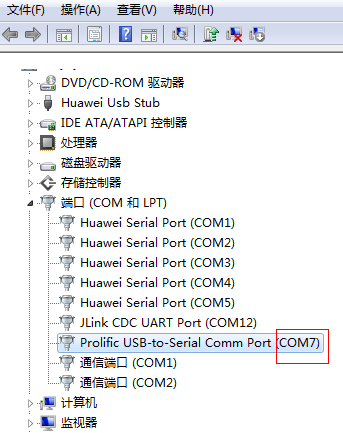


<h2 id="如何进行Trace埋点.md">如何进行Trace埋点</h2>

## Trace埋点准备<a name="section24867087174617"></a>

1.  获取Extension.rar文件。获取地址：[https://github.com/LiteOS/LiteOS\_Studio/doc](https://github.com/LiteOS/LiteOS_Studio/doc)。
2.  解压缩Extension.rar，将获取的Extension\\segger文件夹放入工程源码目录中。

1.  编辑Makefile文件，将Extension\\segger目录编译进工程。

## 背景信息<a name="section18502664174656"></a>

-   Trace数据埋点需要使用jlink提供的一系列库和函数， 这些文件在Extension\\segger文件夹中。调用埋点之前必须执行埋点功能的初始化函数，需要调用SEGGER\_SYSVIEW\_Conf\(\)。

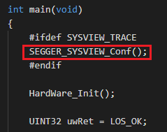

-   目前埋点主要调用SEGGER\_SYSVIEW\_RecordDatas\(\)函数，此函数是对一系列埋点函数的封装，函数原型为int SEGGER\_SYSVIEW\_RecordDatas\(UINT32 packetId,...\)。
    -   其中第一个参数为packetId，即埋点的数据类型。例如定义SYSVIEW\_EVTID\_TASK\_INFO\( 9\)为发送新建任务的信息。
    -   函数的第二个参数为格式化字符的类型，支持%d和%s的格式化参数，后续的数据必须和格式化参数一一对应。

-   调用SEGGER\_SYSVIEW\_RecordDatas 函数可以通过引用"SEGGER\_SYSVIEW.h"进行调用。

-   **[EVENTS面板](#EVENTS面板.md)**  

-   **[Interrupts面板](#Interrupts面板.md)**  

-   **[Timer面板](#Timer面板.md)**  

-   **[Queue面板](#Queue面板.md)**  

-   **[Timeline面板](#Timeline面板.md)**  

-   **[Task Details面板](#Task-Details面板.md)**  

-   **[Semaphore面板](#Semaphore面板.md)**  

-   **[Mutex面板](#Mutex面板.md)**  

-   **[Task Stack面板](#Task-Stack面板.md)**  

-   **[内存面板](#内存面板.md)**  


<h2 id="EVENTS面板.md">EVENTS面板</h2>

在EVENTS面板进行埋点。

## 操作步骤<a name="section1315493175043"></a>

1.  打开los\_event.c文件。

    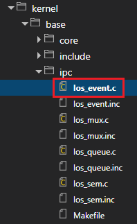

    1.  在EventInit的函数中，定义EventInit的packetId为60，依次发送当前任务ID和LR寄存器值，请根据实际情况修改pstEventCB-\>uwEventID及 uwLR的值。

        > **说明：**   
        >Trace功能是将开发板中的数据按照一定的约定发送至PC端进行分析汇总。目前Trace支持的功能的PacketId是约定的特殊的数值。本文中用“定义”来标示此packetid用于约定传输该类型数据。  

        ```
        SEGGER_SYSVIEW_RecordDatas(60,"%d %d",pstEventCB->uwEventID, uwLR);
        ```

        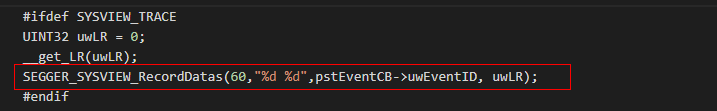

    2.  在EventRead的函数中，定义EventRead的packetId为62，依次发送当前任务ID、事件掩码、事件模式和事件的超时时间。请根据实际情况修改 pstEventCB-\>uwEventID，uwEventMask，uwMode及uwTimeOut的值。

        ```
        SEGGER_SYSVIEW_RecordDatas(62,"%d %d %d %d", pstEventCB->uwEventID, uwEventMask, uwMode, uwTimeOut);
        ```

        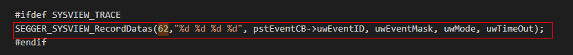

    3.  在EventWrite的函数中，定义EventWrite的packetId为63，依次发送当前任务ID和指定的事件类型。请根据实际情况修改pstEventCB-\>uwEventID及uwEvents的值。

        ```
        SEGGER_SYSVIEW_RecordDatas(63,"%d %d", pstEventCB->uwEventID, uwEvents);
        ```

        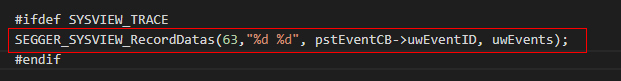

    4.  在EventDestory的函数中，定义EventDestory的packetId为61，发送当前任务ID。请根据实际情况修改pstEventCB-\>uwEventID的值。

        ```
        SEGGER_SYSVIEW_RecordDatas(61,"%d ",pstEventCB->uwEventID);
        ```

        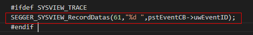


2.  打开los\_hw.c文件。

    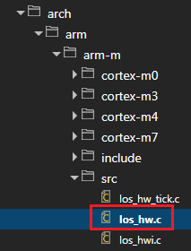

    1.  任务调度时，如果当前任务（RunTask）为IdleTask，定义RunTask的packetId为72，发送当前任务的ID。请根据实际情况修改g\_stLosTask.pstRunTask-\>uwTaskID的值。

        ```
        SEGGER_SYSVIEW_RecordDatas(72,"%d ",g_stLosTask.pstRunTask->uwTaskID);
        ```

    2.  如果当前任务（RunTask）不是IdleTask，定义RunTask的packetId为7，发送当前任务的ID和1。请根据实际情况修改g\_stLosTask.pstRunTask-\>uwTaskID的值。

        ```
        SEGGER_SYSVIEW_RecordDatas(7,"%d %d",g_stLosTask.pstRunTask->uwTaskID, 1);
        ```

    3.  如果任务调度中将要调度的任务（NewTask）为IdleTask，定NewTask的packetId为71，发送将要调度的任务ID。请根据实际情况修改g\_stLosTask.pstNewTask-\>uwTaskID的值。

        ```
        SEGGER_SYSVIEW_RecordDatas(71,"%d ",g_stLosTask.pstNewTask->uwTaskID);
        ```

    4.  如果任务调度中将要调度的任务（NewTask）不是IdleTask，定义NewTask的packetId为4，发送将要调度的任务ID。请根据实际情况修改g\_stLosTask.pstNewTask-\>uwTaskID的值。

        ```
        SEGGER_SYSVIEW_RecordDatas(4,"%d ",g_stLosTask.pstNewTask->uwTaskID);
        ```

        如下图所示：

        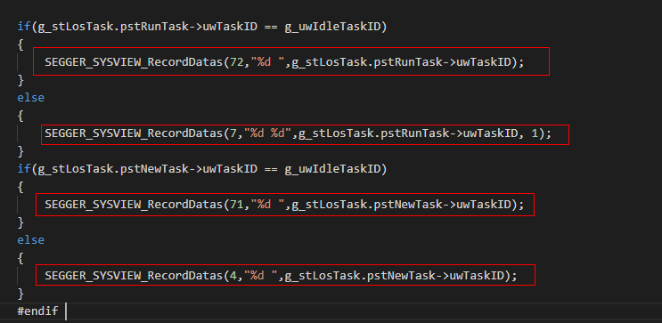


<h2 id="Interrupts面板.md">Interrupts面板</h2>

在Interrupts面板进行埋点。

## 操作步骤<a name="section7397618175217"></a>

1.  打开los\_hwi.c文件。

    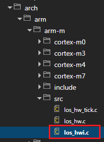

2.  定义EnterISR的packetId为2，发送当前Interrupts的ID。请根据实际情况修改Interrupts的ID值。

    ```
    SEGGER_SYSVIEW_RecordDatas(2,"%d"，2);
    ```

3.  定义ExitISR的packetId为3，发送数据0。

    ```
    SEGGER_SYSVIEW_RecordDatas(3,0);
    ```


<h2 id="Timer面板.md">Timer面板</h2>

在Timer面板进行埋点。

## 操作步骤<a name="section24468203175420"></a>

1.  打开los\_swtmr.c文件。

    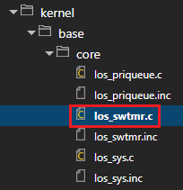

2.  定义EnterTimer的packetId为19，发送处理软件定时器超时的回调函数时传入的参数。请根据实际情况修改\(UINT32\)stSwtmrHandle.uwArg值。

    ```
    SEGGER_SYSVIEW_RecordDatas(19,"%d ",(UINT32)stSwtmrHandle.uwArg);
    ```

3.  定义ExitTimer的packetId为20，发送数据0。

    ```
    SEGGER_SYSVIEW_RecordDatas(20,0);
    ```


<h2 id="Queue面板.md">Queue面板</h2>

在Queue面板进行埋点。

## 操作步骤<a name="section7237496175519"></a>

1.  打开los\_queue.c文件。

    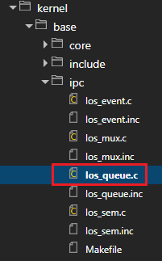

2.  定义QueueCreate的packetId为36，依次创建成功后得到的消息队列的ID、队列的长度、最长消息的大小和LR寄存器值。请根据实际情况修改\*puwQueueID， usLen，usMaxMsgSize及uwLR的值。

    ```
    SEGGER_SYSVIEW_RecordDatas(36,"%d %d %d %d", *puwQueueID, usLen, usMaxMsgSize, uwLR);
    ```


<h2 id="Timeline面板.md">Timeline面板</h2>

Timeline面板：数据库会通过其他面板汇总得到。

<h2 id="Task-Details面板.md">Task Details面板</h2>

在Task Details面板进行埋点。

## 操作步骤<a name="section4419238017568"></a>

1.  打开los\_task.c文件。

    

2.  定义TaskRead的packetId为6，发送当前task的ID。请根据实际情况修改pstTaskCB-\>uwTaskID值。

    ```
    SEGGER_SYSVIEW_RecordDatas(6,"%d ",pstTaskCB->uwTaskID);
    ```

3.  定义TaskTerminate的packetId为29，发送当前task的ID。请根据实际情况修改uwTaskID值。

    ```
    SEGGER_SYSVIEW_RecordDatas(29,"%d ",uwTaskID);
    ```

4.  定义创建任务时TaskInfo的packetId为9，依次发送当前task的ID、创建任务的优先级和创建任务的任务名。请根据实际情况修改Info.TaskID，Info.Prio及Info.sName的值。

    ```
    SEGGER_SYSVIEW_RecordDatas(9,"%d %d %s",Info.TaskID,Info.Prio,Info.sName);
    ```

5.  定义创建任务时StackInfo的packetId为21，依次发送当前task的ID、任务栈的栈顶指针、任务栈的大小和数字0。请根据实际情况修改Info.TaskID，Info.StackBase及Info.StackSize的值。

    ```
    SEGGER_SYSVIEW_RecordDatas(21,"%d %d %d %d",Info.TaskID,Info.StackBase,Info.StackSize,0);
    ```

6.  定义TaskSuspend的packetId为7，依次发送当前task的ID和数字2。请根据实际情况修改uwTaskID的值。

    ```
    SEGGER_SYSVIEW_RecordDatas(7,"%d %d",uwTaskID, 2);
    ```

7.  定义TaskDelay的packetId为33，发送任务延时的时钟个数。请根据实际情况修改uwTick的值。

    ```
    SEGGER_SYSVIEW_RecordDatas(33,"%d ",uwTick);
    ```


<h2 id="Semaphore面板.md">Semaphore面板</h2>

在Semaphore面板进行埋点。

## 操作步骤<a name="section47110766175745"></a>

1.  打开los\_sem.c文件。

    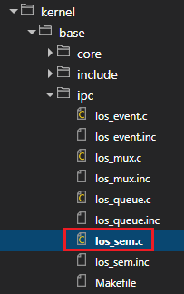

2.  定义SemCreate的packetId为40，依次发送信号量的模式、可使用的信号量个数和LR寄存器值。请根据实际情况修改\*puwSemHandle，usCount及uwLR的值

    ```
    SEGGER_SYSVIEW_RecordDatas(40,"%d %d %d ", *puwSemHandle, usCount, uwLR);
    ```


<h2 id="Mutex面板.md">Mutex面板</h2>

在Mutex面板进行埋点。

## 操作步骤<a name="section13607372175834"></a>

1.  打开los\_mux.c文件。

    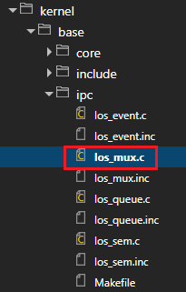

2.  定义MuxCreate的packetId为50，依次发送申请的互斥锁、LR寄存器值。请根据实际情况修改ucMuxID及 uwLR的值。

    ```
    SEGGER_SYSVIEW_RecordDatas(50,"%d %d", ucMuxID, uwLR);
    ```

3.  定义MuxDelete的packetId为51，发送需要删除的互斥锁。请根据实际情况修改uwMuxHandle的值。

    ```
    SEGGER_SYSVIEW_RecordDatas(51,"%d ", uwMuxHandle);
    ```

4.  定义MuxPend的packetId为52，依次发送需要申请的互斥锁和互斥锁的超时时间。请根据实际情况修改uwMuxHandle及uwTimeout的值。

    ```
    SEGGER_SYSVIEW_RecordDatas(52,"%d %d ", uwMuxHandle, uwTimeout);
    ```

5.  定义MuxPost的packetId为53，发送使用的互斥锁。请根据实际情况修改uwMuxHandle的值。

    ```
    SEGGER_SYSVIEW_RecordDatas(53,"%d ",uwMuxHandle);
    ```


<h2 id="Task-Stack面板.md">Task Stack面板</h2>

在Task Stack面板进行埋点。

## 操作步骤<a name="section64682134175944"></a>

1.  打开los\_task.c文件。

    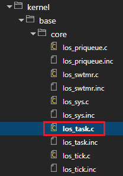

2.  定义TaskInfo的packetId为73，依次发送当前任务ID、当前任务栈大小、栈顶的地址、水线、栈的起始地址和任务的名字。请根据实际情况修改tskinfo.uwTaskID，tskinfo.uwStackSize，tskinfo.uwTopOfStack，tskinfo.WaterLine，tskinfo.MaxStackPoint及tskinfo.pcTaskName的值。

    ```
    SEGGER_SYSVIEW_RecordDatas(73,"%d %d %d %d %d %s",tskinfo.uwTaskID,tskinfo.uwStackSize,tskinfo.uwTopOfStack,tskinfo.WaterLine,tskinfo.MaxStackPoint,tskinfo.pcTaskName);
    ```


<h2 id="内存面板.md">内存面板</h2>

对动态内存及静态内存进行埋点。

-   **[动态内存](#动态内存.md)**  

-   **[静态内存](#静态内存.md)**  


<h2 id="动态内存.md">动态内存</h2>

对动态内存进行埋点。

## 操作步骤<a name="section64857996181420"></a>

1.  打开los\_memory.c文件。

    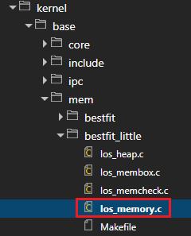

2.  定义LOS\_MemAlloc的packetId为80，依次发送当前任务ID、当前内存池的起始地址、当前内存池的大小、申请返回的内存起始地址和申请所得内存大小。请根据实际情况修改TaskID，\(UINT32\)pPool，poolsize，\(UINT32\)\(pRet\)及uwSize的值。

    ```
    SEGGER_SYSVIEW_RecordDatas(80,"%d %d %d %d %d", TaskID,(UINT32)pPool,poolsize,(UINT32)(pRet), uwSize);
    ```

3.  定义LOS\_MemAlloc的packetId为83，依次发送当前任务ID、当前内存池的起始地址、当前内存池的大小和是否释放成功（成功为1，失败为0）。请根据实际情况修改TaskID，\(UINT32\)pPool，\(UINT32\)pMem 及isFreeOk的值。

    ```
    SEGGER_SYSVIEW_RecordDatas(83,"%d %d %d %d", TaskID, (UINT32)pPool,(UINT32)pMem ,isFreeOk);
    ```

4.  定义LOS\_MemInit的packetId为84，依次发送当前任务ID和申请的内存池起始地址、申请的内存池大小。请根据实际情况修改TaskID，\(UINT32\)pPool及uwSize的值。

    ```
    SEGGER_SYSVIEW_RecordDatas(84,"%d %d %d", TaskID,(UINT32)pPool, uwSize);
    ```

5.  定义LOS\_MemoryIncoming\(连接开发板时发送已经使用的内存信息\)的packetId为85，依次发送当前内存池起始地址、已使用的内存的起始地址和已使用的内存起始地址对应的使用大小。请根据实际情况修改\(UINT32\)pPool，0X08000，\(\(UINT32\)pstTmpNode + sizeof\(LOS\_MEM\_DYN\_NODE\)\)及\(\*\(U32\*\)\(\(U32\)pstTmpNode + sizeof\(LOS\_MEM\_DYN\_NODE\)-4\)&0x7fffffff\)的值。

    ```
    SEGGER_SYSVIEW_RecordDatas(85,"%d %d %d %d",(UINT32)pPool,0X08000,((UINT32)pstTmpNode + sizeof(LOS_MEM_DYN_NODE)),(*(U32*)((U32)pstTmpNode + sizeof(LOS_MEM_DYN_NODE)-4)&0x7fffffff));
    ```

6.  新增memset.c文件，文件名称可自定义。（如已新增此文件，请忽略新增步骤，直接打开即可）。

    注意：不能调用库函数中的memset函数，需要重写memset函数。

    

    定义动态内存memset的packetId为81，依次发送当前任务ID、当前内存池的起始地址、当前内存池的大小、memset的目标内存起始地址和memset操作大小。请根据实际情况修改TaskID，dyn\_pool\_id，dyn\_poolsize，\(UINT32\)dst及n的值。

    ```
    SEGGER_SYSVIEW_RecordDatas(81,"%d %d %d %d %d",TaskID,dyn_pool_id,dyn_poolsize,(UINT32)dst,n);
    ```

7.  新增memcpy.c文件，文件名称可自定义。（如已新增此文件，请忽略新增步骤，直接打开即可）。

    注意：不能调用库函数中的memcpy函数，需要重写memcpy函数。

    

    定义动态内存memcpy的packetId为82，依次发送当前任务ID、当前内存池的起始地址、当前内存池的大小、memcpy的目标内存起始地址和memcpy操作大小。请根据实际情况修改TaskID，dyn\_pool\_id，dyn\_poolsize，\(UINT32\)dst及length的值。

    ```
    SEGGER_SYSVIEW_RecordDatas(82,"%d %d %d %d %d",TaskID,dyn_pool_id,dyn_poolsize,(UINT32)dst,length);
    ```


<h2 id="静态内存.md">静态内存</h2>

对静态内存进行埋点。

## 操作步骤<a name="section2369824418428"></a>

1.  打开los\_membox.c文件。

    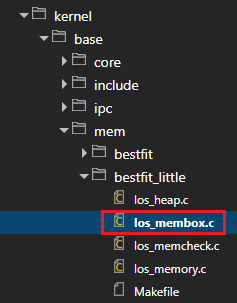

    1.  定义LOS\_MemboxAlloc的packetId为90，依次发送当前任务ID、当前内存池的起始地址、当前内存池的大小、申请返回的内存起始地址和申请所得内存大小。请根据实际情况修改TaskID，\(UINT32\)pBoxMem，poolsize，\(UINT32\)pRet及MemBoxAllocSize的值。

        ```
        SEGGER_SYSVIEW_RecordDatas(90,"%d %d %d %d %d",TaskID,(UINT32)pBoxMem,poolsize,(UINT32)pRet,MemBoxAllocSize);
        ```


    1.  定义LOS\_MemboxAlloc的packetId为93，依次发送当前任务ID、当前内存池的起始地址、当前内存池的大小和是否释放成功（成功为1，失败为0）。请根据实际情况修改TaskID， \(UINT32\)pBoxMem，\(UINT32\)pBox及isFreeOk的值。

        ```
        SEGGER_SYSVIEW_RecordDatas(93,"%d %d %d %d", TaskID, (UINT32)pBoxMem,(UINT32)pBox, isFreeOk);
        ```


    1.  定义LOS\_MemboxInit的packetId为94，依次发送当前任务ID和申请的内存池起始地址、申请的内存池大小。请根据实际情况修改TaskID，\(UINT32\)pBoxMem及uwBoxSize的值。

        ```
        SEGGER_SYSVIEW_RecordDatas(94,"%d %d %d",TaskID,(UINT32)pBoxMem,uwBoxSize);
        ```


    1.  定义LOS\_MemboxIncoming\(连接开发板时发送已经使用的内存信息\)的packetId为95，依次发送当前内存池起始地址、已使用的内存的起始地址和已使用的内存起始地址对应的使用大小。请根据实际情况修改gBoxstr\[i\].TaskID，gBoxstr\[i\].startaddress及gBoxstr\[i\].uwSize的值。

        ```
        SEGGER_SYSVIEW_RecordDatas(95,"%d %d %d",gBoxstr[i].TaskID,gBoxstr[i].startaddress,gBoxstr[i].uwSize);
        ```


2.  新增memset.c文件，文件名称可自定义。（如已新增此文件，请忽略新增步骤，直接打开即可）。

    注意：不能调用库函数中的memset函数，需要重写memset函数。

    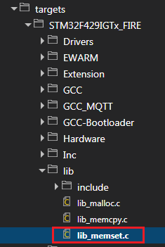

    定义静态内存memset的packetId为91，依次发送当前任务ID、当前内存池的起始地址、当前内存池的大小、memset的目标内存起始地址和memset操作大小。请根据实际情况修改TaskID，sta\_pool\_id，sta\_poolsize，\(UINT32\)dst及n的值。

    ```
    SEGGER_SYSVIEW_RecordDatas(91,"%d %d %d %d %d", TaskID, sta_pool_id,sta_poolsize,(UINT32)dst,n);
    ```

3.  新增memcpy文件，文件名称可自定义。（如已新增此文件，请忽略新增步骤，直接打开即可）。

    注意：不能调用库函数中的memcpy函数，需要重写memcpy函数。

    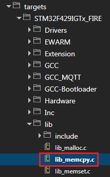

    定义静态内存memcpy的packetId为92，依次发送当前任务ID、当前内存池的起始地址、当前内存池的大小、memcpy的目标内存起始地址和memcpy操作大小。请根据实际情况修改TaskID， sta\_pool\_id，sta\_poolsize，\(UINT32\)dst及length的值。

    ```
    SEGGER_SYSVIEW_RecordDatas(92,"%d %d %d %d %d", TaskID, sta_pool_id,sta_poolsize,(UINT32)dst,length);
    ```


<h2 id="弹出JLink警告如何解决.md">弹出JLink警告如何解决</h2>

调试时，若弹出如下JLink警告框，请更换为V9.4及以上版本的JLink仿真器。

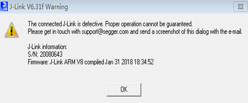

<h2 id="如何配置环境变量.md">如何配置环境变量</h2>

新建LiteOS Studio工程时，优先读取配置的Studio的参数，如未配置Studio，再读取配置的环境变量参数，并作为Studio的默认配置。

## 背景信息<a name="section47332173162342"></a>

添加MinGW，JLink及第三方芯片使用的GCC工具的环境变量时，须保留“Path”变量原有的值，不同值之间以分号（;）隔开。

## 操作步骤<a name="section850902414340"></a>

1.  单击“控制面板\>系统和安全\>系统\>高级系统设置”，在“高级”页签，单击“环境变量”。

    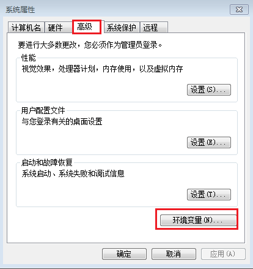

2.  在“系统变量”区域下，单击“Path”变量所在行，再单击“编辑”。

    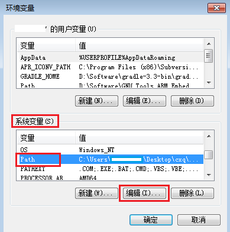

3.  在“变量值”文本框的最后添加[表1](#table22514813162259)中4个环境变量值，不同值之间以分号（;）隔开。如：D:\\MinGW\\bin;D:\\MinGW\\msys\\1.0\\bin;C:\\Program Files \(x86\)\\SEGGER\\JLink\_V634f;C:\\Program Files \(x86\)\\GNU Tools ARM Embedded\\7 2018-q2-update\\bin

    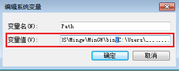

    **表 1**  环境变量参数

    <a name="table22514813162259"></a>
    <table><thead align="left"><tr id="row51945022162259"><th class="cellrowborder" valign="top" width="9.710971097109713%" id="mcps1.2.5.1.1"><p id="p18522358162259"><a name="p18522358162259"></a><a name="p18522358162259"></a>序号</p>
    </th>
    <th class="cellrowborder" valign="top" width="32.893289328932894%" id="mcps1.2.5.1.2"><p id="p23916031162259"><a name="p23916031162259"></a><a name="p23916031162259"></a>名称</p>
    </th>
    <th class="cellrowborder" valign="top" width="32.39323932393239%" id="mcps1.2.5.1.3"><p id="p58150393162259"><a name="p58150393162259"></a><a name="p58150393162259"></a>值</p>
    </th>
    <th class="cellrowborder" valign="top" width="25.002500250025%" id="mcps1.2.5.1.4"><p id="p12561420162259"><a name="p12561420162259"></a><a name="p12561420162259"></a>备注</p>
    </th>
    </tr>
    </thead>
    <tbody><tr id="row45943918162259"><td class="cellrowborder" valign="top" width="9.710971097109713%" headers="mcps1.2.5.1.1 "><p id="p30469848162259"><a name="p30469848162259"></a><a name="p30469848162259"></a>1</p>
    </td>
    <td class="cellrowborder" rowspan="2" valign="top" width="32.893289328932894%" headers="mcps1.2.5.1.2 "><p id="p52138606162259"><a name="p52138606162259"></a><a name="p52138606162259"></a>MinGW环境变量值</p>
    </td>
    <td class="cellrowborder" valign="top" width="32.39323932393239%" headers="mcps1.2.5.1.3 "><p id="p62477594162259"><a name="p62477594162259"></a><a name="p62477594162259"></a>&lt;MinGW安装目录&gt;\MinGW\bin</p>
    </td>
    <td class="cellrowborder" rowspan="2" valign="top" width="25.002500250025%" headers="mcps1.2.5.1.4 "><p id="p27520321162259"><a name="p27520321162259"></a><a name="p27520321162259"></a>请根据实际情况修改MinGW安装目录，如：D:\MinGW\bin;D:\MinGW\msys\1.0\bin</p>
    </td>
    </tr>
    <tr id="row1828397094955"><td class="cellrowborder" valign="top" headers="mcps1.2.5.1.1 "><p id="p3033800294955"><a name="p3033800294955"></a><a name="p3033800294955"></a>2</p>
    </td>
    <td class="cellrowborder" valign="top" headers="mcps1.2.5.1.2 "><p id="p274430394955"><a name="p274430394955"></a><a name="p274430394955"></a>&lt;MinGW安装目录&gt;\MinGW\msys\1.0\bin</p>
    </td>
    </tr>
    <tr id="row46356303162259"><td class="cellrowborder" valign="top" width="9.710971097109713%" headers="mcps1.2.5.1.1 "><p id="p63873085162259"><a name="p63873085162259"></a><a name="p63873085162259"></a>3</p>
    </td>
    <td class="cellrowborder" valign="top" width="32.893289328932894%" headers="mcps1.2.5.1.2 "><p id="p6337371162259"><a name="p6337371162259"></a><a name="p6337371162259"></a>JLink环境变量值</p>
    </td>
    <td class="cellrowborder" valign="top" width="32.39323932393239%" headers="mcps1.2.5.1.3 "><p id="p54362886162846"><a name="p54362886162846"></a><a name="p54362886162846"></a>&lt;JLink安装目录&gt;\SEGGER\JLink_V634f</p>
    </td>
    <td class="cellrowborder" valign="top" width="25.002500250025%" headers="mcps1.2.5.1.4 "><p id="p41317674162846"><a name="p41317674162846"></a><a name="p41317674162846"></a>请根据实际情况修改JLink安装目录，如：C:\Program Files (x86)\SEGGER\JLink_V634f</p>
    </td>
    </tr>
    <tr id="row16399243162259"><td class="cellrowborder" valign="top" width="9.710971097109713%" headers="mcps1.2.5.1.1 "><p id="p53270310162259"><a name="p53270310162259"></a><a name="p53270310162259"></a>4</p>
    </td>
    <td class="cellrowborder" valign="top" width="32.893289328932894%" headers="mcps1.2.5.1.2 "><p id="p19927829162259"><a name="p19927829162259"></a><a name="p19927829162259"></a>GCC工具环境变量值</p>
    </td>
    <td class="cellrowborder" valign="top" width="32.39323932393239%" headers="mcps1.2.5.1.3 "><p id="p910359616297"><a name="p910359616297"></a><a name="p910359616297"></a>&lt;GCC安装目录&gt;\7 2018-q2-update\bin</p>
    </td>
    <td class="cellrowborder" valign="top" width="25.002500250025%" headers="mcps1.2.5.1.4 "><p id="p6630264716297"><a name="p6630264716297"></a><a name="p6630264716297"></a>请根据实际情况修改GCC工具安装目录，如：C:\Program Files (x86)\GNU Tools ARM Embedded\7 2018-q2-update\bin</p>
    </td>
    </tr>
    </tbody>
    </table>

4.  依次单击“确定”，完成环境变量配置。

<h2 id="烧录及调试均失败（华为海思芯片）.md">烧录及调试均失败（华为海思芯片）</h2>

## 现象<a name="section30008729174453"></a>

对华为海思芯片开发板进行烧录及调试时，出现如下情况：

-   当出现“请重启开发板”提示时，重启开发板无响应。

    

-   调试时，无法打开反汇编文件，控制台输出如下信息，如下图所示：

    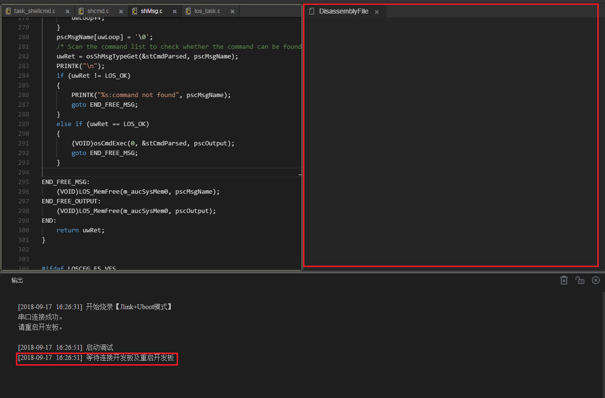


## 可能原因及解决办法<a name="section1946163317459"></a>

可能原因：连接顺序错误：先将开发板与JLink仿真器连接，再连接了开发板的电源。

解决办法：重新连接：先连接开发板的电源，再将开发板与JLink仿真器连接。

<h2 id="打开文件搜索框有-卡死-的现象.md">打开文件搜索框有“卡死”的现象</h2>

打开文件搜索框有“卡死”的现象，与网络盘符有关，扫描网络驱动器需要2~3分钟或更长时间，搜索框打开缓慢，请耐心等待，后续将优化此功能。

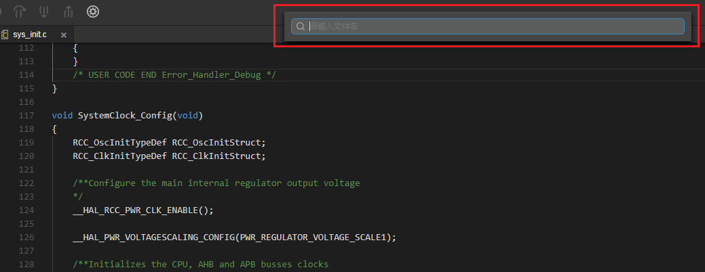

<h2 id="烧录或调试时-JLink弹出框未置顶显示.md">烧录或调试时，JLink弹出框未置顶显示</h2>

## 现象<a name="section77401758969"></a>

烧录或调试过程中，JLink弹出框未置顶显示（被LiteOS Studio窗体遮挡），如下图所示：

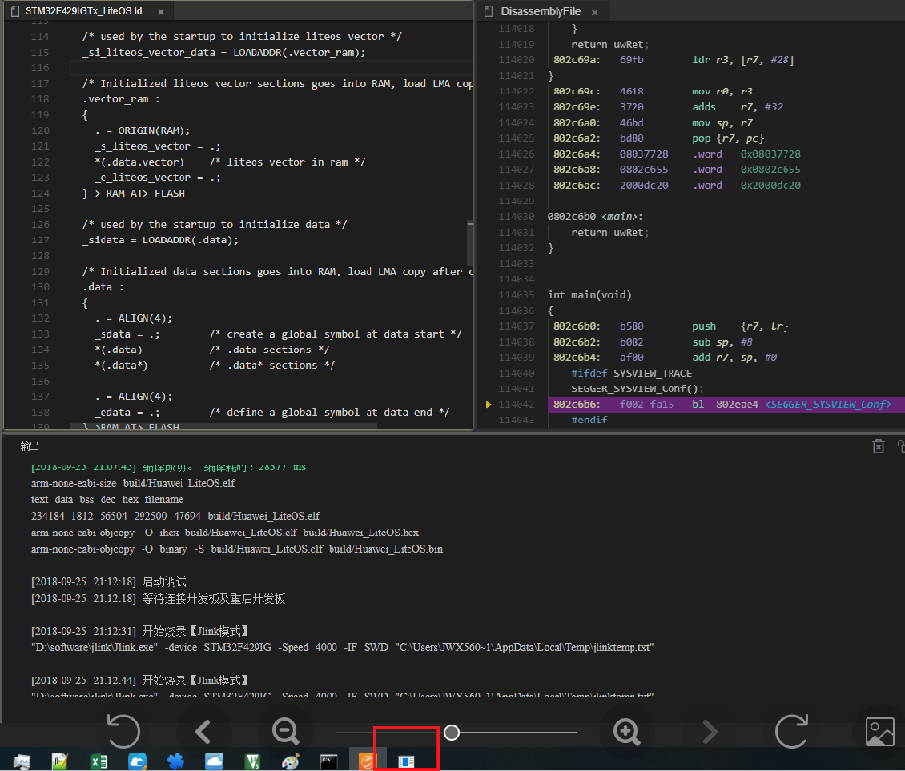

## 原因及解决办法<a name="section5905848191615"></a>

该问题为Windows系统跨应用消息窗体置顶显示兼容性问题，Windows任务仍会出现相应消息窗体的任务图标，可通过点击任务栏对应的图标，让消息窗体显示出来，即可进行下一步操作，如下图所示：

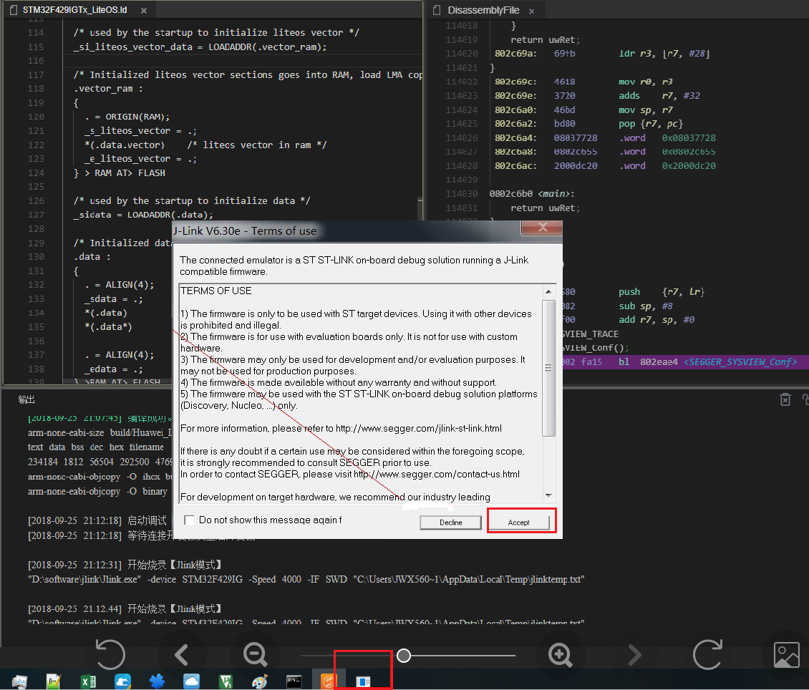

<h2 id="通过LiteOS-Studio修改网络盘符中的文件注意事项.md">通过LiteOS Studio修改网络盘符中的文件注意事项</h2>

修改网络盘符中的文件内容，请先在源码工程根目录中执行以下命令开通修改权限。

**chmod 777 -R .**

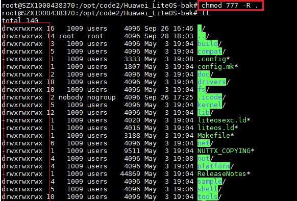

<h2 id="附录.md">附录</h2>

-   **[Trace介绍](#Trace介绍.md)**  


<h2 id="Trace介绍.md">Trace介绍</h2>

-   **[Trace工具栏](#Trace工具栏.md)**  

-   **[Events](#Events.md)**  

-   **[Interrupts](#Interrupts.md)**  

-   **[Timer](#Timer.md)**  

-   **[Quene](#Quene.md)**  

-   **[Timeline](#Timeline.md)**  

-   **[Task Details](#Task-Details.md)**  

-   **[Semaphore](#Semaphore.md)**  

-   **[Mutex](#Mutex.md)**  

-   **[Task Stack](#Task-Stack.md)**  


<h2 id="Trace工具栏.md">Trace工具栏</h2>

## 背景信息<a name="section4636787104437"></a>

LiteOS Studio的Trace功能是基于JTAG的通信接口，通过记录、分析LiteOS系统产生的监视数据，实现跟踪LiteOS系统行为并记录的功能。

Trace跟踪信息的专业性比较强。本文档默认您具备嵌入式开发相关知识，相关术语，例如掩码、埋点等，不作详细解释。

## Trace工具栏说明<a name="section10288007105051"></a>

Trace界面左上角工具栏按钮如下图所示：

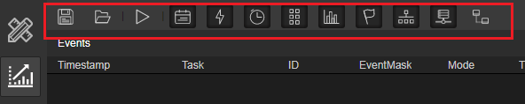

**按钮说明**：

-   单击“Save”储存跟踪的数据。
-   单击“Open”打开已储存的数据。
-   单击“Start”开始跟踪开发板的Trace数据。
-   Trace数据按不同类型分为 “Events”、“Interrupts”、“Timer”、 “Queue”、“Timeline”、 “Task Details”、“Semaphore”、 “Mutex”及“Task Stack”。除“Timeline”外，其余均可单击对应的按钮显示或隐藏其窗口。
-   单击工具栏的（Memory Track）进行内存跟踪。

Trace 跟踪页面的实际数据如下图所示：

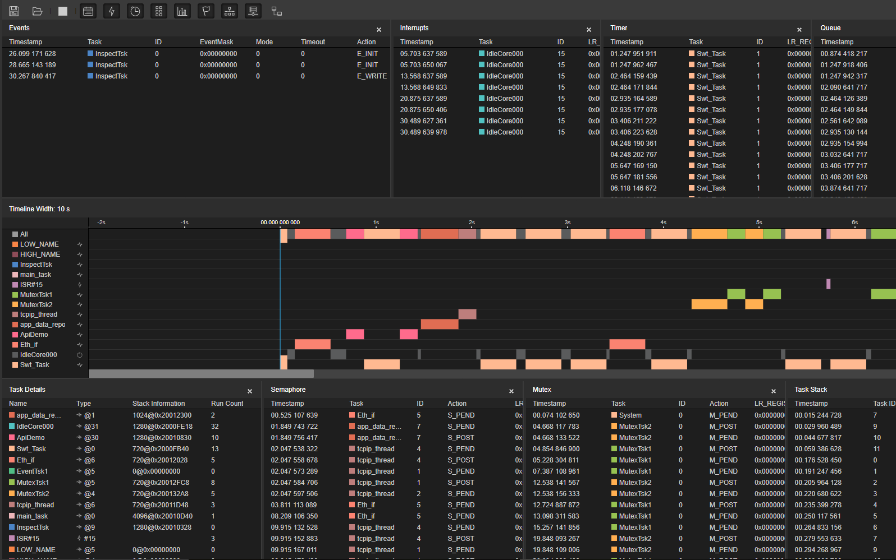

<h2 id="Events.md">Events</h2>

LiteOS Studio通过Events 窗口监控和展示开发板发送的所有事件信息。

Events窗口与其他面板存在联动关系，在Events窗口中，选中一条数据，其他窗口联动显示离该数据对应的时间戳最近的记录。

Events面板实际运行数据如下图所示：

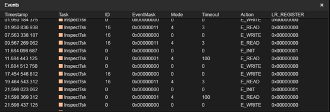

**Events面板的不同列的数据含义如下所述：**

-   Timestamp：事件发生时间。
-   Task：触发此事件的任务。
-   ID：Events的ID。
-   EventMask：事件掩码。
-   Mode：事件模式。
-   Timeout：事件的超时时间。
-   Action：事件的操作。
-   LR\_REGISTER：链接寄存器的值，记录当前函数结束时要返回的地址（可查询调用的函数）。

<h2 id="Interrupts.md">Interrupts</h2>

LiteOS Studio通过Interrupts 窗口监控和展示开发板发送的所有中断信息。

Interrupts窗口与其他面板存在联动关系，在Interrupts窗口中，选中一条数据，其他窗口联动显示离该数据对应的时间戳最近的记录。

Interrupts面板实际运行数据如下图所示：

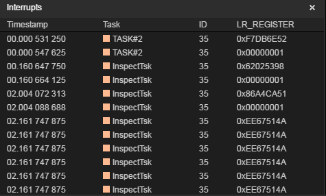

**Interrupts面板的不同列的数据含义如下所述：**

-   Timestamp：事件发生时间。
-   Task：触发此事件的任务。
-   ID：Interrupts的ID。
-   LR\_REGISTER：链接寄存器的值，记录当前函数结束时要返回的地址（可查询调用的函数）。

<h2 id="Timer.md">Timer</h2>

LiteOS Studio通过Timer 窗口监控和展示开发板发送的所有计时器信息。

Timer窗口与其他面板存在联动关系，在Timer窗口中，选中一条数据，其他窗口联动显示离该数据对应的时间戳最近的记录。

Timer面板实际运行数据如下图所示：

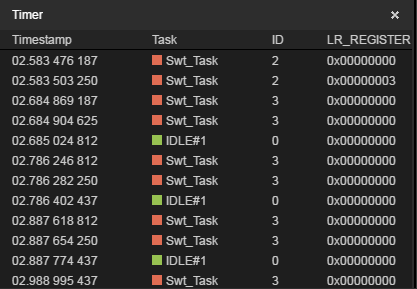

**Timer面板的不同列的数据含义如下所述：**

-   Timestamp：事件发生时间。
-   Task：触发此事件的任务。
-   ID：定时器的ID。
-   LR\_REGISTER：链接寄存器，记录当前函数结束时要返回的地址（可查询调用的函数）。

<h2 id="Quene.md">Quene</h2>

LiteOS Studio通过Queue 窗口监控和展示开发板发送的所有队列信息。

Queue窗口与其他面板存在联动关系，在Queue窗口中，选中一条数据，其他窗口联动显示离该数据对应的时间戳最近的记录。

Queue面板实际运行数据如下图所示：

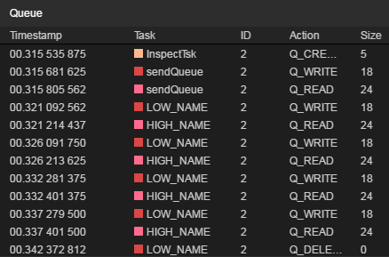

**Queue面板的不同列的数据含义如下所述：**

-   Timestamp：事件发生时间。
-   Task：触发此事件的任务。
-   ID：队列的ID。
-   Action：队列的操作。
-   Size：队列的大小。

<h2 id="Timeline.md">Timeline</h2>

LiteOS Studio通过Timeline实现分析LiteOS系统的行为，记录LiteOS系统产生的监视数据，并在Timeline的窗口中显示对应的信息，同时可以将记录保存到文件中，便于后续分析。

时间轴，可拖动，拖动时，各窗口根据当前指示的时间联动刷新数据。时间轴默认单位为“秒”\(s\)，刻度单位可以放大与缩小，精度最大放大到微秒\(μs\)，最小到秒（s）。

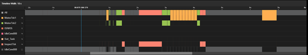

<h2 id="Task-Details.md">Task Details</h2>

LiteOS Studio通过Task Details实现分析LiteOS系统的行为，记录LiteOS系统产生的监视数据，并在Task Details的窗口中显示对应的信息，同时可以将记录保存到文件中，便于后续分析。

Task Details面板实际运行数据如下图所示：

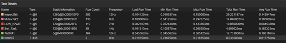

**Task Details面板的不同列的数据含义如下所述：**

-   Name：任务名称。
-   Type： 任务类型（分为Task，Scheduler，Interrupt，Idle四种类型）。
-   Stack Information：任务的栈信息。
-   Run Count：当前任务的运行次数。
-   Frequency： 一秒内运行的次数。
-   Last Run Time：最近一次运行的时间。
-   Min Run Time：运行一次最少的时间。

-   Max Run Time：运行一次最长的时间，运行一次的最长时间过大，则可能是运行时出现异常（例如死锁）。
-   Total Run Time： 累计运行时间。
-   Avg Run Time：平均每次运行的时间。

<h2 id="Semaphore.md">Semaphore</h2>

Semaphore窗口显示用于线程间、进程间同步的所有信号量。

Semaphore窗口与其他窗口存在联动关系，在Semaphore窗口中，选中一条数据，其他窗口联动显示离该数据对应的时间戳最近的记录。

Semaphore面板实际运行数据如下图所示：

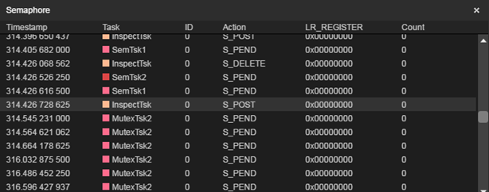

**Semaphore面板的不同列的数据含义如下所述：**

-   Timestamp：时间戳，表示“Semaphore”操作的时间。
-   Task：操作Semaphore的任务的名称。
-   ID：Semaphore的ID。
-   Action：Semaphore的操作。
-   LR\_REGISTER：链接寄存器的值（存放调用函数返回的地址）。
-   Count：信号量的数量。

<h2 id="Mutex.md">Mutex</h2>

Mutex窗口展示了时间戳附近的所有互斥事件，并显示他们的信息。

Mutex窗口与其他窗口存在联动关系，在Mutex窗口中，选中一条数据，其他窗口联动显示离该数据对应的时间戳最近的记录。

Mutex面板实际运行数据如下图所示：


**Mutex面板的不同列的数据含义如下所述：**

-   Timestamp：事件发生时间。
-   Task：触发此事件的任务。
-   ID：Mutex的ID。
-   Action：Mutex的操作。
-   LR\_REGISTER：链接寄存器，记录当前函数结束时要返回的地址（可查询调用的函数）。
-   Timeout：Mutex的超时时间。

<h2 id="Task-Stack.md">Task Stack</h2>

-   Task Stack窗口展示任务栈信息让用户有效定位踩内存问题，当水线不在栈顶与最大可访问地址范围内时，当前任务变为红色，即Water Line\> Stack Size时展示红色。
-   Task Stack窗口与其他窗口存在联动关系，在Task Stack窗口中，选中一条数据，其他窗口联动显示离该数据对应的时间戳最近的记录。

Task Stack面板实际运行数据如下图所示：

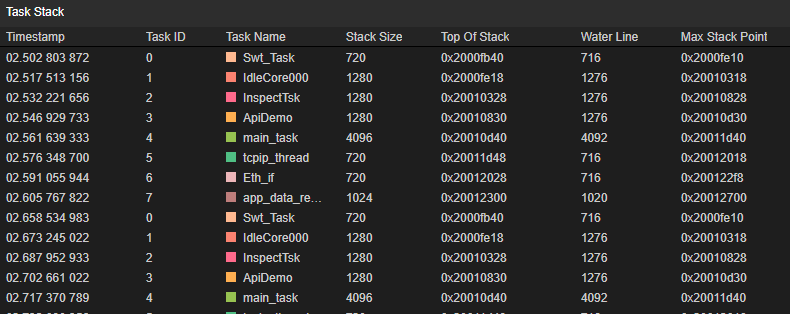

**Task Stack面板的不同列的数据含义如下所述：**

Timestamp：事件发生时间。

Task ID： 任务ID。

Task Name：任务名称。

Stack Size：任务栈大小。

Top Of Stack：栈顶。

Water Line：水线。

Max Stack Point：最大可访问地址。

